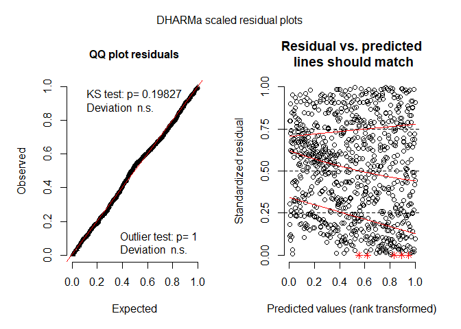
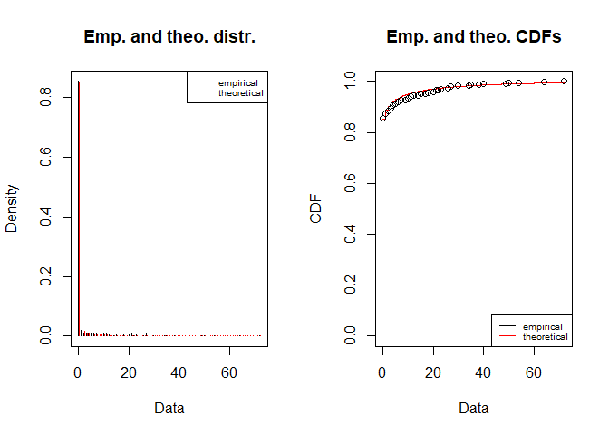

data\_analyses\_GxE
================
Rebecca Batstone
2019-08-19

Load packages
-------------

``` r
# packages
library("tidyverse") #includes ggplot2, dplyr, readr, stringr
library("cowplot") # paneled graphs
library("reshape2") # dcast function
library("lme4") # mixed effects models
library("emmeans") # calc model-estimated means
library("DHARMa") # residual diagnostics for glmm
library("fitdistrplus") # probability distributions of data
library("car") # Anova function
```

Spreadsheets
------------

``` r
# created using "data_setup.Rmd"
F_GH_ds <- read_csv("combined_field_GH_19Aug2019.csv")
```

GLMs (line as fixed effect)
---------------------------

### drop lines with insufficient data

``` r
# drop lines that do not have enough replicates to calc emmeans:
F_GH_ds_drop <- subset(F_GH_ds, ! line == "WR34")
F_GH_ds_shoot <- subset(F_GH_ds_drop, ! line %in% c("DU17","KA24"))
F_GH_ds_root <- subset(F_GH_ds_drop, ! line %in% c("DU17"))
F_GH_ds_count <- subset(F_GH_ds_drop, ! line %in% c("WT39")) # for leaf, nod, flower, fruit
F_GH_ds_nod <- subset(F_GH_ds_root, ! line %in% c("WT39"))
```

### glm1: shoot

``` r
# prob dist
F_GH_ds_shoot.cc <- F_GH_ds_shoot[complete.cases(F_GH_ds_shoot[ ,c("shoot")]),]
ggplot(data=F_GH_ds_shoot.cc, aes(x=shoot)) + geom_density() + facet_grid(env ~.) # highly right-skewed
```


``` r
descdist(F_GH_ds_shoot.cc$shoot, discrete = FALSE)
```


    ## summary statistics
    ## ------
    ## min:  0.8   max:  5131.7 
    ## median:  49.7 
    ## mean:  197.8709 
    ## estimated sd:  415.7647 
    ## estimated skewness:  4.925166 
    ## estimated kurtosis:  39.46961

``` r
# normal, gamma, log normal options
fit.gamma <- fitdist(F_GH_ds_shoot.cc$shoot, "gamma")
fit.norm <- fitdist(F_GH_ds_shoot.cc$shoot, "norm")
fit.lnorm <- fitdist(F_GH_ds_shoot.cc$shoot, "lnorm")
plot(fit.gamma)
```


``` r
plot(fit.norm)
```


``` r
plot(fit.lnorm)
```


``` r
fit.gamma$aic 
```

    ## [1] 9909.188

``` r
fit.norm$aic 
```

    ## [1] 12264.15

``` r
fit.lnorm$aic
```

    ## [1] 9686.514

``` r
# lnorm, gamma, norm (best to worst)

# model
glm1 <- glm(shoot ~ env * line,
             family=Gamma(link="log"),
             data = F_GH_ds_shoot.cc)

# residual diagnostics
simOut_glm1 <- simulateResiduals(fittedModel = glm1, n = 1000)
```

    ## Model family was recognized or set as continuous, but duplicate values were detected in the response. Consider if you are fitting an appropriate model.

``` r
plot(simOut_glm1) # OK
```


``` r
testDispersion(simOut_glm1) # NS
```


    ## 
    ##  DHARMa nonparametric dispersion test via sd of residuals fitted
    ##  vs. simulated
    ## 
    ## data:  simulationOutput
    ## ratioObsSim = 1.0331, p-value = 0.698
    ## alternative hypothesis: two.sided

``` r
# model summary
# summary(glm1)
(ANODEV_shoot <- Anova(glm1, type = 2)) # cannot assess type 3, aliased coeff in model
```

    ## Analysis of Deviance Table (Type II tests)
    ## 
    ## Response: shoot
    ##          LR Chisq  Df Pr(>Chisq)    
    ## env        406.51   4  < 2.2e-16 ***
    ## line        64.52  29  0.0001638 ***
    ## env:line   160.63 101  0.0001484 ***
    ## ---
    ## Signif. codes:  0 '***' 0.001 '**' 0.01 '*' 0.05 '.' 0.1 ' ' 1

### glm2: survival

``` r
ggplot(data=F_GH_ds, aes(x=survival)) + geom_density() + facet_grid(env ~.)
```


``` r
# prob dist
descdist(F_GH_ds$survival, discrete = TRUE)
```


    ## summary statistics
    ## ------
    ## min:  0   max:  1 
    ## median:  1 
    ## mean:  0.7445152 
    ## estimated sd:  0.4362878 
    ## estimated skewness:  -1.122478 
    ## estimated kurtosis:  2.258907

``` r
# normal, poisson, negative binomial options
fit.poiss <- fitdist(F_GH_ds$survival, "pois")
fit.norm <- fitdist(F_GH_ds$survival, "norm")
fit.nbinom <- fitdist(F_GH_ds$survival, "nbinom")
plot(fit.norm)
```


``` r
plot(fit.nbinom)
```


``` r
plot(fit.poiss)
```


``` r
fit.poiss$aic 
```

    ## [1] 2726.726

``` r
fit.norm$aic 
```

    ## [1] 1668.885

``` r
fit.nbinom$aic
```

    ## [1] 2728.726

``` r
# norm, poisson, nbinom (best to worst)

glm2 <- glm(survival ~ env * line,
             family = binomial,
               data = F_GH_ds)

## residual diagnostics
simuOut_glm2 <- simulateResiduals(fittedModel = glm2, n = 1000)
plot(simuOut_glm2) # OK
```


``` r
testDispersion(simuOut_glm2) # NS
```


    ## 
    ##  DHARMa nonparametric dispersion test via sd of residuals fitted
    ##  vs. simulated
    ## 
    ## data:  simulationOutput
    ## ratioObsSim = 1.001, p-value = 0.96
    ## alternative hypothesis: two.sided

``` r
## model summary
# summary(glm2)
(ANODEV_survival <- Anova(glm2, type = 2)) # cannot assess type 3, aliased coeff in model
```

    ## Analysis of Deviance Table (Type II tests)
    ## 
    ## Response: survival
    ##          LR Chisq  Df Pr(>Chisq)    
    ## env        62.449   4  8.862e-13 ***
    ## line       50.637  32  0.0193354 *  
    ## env:line  176.511 113  0.0001242 ***
    ## ---
    ## Signif. codes:  0 '***' 0.001 '**' 0.01 '*' 0.05 '.' 0.1 ' ' 1

### glm3: leaf

``` r
# prob dist
F_GH_ds_leaf <- F_GH_ds_count[complete.cases(F_GH_ds_count[ ,c("leaf")]),]
ggplot(data=F_GH_ds_leaf, aes(x=leaf)) + geom_density() + facet_grid(env ~.) # highly right-skewed
```


``` r
descdist(F_GH_ds_leaf$leaf, discrete = TRUE)
```


    ## summary statistics
    ## ------
    ## min:  0   max:  541 
    ## median:  16 
    ## mean:  45.17661 
    ## estimated sd:  70.56839 
    ## estimated skewness:  3.046316 
    ## estimated kurtosis:  14.34338

``` r
# normal, poisson, negative binomial options
fit.poiss <- fitdist(F_GH_ds_leaf$leaf, "pois")
fit.norm <- fitdist(F_GH_ds_leaf$leaf, "norm")
fit.nbinom <- fitdist(F_GH_ds_leaf$leaf, "nbinom")
plot(fit.norm)
```


``` r
plot(fit.nbinom)
```


``` r
plot(fit.poiss)
```


``` r
fit.poiss$aic
```

    ## [1] 64536.3

``` r
fit.norm$aic 
```

    ## [1] 9708.14

``` r
fit.nbinom$aic 
```

    ## [1] 8140.491

``` r
# nbinom, norm, poiss (best to worst)

# model
glm3 <- glm.nb(leaf ~ env * line, 
            data = F_GH_ds_leaf)

## residual diagnostics
simOut_glm3 <- simulateResiduals(fittedModel = glm3, n = 1000)
plot(simOut_glm3) # OK
```



``` r
testDispersion(simOut_glm3) # NS
```


    ## 
    ##  DHARMa nonparametric dispersion test via sd of residuals fitted
    ##  vs. simulated
    ## 
    ## data:  simulationOutput
    ## ratioObsSim = 1.0932, p-value = 0.256
    ## alternative hypothesis: two.sided

``` r
## model summary
# summary(glm3)
(ANODEV_leaf <- Anova(glm3, type = 2)) # cannot assess type 3, aliased coeff in model
```

    ## Analysis of Deviance Table (Type II tests)
    ## 
    ## Response: leaf
    ##          LR Chisq  Df Pr(>Chisq)    
    ## env        716.44   4  < 2.2e-16 ***
    ## line        77.80  30  4.077e-06 ***
    ## env:line   169.22 105  7.224e-05 ***
    ## ---
    ## Signif. codes:  0 '***' 0.001 '**' 0.01 '*' 0.05 '.' 0.1 ' ' 1

### glm4: nod

``` r
# prob dist
F_GH_ds_nod.cc <- F_GH_ds_nod[complete.cases(F_GH_ds_nod[ ,c("nod")]),]
ggplot(data=F_GH_ds_nod.cc, aes(x=nod)) + geom_density() + facet_grid(env ~.) # highly right-skewed
```


``` r
descdist(F_GH_ds_nod.cc$nod, discrete = TRUE)
```


    ## summary statistics
    ## ------
    ## min:  0   max:  856 
    ## median:  19 
    ## mean:  62.36975 
    ## estimated sd:  119.2019 
    ## estimated skewness:  3.799537 
    ## estimated kurtosis:  19.83262

``` r
# normal, poisson, negative binomial options
fit.poiss <- fitdist(F_GH_ds_nod.cc$nod, "pois")
fit.norm <- fitdist(F_GH_ds_nod.cc$nod, "norm")
fit.nbinom <- fitdist(F_GH_ds_nod.cc$nod, "nbinom")
plot(fit.norm)
```


``` r
plot(fit.nbinom)
```


``` r
plot(fit.poiss)
```


``` r
fit.poiss$aic
```

    ## [1] 105388.1

``` r
fit.norm$aic 
```

    ## [1] 10331.79

``` r
fit.nbinom$aic 
```

    ## [1] 8353.18

``` r
# nbinom, norm, poisson (best to worst)

# model
glm4 <- glm.nb(nod ~ env * line, 
            data = F_GH_ds_nod.cc)

## residual diagnostics
simOut_glm4 <- simulateResiduals(fittedModel = glm4, n = 1000)
plot(simOut_glm4) # OK
```


``` r
testDispersion(simOut_glm4) # NS
```


    ## 
    ##  DHARMa nonparametric dispersion test via sd of residuals fitted
    ##  vs. simulated
    ## 
    ## data:  simulationOutput
    ## ratioObsSim = 1.0329, p-value = 0.676
    ## alternative hypothesis: two.sided

``` r
## model summary
# summary(glm4)
(ANODEV_nod <- Anova(glm4, type = 2)) # cannot assess type 3, aliased coeff in model
```

    ## Analysis of Deviance Table (Type II tests)
    ## 
    ## Response: nod
    ##          LR Chisq  Df Pr(>Chisq)    
    ## env        589.06   4  < 2.2e-16 ***
    ## line        56.16  29   0.001810 ** 
    ## env:line   141.84 101   0.004616 ** 
    ## ---
    ## Signif. codes:  0 '***' 0.001 '**' 0.01 '*' 0.05 '.' 0.1 ' ' 1

### glm5: choice

``` r
# prob dist
F_GH_ds_choice <- F_GH_ds[complete.cases(F_GH_ds[ ,c("choice")]),]
ggplot(data=F_GH_ds_choice, aes(x=choice)) + geom_density() + facet_grid(env ~.) # normal-ish
```


``` r
descdist(F_GH_ds_choice$choice, discrete = FALSE)
```


    ## summary statistics
    ## ------
    ## min:  0   max:  1 
    ## median:  0.5531915 
    ## mean:  0.4630196 
    ## estimated sd:  0.2883259 
    ## estimated skewness:  -0.5028709 
    ## estimated kurtosis:  2.006805

``` r
# normal, poisson, negative binomial options
fit.unif <- fitdist(F_GH_ds_choice$choice, "unif")
fit.norm <- fitdist(F_GH_ds_choice$choice, "norm")
# fit.beta <- fitdist(F_GH_ds_choice$choice, "beta")
plot(fit.norm)
```


``` r
plot(fit.unif)
```


``` r
#plot(fit.beta)
fit.unif$aic 
```

    ## [1] NA

``` r
fit.norm$aic
```

    ## [1] 91.6871

``` r
#fit.beta$aic
# norm (best to worst)

# model
glm5 <- lm(choice ~ line, 
             data = F_GH_ds_choice)

plot(glm5)
```


``` r
## model summary
# summary(glm5)
(ANODEV_choice <- Anova(glm5, type = 2)) # no interaction term, type 2 used
```

    ## Anova Table (Type II tests)
    ## 
    ## Response: choice
    ##            Sum Sq  Df F value    Pr(>F)    
    ## line       4.6621  29  2.2011 0.0007277 ***
    ## Residuals 16.2871 223                      
    ## ---
    ## Signif. codes:  0 '***' 0.001 '**' 0.01 '*' 0.05 '.' 0.1 ' ' 1

### glm6: pink

``` r
# prob dist
F_GH_ds_totalred <- F_GH_ds[complete.cases(F_GH_ds[ ,c("totalred")]),]
ggplot(data=F_GH_ds_totalred, aes(x=totalred)) + geom_density() + facet_grid(env ~.) # right skewed
```


``` r
F_GH_ds_totalred_sum <- F_GH_ds_totalred %>%
  group_by(line) %>%
  summarise(mean_line = mean(totalred), count = length(totalred))

descdist(F_GH_ds_totalred$totalred, discrete = TRUE)
```


    ## summary statistics
    ## ------
    ## min:  0   max:  635 
    ## median:  48 
    ## mean:  96.9387 
    ## estimated sd:  128.298 
    ## estimated skewness:  1.865651 
    ## estimated kurtosis:  6.256071

``` r
# normal, poisson, negative binomial options
fit.poiss <- fitdist(F_GH_ds_totalred$totalred, "pois")
fit.norm <- fitdist(F_GH_ds_totalred$totalred, "norm")
fit.nbinom <- fitdist(F_GH_ds_totalred$totalred, "nbinom")
plot(fit.norm)
```


``` r
plot(fit.nbinom)
```


``` r
plot(fit.poiss)
```


``` r
fit.poiss$aic 
```

    ## [1] 38951.16

``` r
fit.norm$aic 
```

    ## [1] 3277.657

``` r
fit.nbinom$aic 
```

    ## [1] 2659.14

``` r
# nbinom, norm, poisson (best to worst)

# model
glm6 <- glm.nb(totalred ~ line,
                data = subset(F_GH_ds_totalred, survival > 0))

## residual diagnostics
simOut_glm6 <- simulateResiduals(fittedModel = glm6, n = 1000)
plot(simOut_glm6) # OK
```


``` r
testDispersion(simOut_glm6) # NS
```


    ## 
    ##  DHARMa nonparametric dispersion test via sd of residuals fitted
    ##  vs. simulated
    ## 
    ## data:  simulationOutput
    ## ratioObsSim = 0.8601, p-value = 0.246
    ## alternative hypothesis: two.sided

``` r
# model summary
# summary(glm6)
(ANODEV_totalred <- Anova(glm6, type = 2)) # no interaction term, type 2 used
```

    ## Analysis of Deviance Table (Type II tests)
    ## 
    ## Response: totalred
    ##      LR Chisq Df Pr(>Chisq)   
    ## line   56.932 29   0.001464 **
    ## ---
    ## Signif. codes:  0 '***' 0.001 '**' 0.01 '*' 0.05 '.' 0.1 ' ' 1

### glm7: flower

``` r
# prob dist
F_GH_ds_flo <- F_GH_ds_count[complete.cases(F_GH_ds_count[ ,c("flo")]),]
ggplot(data=F_GH_ds_flo, aes(x=flo)) + geom_density() + facet_grid(env ~ .) # highly right-skewed
```


``` r
descdist(F_GH_ds_flo$flo, discrete = TRUE)
```


    ## summary statistics
    ## ------
    ## min:  0   max:  23 
    ## median:  0 
    ## mean:  0.5098039 
    ## estimated sd:  2.119561 
    ## estimated skewness:  6.566717 
    ## estimated kurtosis:  58.08699

``` r
# normal, poisson, negative binomial options
fit.poiss <- fitdist(F_GH_ds_flo$flo, "pois")
fit.norm <- fitdist(F_GH_ds_flo$flo, "norm")
fit.nbinom <- fitdist(F_GH_ds_flo$flo, "nbinom")
plot(fit.norm)
```


``` r
plot(fit.nbinom)
```


``` r
plot(fit.poiss)
```


``` r
fit.poiss$aic 
```

    ## [1] 1835.047

``` r
fit.norm$aic 
```

    ## [1] 2659.26

``` r
fit.nbinom$aic 
```

    ## [1] 717.5518

``` r
# nbinom, poisson, norm (best to worst)

F_GH_ds_flo_sum <- F_GH_ds_flo %>%
  group_by(env) %>%
  summarise(mean_flower = mean(flo))

# exclude plot 4, no plants formed flowers
F_GH_ds_flo.d <- subset(F_GH_ds_flo, ! env %in% c("GH","plot_4")) %>%
  droplevels(.)

F_GH_ds_flo.d$flo_bin <- as.numeric(F_GH_ds_flo.d$flo>0) 

glm7 <- glm(flo_bin ~ env * line,
             family= binomial,
             data = F_GH_ds_flo.d)

## residual diagnostics
simOut_glm7 <- simulateResiduals(fittedModel = glm7, n = 1000)
plot(simOut_glm7) # OK
```


``` r
testDispersion(simOut_glm7) # NS
```


    ## 
    ##  DHARMa nonparametric dispersion test via sd of residuals fitted
    ##  vs. simulated
    ## 
    ## data:  simulationOutput
    ## ratioObsSim = 0.99996, p-value = 0.968
    ## alternative hypothesis: two.sided

``` r
# model summary
# summary(glm7)
(ANODEV_flo <- Anova(glm7, type = 2)) # NS interaction term, type 2 used
```

    ## Analysis of Deviance Table (Type II tests)
    ## 
    ## Response: flo_bin
    ##          LR Chisq Df Pr(>Chisq)    
    ## env        34.453  2  3.302e-08 ***
    ## line       64.155 27  7.339e-05 ***
    ## env:line   37.953 54      0.952    
    ## ---
    ## Signif. codes:  0 '***' 0.001 '**' 0.01 '*' 0.05 '.' 0.1 ' ' 1

### glm8: fruit

``` r
# prob dist
F_GH_ds_fru <- F_GH_ds_count[complete.cases(F_GH_ds_count[ ,c("fru")]),]
ggplot(data=F_GH_ds, aes(x=fru)) + geom_density() + facet_grid(env ~.) # highly right-skewed
```

    ## Warning: Removed 752 rows containing non-finite values (stat_density).


``` r
descdist(F_GH_ds_fru$fru, discrete = TRUE)
```


    ## summary statistics
    ## ------
    ## min:  0   max:  72 
    ## median:  0 
    ## mean:  1.79902 
    ## estimated sd:  7.236057 
    ## estimated skewness:  5.650201 
    ## estimated kurtosis:  40.56641

``` r
# normal, poisson, negative binomial options
fit.poiss <- fitdist(F_GH_ds_fru$fru, "pois")
fit.norm <- fitdist(F_GH_ds_fru$fru, "norm")
fit.nbinom <- fitdist(F_GH_ds_fru$fru, "nbinom")
plot(fit.norm)
```


``` r
plot(fit.nbinom)
```



``` r
plot(fit.poiss)
```


``` r
fit.poiss$aic 
```

    ## [1] 5951.678

``` r
fit.norm$aic 
```

    ## [1] 4162.17

``` r
fit.nbinom$aic 
```

    ## [1] 1032.557

``` r
# nbinom, norm, poisson  (best to worst)

F_GH_ds_fru_sum <- F_GH_ds_fru %>%
  group_by(env) %>%
  summarise(mean_fruit = mean(fru))

F_GH_ds_fru$fru_bin <- as.numeric(F_GH_ds_fru$fru>0) 
F_GH_ds_fru.d <- subset(F_GH_ds_fru, ! env %in% c("GH","plot_4")) %>%
  droplevels(.)

F_GH_ds_fru.dd <- subset(F_GH_ds_fru.d, fru > 0) %>%
  droplevels(.)

glm8_nz <- glm.nb(fru ~ env * line, 
              data = F_GH_ds_fru.dd)

glm8_bin <- glm(fru_bin ~ env * line, 
              family = binomial,   
              data = F_GH_ds_fru.d)

## residual diagnostics
simOut_glm8_nz <- simulateResiduals(fittedModel = glm8_nz, n = 1000)
plot(simOut_glm8_nz) # not great
```


``` r
testDispersion(simOut_glm8_nz) # NS
```


    ## 
    ##  DHARMa nonparametric dispersion test via sd of residuals fitted
    ##  vs. simulated
    ## 
    ## data:  simulationOutput
    ## ratioObsSim = 0.85933, p-value = 0.442
    ## alternative hypothesis: two.sided

``` r
simOut_glm8_bin <- simulateResiduals(fittedModel = glm8_bin, n = 1000)
plot(simOut_glm8_bin) # OK
```


``` r
testDispersion(simOut_glm8_bin) # NS
```


    ## 
    ##  DHARMa nonparametric dispersion test via sd of residuals fitted
    ##  vs. simulated
    ## 
    ## data:  simulationOutput
    ## ratioObsSim = 1.0015, p-value = 1
    ## alternative hypothesis: two.sided

``` r
# model summaries
# summary(glm8_nz)
(ANODEV_fru_nz <- Anova(glm8_nz, type = 2)) # cannot assess type 3, aliased coeff in model
```

    ## Analysis of Deviance Table (Type II tests)
    ## 
    ## Response: fru
    ##          LR Chisq Df Pr(>Chisq)    
    ## env        17.272  2  0.0001776 ***
    ## line      104.848 24  4.424e-12 ***
    ## env:line   41.455 16  0.0004756 ***
    ## ---
    ## Signif. codes:  0 '***' 0.001 '**' 0.01 '*' 0.05 '.' 0.1 ' ' 1

``` r
# summary(glm8_bin)
(ANODEV_fru_bin <- Anova(glm8_bin, type = 2)) # NS interaction term, type 2 used
```

    ## Analysis of Deviance Table (Type II tests)
    ## 
    ## Response: fru_bin
    ##          LR Chisq Df Pr(>Chisq)    
    ## env        33.977  2  4.188e-08 ***
    ## line       50.631 27   0.003844 ** 
    ## env:line   55.603 54   0.414169    
    ## ---
    ## Signif. codes:  0 '***' 0.001 '**' 0.01 '*' 0.05 '.' 0.1 ' ' 1

Write cleaned spreadsheets to directory
---------------------------------------

``` r
write.csv(F_GH_ds_shoot.cc, "./dataset_cleaned/shoot_cleaned.csv", row.names = FALSE)
write.csv(F_GH_ds, "./dataset_cleaned/survival_cleaned.csv", row.names = FALSE)
write.csv(F_GH_ds_leaf, "./dataset_cleaned/leaves_cleaned.csv", row.names = FALSE)
write.csv(F_GH_ds_nod.cc, "./dataset_cleaned/nods_cleaned.csv", row.names = FALSE)
write.csv(F_GH_ds_choice, "./dataset_cleaned/choice_cleaned.csv", row.names = FALSE)
write.csv(F_GH_ds_totalred, "./dataset_cleaned/red.nods_cleaned.csv", row.names = FALSE)
write.csv(F_GH_ds_flo.d, "./dataset_cleaned/flowers_cleaned.csv", row.names = FALSE)
write.csv(F_GH_ds_fru.d, "./dataset_cleaned/fruit_succ_cleaned.csv", row.names = FALSE)
write.csv(F_GH_ds_fru.dd, "./dataset_cleaned/fruit_nz_cleaned.csv", row.names = FALSE)
```
