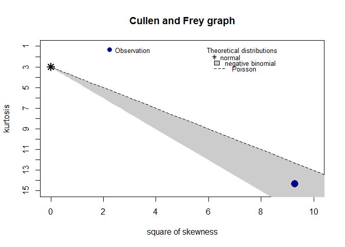
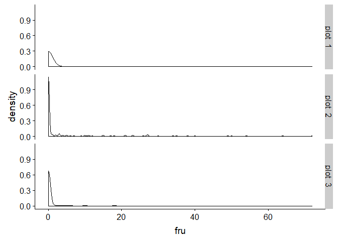

data\_analyses\_GxE
================
Rebecca Batstone
2019-08-20

Load packages
-------------

``` r
# packages
library("tidyverse") ## includes ggplot2, dplyr, readr, stringr
library("cowplot") ## paneled graphs
library("reshape2") ## dcast function
library("lme4") ## mixed effects models
library("emmeans") ## calc model-estimated means
library("DHARMa") ## residual diagnostics for glmm
library("fitdistrplus") ## probability distributions of data
library("car") ## Anova function
```

Spreadsheets
------------

``` r
# created using "data_setup.Rmd"
date <- format(Sys.Date())
load(paste0("combined_field_GH_", date, ".Rdata"))
load("./dataset_cleaned/shoot_cleaned.Rdata")
load("./dataset_cleaned/survival_cleaned.Rdata")
load("./dataset_cleaned/leaves_cleaned.Rdata")
load("./dataset_cleaned/nods_cleaned.Rdata")
load("./dataset_cleaned/choice_cleaned.Rdata")
load("./dataset_cleaned/red_nod_cleaned.Rdata")
load("./dataset_cleaned/flowers_cleaned.Rdata")
load("./dataset_cleaned/fruits_cleaned.Rdata")
```

Set to effects contrasts
------------------------

``` r
options(contrasts = rep ("contr.sum", 2)) 
```

GLMs (line as fixed effect)
---------------------------

### glm1: shoot

``` r
# prob dist
ggplot(data=shoot_cc, aes(x=shoot)) + geom_density() + facet_grid(env ~.) ## highly right-skewed
```


``` r
descdist(shoot_cc$shoot, discrete = FALSE)
```


    ## summary statistics
    ## ------
    ## min:  0.8   max:  5131.7 
    ## median:  49.7 
    ## mean:  197.8709 
    ## estimated sd:  415.7647 
    ## estimated skewness:  4.925166 
    ## estimated kurtosis:  39.46961

``` r
## normal, gamma, log normal options
fit.gamma <- fitdist(shoot_cc$shoot, "gamma")
fit.norm <- fitdist(shoot_cc$shoot, "norm")
fit.lnorm <- fitdist(shoot_cc$shoot, "lnorm")
plot(fit.gamma)
```


``` r
plot(fit.norm)
```


``` r
plot(fit.lnorm)
```


``` r
fit.gamma$aic 
```

    ## [1] 9909.188

``` r
fit.norm$aic 
```

    ## [1] 12264.15

``` r
fit.lnorm$aic
```

    ## [1] 9686.514

``` r
## lnorm, gamma, norm (best to worst)

# model
glm1 <- glm(shoot ~ env * line,
            family = Gamma(link="log"),
            data = shoot_cc)

# residual diagnostics
simuOut_glm1 <- simulateResiduals(fittedModel = glm1, n = 1000)
```

    ## Model family was recognized or set as continuous, but duplicate values were detected in the response. Consider if you are fitting an appropriate model.

``` r
plot(simuOut_glm1) ## OK
```


``` r
testDispersion(simuOut_glm1) ## NS
```


    ## 
    ##  DHARMa nonparametric dispersion test via sd of residuals fitted
    ##  vs. simulated
    ## 
    ## data:  simulationOutput
    ## ratioObsSim = 1.0331, p-value = 0.698
    ## alternative hypothesis: two.sided

``` r
# model summary
summary(glm1)
```

    ## 
    ## Call:
    ## glm(formula = shoot ~ env * line, family = Gamma(link = "log"), 
    ##     data = shoot_cc)
    ## 
    ## Deviance Residuals: 
    ##     Min       1Q   Median       3Q      Max  
    ## -2.9530  -1.3287  -0.5192   0.3713   2.6646  
    ## 
    ## Coefficients:
    ##               Estimate Std. Error t value Pr(>|t|)    
    ## (Intercept)  4.6174210  0.0521169  88.597  < 2e-16 ***
    ## env1        -0.9475417  0.0822678 -11.518  < 2e-16 ***
    ## env2         0.3904331  0.0974691   4.006 6.86e-05 ***
    ## env3         1.5168315  0.0957829  15.836  < 2e-16 ***
    ## env4         0.2133863  0.0981675   2.174 0.030068 *  
    ## line1       -0.1419707  0.3617949  -0.392 0.694879    
    ## line2        0.4117769  0.2282808   1.804 0.071697 .  
    ## line3        0.2600551  0.2323049   1.119 0.263336    
    ## line4        0.1187207  0.2211255   0.537 0.591515    
    ## line5       -0.1163227  0.2668009  -0.436 0.662980    
    ## line6       -0.2184729  0.2485178  -0.879 0.379652    
    ## line7        0.1591760  0.3225045   0.494 0.621773    
    ## line8        0.4565233  0.3093936   1.476 0.140524    
    ## line9        0.1100931  0.2077486   0.530 0.596328    
    ## line10       0.1641373  0.2159654   0.760 0.447505    
    ## line11      -0.3196670  0.2432002  -1.314 0.189143    
    ## line12       0.2953492  0.2036728   1.450 0.147482    
    ## line13      -0.1457628  0.2999011  -0.486 0.627096    
    ## line14       0.6618089  0.2668009   2.481 0.013357 *  
    ## line15       0.3040882  0.2605764   1.167 0.243622    
    ## line16      -0.9910716  0.2755707  -3.596 0.000346 ***
    ## line17      -0.1468094  0.3084900  -0.476 0.634299    
    ## line18      -0.1457012  0.2206200  -0.660 0.509207    
    ## line19       0.3297243  0.2619014   1.259 0.208470    
    ## line20      -0.5807745  0.2688437  -2.160 0.031097 *  
    ## line21      -0.0055475  0.2730061  -0.020 0.983794    
    ## line22      -0.3603603  0.2595929  -1.388 0.165533    
    ## line23      -0.4132712  0.2361660  -1.750 0.080578 .  
    ## line24      -0.1812549  0.2146690  -0.844 0.398770    
    ## line25       0.4903951  0.2607840   1.880 0.060467 .  
    ## line26       0.1605733  0.3159994   0.508 0.611515    
    ## env1:line1   0.2318424  0.4782647   0.485 0.628003    
    ## env2:line1   1.2284009  0.6473399   1.898 0.058165 .  
    ## env3:line1   0.5546471  0.6470882   0.857 0.391664    
    ## env4:line1  -0.2166266  0.7482448  -0.290 0.772276    
    ## env1:line2  -0.0433338  0.3872386  -0.112 0.910932    
    ## env2:line2  -0.7790937  0.4771978  -1.633 0.103002    
    ## env3:line2  -0.0462925  0.4463799  -0.104 0.917433    
    ## env4:line2   0.8699911  0.4773410   1.823 0.068801 .  
    ## env1:line3   0.1589804  0.4043896   0.393 0.694340    
    ## env2:line3   1.1036456  0.5849094   1.887 0.059599 .  
    ## env3:line3  -0.1233462  0.4254535  -0.290 0.771967    
    ## env4:line3  -0.6229859  0.4259966  -1.462 0.144083    
    ## env1:line4   0.3979926  0.3830641   1.039 0.299183    
    ## env2:line4  -0.9321696  0.4198421  -2.220 0.026724 *  
    ## env3:line4   0.1704090  0.4427633   0.385 0.700448    
    ## env4:line4   0.2117661  0.4739607   0.447 0.655159    
    ## env1:line5  -0.8404088  0.3995564  -2.103 0.035797 *  
    ## env2:line5  -0.0978920  0.4967780  -0.197 0.843844    
    ## env3:line5   0.3775543  0.4672532   0.808 0.419353    
    ## env4:line5   1.3295723  0.7072181   1.880 0.060530 .  
    ## env1:line6   1.1653451  0.4139160   2.815 0.005011 ** 
    ## env2:line6  -0.0172147  0.5287458  -0.033 0.974037    
    ## env3:line6  -0.1757455  0.5284376  -0.333 0.739556    
    ## env4:line6   0.8263376  0.3813383   2.167 0.030582 *  
    ## env1:line7   0.3803211  0.4387160   0.867 0.386301    
    ## env2:line7   0.5418725  0.5287862   1.025 0.305842    
    ## env3:line7  -0.6993369  0.6259686  -1.117 0.264296    
    ## env4:line7  -1.3440984  0.5016119  -2.680 0.007548 ** 
    ## env1:line8  -1.4024601  0.4399613  -3.188 0.001499 ** 
    ## env2:line8   0.3078421  0.5599423   0.550 0.582652    
    ## env3:line8  -0.6675455  0.4928156  -1.355 0.176004    
    ## env4:line8   0.1077163  0.4562440   0.236 0.813430    
    ## env1:line9   0.4344626  0.3755011   1.157 0.247665    
    ## env2:line9   0.3857569  0.3665437   1.052 0.292978    
    ## env3:line9   0.0736392  0.3554641   0.207 0.835943    
    ## env4:line9  -0.4684049  0.5109865  -0.917 0.359638    
    ## env1:line10 -0.5878759  0.3801087  -1.547 0.122420    
    ## env2:line10  0.2735958  0.3836859   0.713 0.476043    
    ## env3:line10  0.5967993  0.3982622   1.499 0.134460    
    ## env4:line10 -0.4399106  0.3714466  -1.184 0.236696    
    ## env1:line11 -0.8353667  0.3841991  -2.174 0.030022 *  
    ## env2:line11 -0.9853432  0.4140579  -2.380 0.017597 *  
    ## env3:line11  1.4166050  0.5890449   2.405 0.016439 *  
    ## env4:line11 -0.6322146  0.3998210  -1.581 0.114282    
    ## env1:line12 -0.2881206  0.3604792  -0.799 0.424409    
    ## env2:line12  0.0194000  0.4346853   0.045 0.964415    
    ## env3:line12  0.0595525  0.3764712   0.158 0.874357    
    ## env4:line12  0.5877595  0.3770850   1.559 0.119529    
    ## env1:line13 -0.4222506  0.4223781  -1.000 0.317808    
    ## env2:line13  0.7077024  0.5153119   1.373 0.170092    
    ## env3:line13 -0.1180870  0.4083396  -0.289 0.772524    
    ## env4:line13  1.2748863  0.4873869   2.616 0.009098 ** 
    ## env1:line14 -0.0737217  0.3995564  -0.185 0.853669    
    ## env2:line14 -0.2636130  0.7071215  -0.373 0.709414    
    ## env3:line14 -0.4543142  0.5372782  -0.846 0.398078    
    ## env4:line14  1.1435708  0.4677479   2.445 0.014741 *  
    ## env1:line15 -0.4510918  0.4212664  -1.071 0.284635    
    ## env2:line15  0.1606433  0.5345195   0.301 0.763858    
    ## env3:line15 -0.7890731  0.3803953  -2.074 0.038418 *  
    ## env4:line15 -0.0003921  0.4936014  -0.001 0.999366    
    ## env1:line16  0.8393053  0.4307024   1.949 0.051739 .  
    ## env2:line16 -0.1278235  0.5015425  -0.255 0.798907    
    ## env3:line16  0.0376391  0.4505377   0.084 0.933444    
    ## env4:line16 -0.6520067  0.6035141  -1.080 0.280365    
    ## env1:line17  0.9475375  0.4524726   2.094 0.036614 *  
    ## env2:line17  0.1130253  0.4717383   0.240 0.810717    
    ## env3:line17 -0.6402165  0.5591523  -1.145 0.252617    
    ## env4:line17  0.0439428  0.4556317   0.096 0.923196    
    ## env1:line18  0.6778139  0.3703185   1.830 0.067629 .  
    ## env2:line18 -0.6653270  0.5162211  -1.289 0.197887    
    ## env3:line18 -0.0474068  0.3735534  -0.127 0.899051    
    ## env4:line18 -0.0233666  0.4737251  -0.049 0.960674    
    ## env1:line19 -0.5281570  0.4079631  -1.295 0.195886    
    ## env2:line19 -0.4596586  0.4426774  -1.038 0.299467    
    ## env3:line19  0.2411317  0.5970091   0.404 0.686412    
    ## env4:line19 -0.5739499  0.3819101  -1.503 0.133339    
    ## env1:line20  0.0002493  0.4124543   0.001 0.999518    
    ## env2:line20 -0.1908016  0.4687704  -0.407 0.684116    
    ## env3:line20  0.0733784  0.4292419   0.171 0.864314    
    ## env4:line20  0.4549826  0.6004723   0.758 0.448885    
    ## env1:line21  0.5971365  0.4037264   1.479 0.139581    
    ## env2:line21 -0.0849569  0.5001380  -0.170 0.865165    
    ## env3:line21  0.1897739  0.4489737   0.423 0.672658    
    ## env4:line21 -0.6042827  0.6023474  -1.003 0.316111    
    ## env1:line22  0.9150633  0.4206588   2.175 0.029947 *  
    ## env2:line22 -0.3863645  0.3982252  -0.970 0.332280    
    ## env3:line22 -1.0675202  0.7042022  -1.516 0.129997    
    ## env4:line22  0.5122251  0.3886467   1.318 0.187952    
    ## env1:line23  0.7780374  0.3797855   2.049 0.040878 *  
    ## env2:line23 -0.0031737  0.4508249  -0.007 0.994385    
    ## env3:line23 -0.0569798  0.4806810  -0.119 0.905675    
    ## env4:line23 -0.0398045  0.4281144  -0.093 0.925949    
    ## env1:line24  0.0386624  0.3668043   0.105 0.916086    
    ## env2:line24 -0.7203811  0.4399449  -1.637 0.101997    
    ## env3:line24  0.3146636  0.4160863   0.756 0.449761    
    ## env4:line24 -0.1941722  0.3831361  -0.507 0.612460    
    ## env1:line25 -0.8010571  0.5944993  -1.347 0.178279    
    ## env2:line25  0.2986966  0.3737964   0.799 0.424515    
    ## env3:line25  0.3439362  0.4638439   0.741 0.458649    
    ## env4:line25 -0.5841272  0.5969073  -0.979 0.328127    
    ## env1:line26 -0.0212537  0.4738083  -0.045 0.964234    
    ## env2:line26 -0.0729916  0.5636192  -0.130 0.896996    
    ## env3:line26  0.2432899  0.4969894   0.490 0.624624    
    ## env4:line26  0.1380248  0.4974545   0.277 0.781509    
    ## ---
    ## Signif. codes:  0 '***' 0.001 '**' 0.01 '*' 0.05 '.' 0.1 ' ' 1
    ## 
    ## (Dispersion parameter for Gamma family taken to be 1.519394)
    ## 
    ##     Null deviance: 2261.9  on 822  degrees of freedom
    ## Residual deviance: 1240.2  on 688  degrees of freedom
    ## AIC: 9582.4
    ## 
    ## Number of Fisher Scoring iterations: 13

``` r
(ANODEV_shoot <- Anova(glm1, type = 2)) ## error if type 3 used, see message below:
```

    ## Analysis of Deviance Table (Type II tests)
    ## 
    ## Response: shoot
    ##          LR Chisq  Df Pr(>Chisq)    
    ## env        429.91   4  < 2.2e-16 ***
    ## line        55.65  26  0.0006269 ***
    ## env:line   169.50 104  5.257e-05 ***
    ## ---
    ## Signif. codes:  0 '***' 0.001 '**' 0.01 '*' 0.05 '.' 0.1 ' ' 1

``` r
# Error in glm.fit(x[, jj, drop = FALSE], y, wt, offset = object$offset,  :
#   NA/NaN/Inf in 'x'
# In addition: Warning message:
# step size truncated due to divergence
```

### glm2: survival

``` r
ggplot(data=survival_cc, aes(x=survival)) + geom_density() + facet_grid(env ~.) 
```


``` r
# prob dist
descdist(survival_cc$survival, discrete = TRUE)
```


    ## summary statistics
    ## ------
    ## min:  0   max:  1 
    ## median:  1 
    ## mean:  0.7445152 
    ## estimated sd:  0.4362878 
    ## estimated skewness:  -1.122478 
    ## estimated kurtosis:  2.258907

``` r
## normal, poisson, negative binomial options
fit.poiss <- fitdist(survival_cc$survival, "pois")
fit.norm <- fitdist(survival_cc$survival, "norm")
fit.nbinom <- fitdist(survival_cc$survival, "nbinom")
plot(fit.norm)
```


``` r
plot(fit.nbinom)
```


``` r
plot(fit.poiss)
```


``` r
fit.poiss$aic 
```

    ## [1] 2726.726

``` r
fit.norm$aic 
```

    ## [1] 1668.885

``` r
fit.nbinom$aic
```

    ## [1] 2728.726

``` r
## norm, poisson, nbinom (best to worst)

# model
glm2 <- glm(survival ~ env * line,
             family = binomial,
               data = survival_cc)

# residual diagnostics
simuOut_glm2 <- simulateResiduals(fittedModel = glm2, n = 1000)
plot(simuOut_glm2) ## OK
```


``` r
testDispersion(simuOut_glm2) ## NS
```


    ## 
    ##  DHARMa nonparametric dispersion test via sd of residuals fitted
    ##  vs. simulated
    ## 
    ## data:  simulationOutput
    ## ratioObsSim = 1.001, p-value = 0.958
    ## alternative hypothesis: two.sided

``` r
# model summary
summary(glm2)
```

    ## 
    ## Call:
    ## glm(formula = survival ~ env * line, family = binomial, data = survival_cc)
    ## 
    ## Deviance Residuals: 
    ##     Min       1Q   Median       3Q      Max  
    ## -2.3272  -0.8446   0.5168   0.8203   1.5518  
    ## 
    ## Coefficients:
    ##               Estimate Std. Error z value Pr(>|z|)
    ## (Intercept)    4.22559  107.42857   0.039    0.969
    ## env1          -2.30790  135.75388  -0.017    0.986
    ## env2           4.69070  265.12551   0.018    0.986
    ## env3           2.29603  251.28906   0.009    0.993
    ## env4          -0.99119  225.53267  -0.004    0.996
    ## line1         -0.23512  735.51857   0.000    1.000
    ## line2          0.45488  525.60850   0.001    0.999
    ## line3         -3.24454  107.42918  -0.030    0.976
    ## line4          3.89398  659.61976   0.006    0.995
    ## line5         -0.06566  525.60850   0.000    1.000
    ## line6         -0.33888 1264.86381   0.000    1.000
    ## line7          3.36053  728.56425   0.005    0.996
    ## line8         -3.40673  107.42942  -0.032    0.975
    ## line9          0.18077  525.60847   0.000    1.000
    ## line10        -2.60729  107.42926  -0.024    0.981
    ## line11         4.08700  566.02546   0.007    0.994
    ## line12         0.29269  735.51859   0.000    1.000
    ## line13        -2.92265  107.42912  -0.027    0.978
    ## line14        -0.13047  433.61638   0.000    1.000
    ## line15         0.55704  639.23858   0.001    0.999
    ## line16         0.43380  639.23855   0.001    0.999
    ## line17        -0.19866  433.61637   0.000    1.000
    ## line18        -3.08484  107.42923  -0.029    0.977
    ## line19         0.11817  412.76502   0.000    1.000
    ## line20         3.93861  770.67001   0.005    0.996
    ## line21         0.22540  433.61641   0.001    1.000
    ## line22        -3.56643  107.42909  -0.033    0.974
    ## line23        -3.76259  107.42903  -0.035    0.972
    ## line24         7.42184 1092.06870   0.007    0.995
    ## line25         3.56646  672.86435   0.005    0.996
    ## line26        -6.67828  639.23857  -0.010    0.992
    ## line27         0.38721  458.34861   0.001    0.999
    ## line28         0.63622  525.60853   0.001    0.999
    ## line29         0.07297  488.31005   0.000    1.000
    ## env1:line1    -0.29628  740.18656   0.000    1.000
    ## env2:line1     9.88489 2922.57367   0.003    0.997
    ## env3:line1    -5.43920  769.80071  -0.007    0.994
    ## env4:line1    -2.99929  761.78226  -0.004    0.997
    ## env1:line2    -1.96711  532.12098  -0.004    0.997
    ## env2:line2    -7.42526  578.80530  -0.013    0.990
    ## env3:line2    11.58957 2073.33521   0.006    0.996
    ## env4:line2    -2.30299  561.77285  -0.004    0.997
    ## env1:line3     1.73231  135.75522   0.013    0.990
    ## env2:line3    -4.06232  265.12703  -0.015    0.988
    ## env3:line3    -1.19764  251.29057  -0.005    0.996
    ## env4:line3     0.82106  225.53341   0.004    0.997
    ## env1:line4    -4.42538  664.82087  -0.007    0.995
    ## env2:line4     5.75579 1695.98305   0.003    0.997
    ## env3:line4     8.15046 2111.29177   0.004    0.997
    ## env4:line4    -6.14756  688.78340  -0.009    0.993
    ## env1:line5    -1.00473  532.12102  -0.002    0.998
    ## env2:line5     9.71543 2075.05766   0.005    0.996
    ## env3:line5    -4.37652  572.59953  -0.008    0.994
    ## env4:line5    -3.86189  561.77291  -0.007    0.995
    ## env1:line6    -1.35567 1267.58389  -0.001    0.999
    ## env2:line6    -9.13703 1287.87861  -0.007    0.994
    ## env3:line6    -5.26645 1285.10153  -0.004    0.997
    ## env4:line6    15.67054 5046.21610   0.003    0.998
    ## env1:line7    -4.76740  733.27647  -0.007    0.995
    ## env2:line7   -11.42953  767.82601  -0.015    0.988
    ## env3:line7     8.68391 2557.08530   0.003    0.997
    ## env4:line7    11.97113 1550.10633   0.008    0.994
    ## env1:line8     2.87533  135.75584   0.021    0.983
    ## env2:line8    -4.41096  265.12656  -0.017    0.987
    ## env3:line8    -1.50546  251.29076  -0.006    0.995
    ## env4:line8     0.17232  225.53358   0.001    0.999
    ## env1:line9    -1.40531  532.12101  -0.003    0.998
    ## env2:line9     9.46901 2075.05765   0.005    0.996
    ## env3:line9    -5.31610  572.59926  -0.009    0.993
    ## env4:line9    -2.94517  561.77267  -0.005    0.996
    ## env1:line10    2.76904  135.75675   0.020    0.984
    ## env2:line10   -4.69957  265.12643  -0.018    0.986
    ## env3:line10   -1.96842  251.28999  -0.008    0.994
    ## env4:line10   -0.11629  225.53367  -0.001    1.000
    ## env1:line11   -5.15739  572.07806  -0.009    0.993
    ## env2:line11    5.56278 1537.71263   0.004    0.997
    ## env3:line11    7.95745 1737.59115   0.005    0.996
    ## env4:line11   -4.83650  599.75788  -0.008    0.994
    ## env1:line12   -2.61585  740.18649  -0.004    0.997
    ## env2:line12   -6.56993  774.42807  -0.008    0.993
    ## env3:line12   11.75175 2921.35100   0.004    0.997
    ## env4:line12   -1.04219  761.78231  -0.001    0.999
    ## env1:line13    1.41042  135.75517   0.010    0.992
    ## env2:line13   -3.79642  265.12691  -0.014    0.989
    ## env3:line13   -1.51953  251.28992  -0.006    0.995
    ## env4:line13    0.60454  225.53337   0.003    0.998
    ## env1:line14   -1.78722  441.48795  -0.004    0.997
    ## env2:line14    9.78024 1701.17803   0.006    0.995
    ## env3:line14   -5.98569  489.51870  -0.012    0.990
    ## env4:line14   -2.00532  476.80985  -0.004    0.997
    ## env1:line15   -0.27751  644.60438   0.000    1.000
    ## env2:line15    9.09273 2534.49221   0.004    0.997
    ## env3:line15   -7.07866  678.40367  -0.010    0.992
    ## env4:line15   -2.58748  669.29089  -0.004    0.997
    ## env1:line16   -1.09874  644.60414  -0.002    0.999
    ## env2:line16    9.21597 2534.49216   0.004    0.997
    ## env3:line16   -6.36764  678.40350  -0.009    0.993
    ## env4:line16   -1.87645  669.29117  -0.003    0.998
    ## env1:line17   -1.02589  441.48800  -0.002    0.998
    ## env2:line17    9.84843 1701.17802   0.006    0.995
    ## env3:line17   -5.22435  489.51875  -0.011    0.991
    ## env4:line17   -3.54658  476.80976  -0.007    0.994
    ## env1:line18    2.26576  135.75578   0.017    0.987
    ## env2:line18   -3.52887  265.12695  -0.013    0.989
    ## env3:line18   -1.82735  251.29068  -0.007    0.994
    ## env4:line18    0.25590  225.53334   0.001    0.999
    ## env1:line19   16.53021 1599.92898   0.010    0.992
    ## env2:line19   -7.93585  478.67144  -0.017    0.987
    ## env3:line19   -4.76799  471.14815  -0.010    0.992
    ## env4:line19   -3.57572  457.92923  -0.008    0.994
    ## env1:line20   -4.47001  775.12633  -0.006    0.995
    ## env2:line20    5.71116 2327.59580   0.002    0.998
    ## env3:line20   -8.85080  803.45394  -0.011    0.991
    ## env4:line20   11.39305 2145.71799   0.005    0.996
    ## env1:line21   -1.29579  441.48802  -0.003    0.998
    ## env2:line21    9.42438 1701.17804   0.006    0.996
    ## env3:line21   -5.36072  489.51934  -0.011    0.991
    ## env4:line21   -2.69766  476.80960  -0.006    0.995
    ## env1:line22    1.42559  135.75522   0.011    0.992
    ## env2:line22   -3.84579  265.12637  -0.015    0.988
    ## env3:line22   -2.03891  251.28967  -0.008    0.994
    ## env4:line22    0.73748  225.53396   0.003    0.997
    ## env1:line23    2.25036  135.75510   0.017    0.987
    ## env2:line23   -4.05509  265.12617  -0.015    0.988
    ## env3:line23   -2.06588  251.28968  -0.008    0.993
    ## env4:line23    0.24050  225.53362   0.001    0.999
    ## env1:line24   -8.64639 1095.21804  -0.008    0.994
    ## env2:line24    2.22793 1756.15045   0.001    0.999
    ## env3:line24    4.62260 3030.82794   0.002    0.999
    ## env4:line24   -8.81042 1109.92719  -0.008    0.994
    ## env1:line25   -4.63686  677.96381  -0.007    0.995
    ## env2:line25    6.08331 1777.28162   0.003    0.997
    ## env3:line25    8.47799 2115.46714   0.004    0.997
    ## env4:line25   -5.82004  701.47757  -0.008    0.993
    ## env1:line26    4.76059  644.60405   0.007    0.994
    ## env2:line26    0.24689  683.64990   0.000    1.000
    ## env3:line26    2.10257  678.40392   0.003    0.998
    ## env4:line26    5.31568  669.29094   0.008    0.994
    ## env1:line27   -1.74529  465.80241  -0.004    0.997
    ## env2:line27   -9.01582  518.49229  -0.017    0.986
    ## env3:line27   11.65723 1799.95158   0.006    0.995
    ## env4:line27   -1.91687  499.40752  -0.004    0.997
    ## env1:line28   -1.86077  532.12119  -0.003    0.997
    ## env2:line28   -7.68071  578.80505  -0.013    0.989
    ## env3:line28   11.40822 2073.33522   0.006    0.996
    ## env4:line28   -2.48433  561.77319  -0.004    0.996
    ## env1:line29   16.57541 1910.21465   0.009    0.993
    ## env2:line29   -7.19750  545.15869  -0.013    0.989
    ## env3:line29   -5.74729  538.56501  -0.011    0.991
    ## env4:line29   -2.32655  527.03990  -0.004    0.996
    ## 
    ## (Dispersion parameter for binomial family taken to be 1)
    ## 
    ##     Null deviance: 1606.0  on 1412  degrees of freedom
    ## Residual deviance: 1322.7  on 1263  degrees of freedom
    ## AIC: 1622.7
    ## 
    ## Number of Fisher Scoring iterations: 17

``` r
(ANODEV_survival <- Anova(glm2, type = 3)) 
```

    ## Warning: glm.fit: fitted probabilities numerically 0 or 1 occurred

    ## Analysis of Deviance Table (Type III tests)
    ## 
    ## Response: survival
    ##          LR Chisq  Df Pr(>Chisq)    
    ## env         0.000   4  1.0000000    
    ## line       45.457  29  0.0265494 *  
    ## env:line  180.003 116  0.0001299 ***
    ## ---
    ## Signif. codes:  0 '***' 0.001 '**' 0.01 '*' 0.05 '.' 0.1 ' ' 1

### glm3: leaf

``` r
# prob dist
ggplot(data=leaf_cc, aes(x=leaf)) + geom_density() + facet_grid(env ~.) ## highly right-skewed
```


``` r
descdist(leaf_cc$leaf, discrete = TRUE)
```



    ## summary statistics
    ## ------
    ## min:  0   max:  541 
    ## median:  16 
    ## mean:  45.17661 
    ## estimated sd:  70.56839 
    ## estimated skewness:  3.046316 
    ## estimated kurtosis:  14.34338

``` r
## normal, poisson, negative binomial options
fit.poiss <- fitdist(leaf_cc$leaf, "pois")
fit.norm <- fitdist(leaf_cc$leaf, "norm")
fit.nbinom <- fitdist(leaf_cc$leaf, "nbinom")
plot(fit.norm)
```


``` r
plot(fit.nbinom)
```


``` r
plot(fit.poiss)
```


``` r
fit.poiss$aic
```

    ## [1] 64536.3

``` r
fit.norm$aic 
```

    ## [1] 9708.14

``` r
fit.nbinom$aic 
```

    ## [1] 8140.491

``` r
## nbinom, norm, poiss (best to worst)

# model
glm3 <- glm.nb(leaf ~ env * line, 
            data = leaf_cc)

# residual diagnostics
simOut_glm3 <- simulateResiduals(fittedModel = glm3, n = 1000)
plot(simOut_glm3) ## OK
```


``` r
testDispersion(simOut_glm3) ## NS
```


    ## 
    ##  DHARMa nonparametric dispersion test via sd of residuals fitted
    ##  vs. simulated
    ## 
    ## data:  simulationOutput
    ## ratioObsSim = 1.0932, p-value = 0.256
    ## alternative hypothesis: two.sided

``` r
# model summary
summary(glm3)
```

    ## 
    ## Call:
    ## glm.nb(formula = leaf ~ env * line, data = leaf_cc, init.theta = 1.323873431, 
    ##     link = log)
    ## 
    ## Deviance Residuals: 
    ##     Min       1Q   Median       3Q      Max  
    ## -3.4576  -0.9909  -0.2069   0.3655   2.5940  
    ## 
    ## Coefficients:
    ##               Estimate Std. Error z value Pr(>|z|)
    ## (Intercept)   3.020330  21.247204   0.142    0.887
    ## env1         -0.775930  21.247256  -0.037    0.971
    ## env2          0.897454  21.247285   0.042    0.966
    ## env3          1.467041  21.247276   0.069    0.945
    ## env4          0.634669  21.247297   0.030    0.976
    ## line1        -3.578756 405.926692  -0.009    0.993
    ## line2         0.552026  21.247803   0.026    0.979
    ## line3         0.596763  21.247837   0.028    0.978
    ## line4         0.283772  21.247741   0.013    0.989
    ## line5         0.053840  21.248142   0.003    0.998
    ## line6        -0.261680  21.248777  -0.012    0.990
    ## line7         0.199539  21.248030   0.009    0.993
    ## line8         0.110091  21.248510   0.005    0.996
    ## line9         0.863215  21.247986   0.041    0.968
    ## line10        0.518602  21.247672   0.024    0.981
    ## line11        0.282292  21.247690   0.013    0.989
    ## line12        0.065405  21.247917   0.003    0.998
    ## line13        0.522544  21.247748   0.025    0.980
    ## line14        0.416270  21.248367   0.020    0.984
    ## line15        0.732866  21.247915   0.034    0.972
    ## line16        0.449816  21.248021   0.021    0.983
    ## line17       -0.013947  21.248161  -0.001    0.999
    ## line18        0.264405  21.248334   0.012    0.990
    ## line19        0.249336  21.247741   0.012    0.991
    ## line20       -3.239152 405.926680  -0.008    0.994
    ## line21        0.535189  21.247892   0.025    0.980
    ## line22       -0.416889  21.248327  -0.020    0.984
    ## line23        0.206480  21.248215   0.010    0.992
    ## line24       -0.255605  21.248159  -0.012    0.990
    ## line25       -0.264745  21.247948  -0.012    0.990
    ## line26        0.099983  21.247741   0.005    0.996
    ## line27        0.467134  21.247931   0.022    0.982
    ## env1:line1    3.543851 405.926761   0.009    0.993
    ## env2:line1    3.631264 405.926873   0.009    0.993
    ## env3:line1    3.649463 405.926801   0.009    0.993
    ## env4:line1    2.696346 405.926977   0.007    0.995
    ## env1:line2   -0.311519  21.249230  -0.015    0.988
    ## env2:line2   -0.732141  21.249927  -0.034    0.973
    ## env3:line2   -0.254688  21.249544  -0.012    0.990
    ## env4:line2    0.305664  21.249571   0.014    0.989
    ## env1:line3   -0.377310  21.249266  -0.018    0.986
    ## env2:line3    0.808462  21.251240   0.038    0.970
    ## env3:line3   -0.466190  21.249342  -0.022    0.982
    ## env4:line3   -0.768327  21.249402  -0.036    0.971
    ## env1:line4   -0.071436  21.249018  -0.003    0.997
    ## env2:line4   -0.819591  21.249300  -0.039    0.969
    ## env3:line4   -0.312928  21.249489  -0.015    0.988
    ## env4:line4   -0.094722  21.249289  -0.004    0.996
    ## env1:line5   -0.441942  21.249389  -0.021    0.983
    ## env2:line5   -0.639420  21.250297  -0.030    0.976
    ## env3:line5    0.033499  21.250222   0.002    0.999
    ## env4:line5    0.982508  21.253246   0.046    0.963
    ## env1:line6   -0.001719  21.250293   0.000    1.000
    ## env2:line6   -0.115146  21.253999  -0.005    0.996
    ## env3:line6   -0.048744  21.250534  -0.002    0.998
    ## env4:line6   -1.196095  21.260227  -0.056    0.955
    ## env1:line7    0.292283  21.249618   0.014    0.989
    ## env2:line7   -0.554857  21.250679  -0.026    0.979
    ## env3:line7   -0.396451  21.250622  -0.019    0.985
    ## env4:line7    0.557048  21.249129   0.026    0.979
    ## env1:line8    0.043405  21.249671   0.002    0.998
    ## env2:line8    0.209126  21.250609   0.010    0.992
    ## env3:line8   -0.942484  21.251996  -0.044    0.965
    ## env4:line8   -0.967809  21.250744  -0.046    0.964
    ## env1:line9   -1.056344  21.249326  -0.050    0.960
    ## env2:line9   -0.568872  21.250592  -0.027    0.979
    ## env3:line9   -0.721421  21.249491  -0.034    0.973
    ## env4:line9   -0.136187  21.249518  -0.006    0.995
    ## env1:line10  -0.365107  21.248957  -0.017    0.986
    ## env2:line10   0.014466  21.248759   0.001    0.999
    ## env3:line10  -0.152524  21.248654  -0.007    0.994
    ## env4:line10  -0.746087  21.249831  -0.035    0.972
    ## env1:line11  -0.386625  21.248887  -0.018    0.985
    ## env2:line11  -0.242443  21.248899  -0.011    0.991
    ## env3:line11  -0.267080  21.249018  -0.013    0.990
    ## env4:line11  -0.569995  21.248819  -0.027    0.979
    ## env1:line12  -0.605057  21.249197  -0.028    0.977
    ## env2:line12  -1.120988  21.249329  -0.053    0.958
    ## env3:line12   0.753840  21.251311   0.035    0.972
    ## env4:line12  -0.730243  21.249183  -0.034    0.973
    ## env1:line13  -0.444556  21.248919  -0.021    0.983
    ## env2:line13   0.179731  21.250337   0.008    0.993
    ## env3:line13  -0.095925  21.248729  -0.005    0.996
    ## env4:line13   0.070952  21.248962   0.003    0.997
    ## env1:line14  -0.920203  21.249639  -0.043    0.965
    ## env2:line14   0.409137  21.250452   0.019    0.985
    ## env3:line14  -0.424558  21.249213  -0.020    0.984
    ## env4:line14   0.203080  21.250141   0.010    0.992
    ## env1:line15  -0.359869  21.249053  -0.017    0.986
    ## env2:line15  -0.486572  21.251365  -0.023    0.982
    ## env3:line15  -0.316816  21.250487  -0.015    0.988
    ## env4:line15   0.541457  21.249436   0.025    0.980
    ## env1:line16  -0.336061  21.249665  -0.016    0.987
    ## env2:line16  -0.144423  21.250626  -0.007    0.995
    ## env3:line16  -0.904992  21.248873  -0.043    0.966
    ## env4:line16  -0.200825  21.250148  -0.009    0.992
    ## env1:line17   0.180346  21.249796   0.008    0.993
    ## env2:line17  -0.489395  21.250309  -0.023    0.982
    ## env3:line17  -0.259447  21.249496  -0.012    0.990
    ## env4:line17  -0.520157  21.251748  -0.024    0.980
    ## env1:line18   0.075193  21.249747   0.004    0.997
    ## env2:line18  -0.332042  21.249687  -0.016    0.988
    ## env3:line18  -0.500429  21.250424  -0.024    0.981
    ## env4:line18  -0.666127  21.249728  -0.031    0.975
    ## env1:line19  -0.151930  21.248910  -0.007    0.994
    ## env2:line19  -0.685881  21.250399  -0.032    0.974
    ## env3:line19  -0.061545  21.248649  -0.003    0.998
    ## env4:line19  -0.805746  21.249584  -0.038    0.970
    ## env1:line20   3.191977 405.926749   0.008    0.994
    ## env2:line20   3.158667 405.926791   0.008    0.994
    ## env3:line20   3.479168 405.926789   0.009    0.993
    ## env4:line20   4.030718 405.926861   0.010    0.992
    ## env1:line21  -0.633008  21.249215  -0.030    0.976
    ## env2:line21  -0.615058  21.249428  -0.029    0.977
    ## env3:line21  -0.119758  21.251298  -0.006    0.996
    ## env4:line21  -0.491739  21.248772  -0.023    0.982
    ## env1:line22  -0.035751  21.249722  -0.002    0.999
    ## env2:line22  -0.056213  21.250128  -0.003    0.998
    ## env3:line22  -0.085209  21.249414  -0.004    0.997
    ## env4:line22   0.151914  21.251868   0.007    0.994
    ## env1:line23   0.096828  21.249481   0.005    0.996
    ## env2:line23   0.532865  21.249967   0.025    0.980
    ## env3:line23  -0.095371  21.249960  -0.004    0.996
    ## env4:line23  -0.629358  21.251781  -0.030    0.976
    ## env1:line24   0.420400  21.249596   0.020    0.984
    ## env2:line24  -0.329975  21.249392  -0.016    0.988
    ## env3:line24  -0.690807  21.253372  -0.033    0.974
    ## env4:line24   0.631047  21.248976   0.030    0.976
    ## env1:line25   0.124479  21.249150   0.006    0.995
    ## env2:line25   0.014786  21.249735   0.001    0.999
    ## env3:line25  -0.148485  21.250045  -0.007    0.994
    ## env4:line25  -0.557041  21.249566  -0.026    0.979
    ## env1:line26  -0.264941  21.248947  -0.012    0.990
    ## env2:line26  -0.616570  21.249545  -0.029    0.977
    ## env3:line26   0.179084  21.249482   0.008    0.993
    ## env4:line26  -0.317417  21.248981  -0.015    0.988
    ## env1:line27  -0.730533  21.250910  -0.034    0.973
    ## env2:line27  -0.024273  21.248786  -0.001    0.999
    ## env3:line27  -0.502099  21.249679  -0.024    0.981
    ## env4:line27  -0.484548  21.251440  -0.023    0.982
    ## 
    ## (Dispersion parameter for Negative Binomial(1.3239) family taken to be 1)
    ## 
    ##     Null deviance: 1976.94  on 854  degrees of freedom
    ## Residual deviance:  933.97  on 715  degrees of freedom
    ## AIC: 7695.8
    ## 
    ## Number of Fisher Scoring iterations: 1
    ## 
    ## 
    ##               Theta:  1.3239 
    ##           Std. Err.:  0.0631 
    ## 
    ##  2 x log-likelihood:  -7413.7500

``` r
(ANODEV_leaf <- Anova(glm3, type = 2)) ## error if type 3 used, see message below:
```

    ## Analysis of Deviance Table (Type II tests)
    ## 
    ## Response: leaf
    ##          LR Chisq  Df Pr(>Chisq)    
    ## env        773.71   4  < 2.2e-16 ***
    ## line        71.71  27  6.368e-06 ***
    ## env:line   175.30 108  4.519e-05 ***
    ## ---
    ## Signif. codes:  0 '***' 0.001 '**' 0.01 '*' 0.05 '.' 0.1 ' ' 1

``` r
# Error in glm.fit(x[, jj, drop = FALSE], y, wt, offset = object$offset,  :
#   NA/NaN/Inf in 'x'
# In addition: Warning message:
# step size truncated due to divergence
```

### glm4: nod

``` r
# prob dist
ggplot(data=nod_cc, aes(x=nod)) + geom_density() + facet_grid(env ~.) ## highly right-skewed
```


``` r
descdist(nod_cc$nod, discrete = TRUE)
```


    ## summary statistics
    ## ------
    ## min:  0   max:  856 
    ## median:  19 
    ## mean:  62.20609 
    ## estimated sd:  118.9718 
    ## estimated skewness:  3.782906 
    ## estimated kurtosis:  19.67637

``` r
## normal, poisson, negative binomial options
fit.poiss <- fitdist(nod_cc$nod, "pois")
fit.norm <- fitdist(nod_cc$nod, "norm")
fit.nbinom <- fitdist(nod_cc$nod, "nbinom")
plot(fit.norm)
```


``` r
plot(fit.nbinom)
```


``` r
plot(fit.poiss)
```


``` r
fit.poiss$aic
```

    ## [1] 107953.7

``` r
fit.norm$aic 
```

    ## [1] 10588.89

``` r
fit.nbinom$aic 
```

    ## [1] 8559.935

``` r
## nbinom, norm, poisson (best to worst)

# model
glm4 <- glm.nb(nod ~ env * line, 
            data = nod_cc)

# residual diagnostics
simOut_glm4 <- simulateResiduals(fittedModel = glm4, n = 1000)
plot(simOut_glm4) ## OK
```


``` r
testDispersion(simOut_glm4) ## NS
```


    ## 
    ##  DHARMa nonparametric dispersion test via sd of residuals fitted
    ##  vs. simulated
    ## 
    ## data:  simulationOutput
    ## ratioObsSim = 1.0336, p-value = 0.672
    ## alternative hypothesis: two.sided

``` r
# model summary
summary(glm4)
```

    ## 
    ## Call:
    ## glm.nb(formula = nod ~ env * line, data = nod_cc, init.theta = 1.056339281, 
    ##     link = log)
    ## 
    ## Deviance Residuals: 
    ##     Min       1Q   Median       3Q      Max  
    ## -3.4133  -0.9817  -0.2402   0.3742   2.7545  
    ## 
    ## Coefficients:
    ##              Estimate Std. Error z value Pr(>|z|)    
    ## (Intercept)  3.402324   0.041606  81.775  < 2e-16 ***
    ## env1         1.533899   0.065059  23.577  < 2e-16 ***
    ## env2        -0.123920   0.078251  -1.584 0.113278    
    ## env3        -0.045227   0.075145  -0.602 0.547269    
    ## env4        -0.532245   0.082523  -6.450 1.12e-10 ***
    ## line1       -0.554765   0.300118  -1.848 0.064531 .  
    ## line2        0.217354   0.181879   1.195 0.232068    
    ## line3        0.087067   0.186078   0.468 0.639853    
    ## line4       -0.264480   0.175774  -1.505 0.132411    
    ## line5       -0.316545   0.232598  -1.361 0.173542    
    ## line6       -0.289615   0.288514  -1.004 0.315466    
    ## line7        0.275861   0.203150   1.358 0.174491    
    ## line8        0.529630   0.260860   2.030 0.042324 *  
    ## line9       -0.131940   0.196665  -0.671 0.502290    
    ## line10       0.303451   0.161750   1.876 0.060648 .  
    ## line11      -0.022620   0.165232  -0.137 0.891113    
    ## line12      -0.164474   0.196080  -0.839 0.401576    
    ## line13       0.330483   0.170557   1.938 0.052664 .  
    ## line14      -0.085065   0.245435  -0.347 0.728901    
    ## line15       0.135211   0.199460   0.678 0.497846    
    ## line16       0.378093   0.209971   1.801 0.071751 .  
    ## line17      -0.215652   0.223129  -0.966 0.333799    
    ## line18       0.080913   0.243559   0.332 0.739731    
    ## line19       0.018714   0.173964   0.108 0.914333    
    ## line20       0.111664   0.271827   0.411 0.681226    
    ## line21      -0.038253   0.196681  -0.194 0.845789    
    ## line22      -0.409662   0.219473  -1.867 0.061962 .  
    ## line23       0.518678   0.219467   2.363 0.018111 *  
    ## line24      -0.345424   0.211896  -1.630 0.103067    
    ## line25       0.197318   0.192383   1.026 0.305054    
    ## line26      -0.316893   0.172465  -1.837 0.066146 .  
    ## line27      -0.060219   0.206213  -0.292 0.770269    
    ## env1:line1   0.455706   0.389443   1.170 0.241942    
    ## env2:line1  -0.084581   0.532482  -0.159 0.873792    
    ## env3:line1   0.558044   0.450934   1.238 0.215891    
    ## env4:line1  -0.300410   0.629290  -0.477 0.633092    
    ## env1:line2  -0.185501   0.319366  -0.581 0.561348    
    ## env2:line2  -0.441757   0.384985  -1.147 0.251190    
    ## env3:line2  -0.554026   0.359764  -1.540 0.123567    
    ## env4:line2   0.992926   0.357258   2.779 0.005448 ** 
    ## env1:line3  -0.034370   0.310083  -0.111 0.911744    
    ## env2:line3   0.572869   0.467380   1.226 0.220310    
    ## env3:line3  -0.052536   0.341418  -0.154 0.877708    
    ## env4:line3  -0.211708   0.346644  -0.611 0.541376    
    ## env1:line4   0.509417   0.303890   1.676 0.093675 .  
    ## env2:line4   0.265913   0.337092   0.789 0.430203    
    ## env3:line4  -0.148178   0.357217  -0.415 0.678280    
    ## env4:line4  -0.008214   0.342417  -0.024 0.980863    
    ## env1:line5  -0.232663   0.331722  -0.701 0.483066    
    ## env2:line5   0.528570   0.409117   1.292 0.196365    
    ## env3:line5   0.298770   0.409212   0.730 0.465322    
    ## env4:line5   0.559982   0.579030   0.967 0.333492    
    ## env1:line6  -0.006499   0.380713  -0.017 0.986380    
    ## env2:line6  -0.044350   0.604986  -0.073 0.941562    
    ## env3:line6   0.075233   0.423165   0.178 0.858892    
    ## env4:line6  -0.634553   0.833870  -0.761 0.446673    
    ## env1:line7   0.528915   0.331547   1.595 0.110647    
    ## env2:line7  -0.153067   0.426804  -0.359 0.719868    
    ## env3:line7   0.365243   0.423791   0.862 0.388771    
    ## env4:line7   0.112157   0.318174   0.353 0.724461    
    ## env1:line8  -0.099410   0.351500  -0.283 0.777319    
    ## env2:line8   0.091916   0.424478   0.217 0.828567    
    ## env3:line8   0.277351   0.500659   0.554 0.579599    
    ## env4:line8  -0.931609   0.433654  -2.148 0.031692 *  
    ## env1:line9  -0.051770   0.328189  -0.158 0.874658    
    ## env2:line9   0.536146   0.422410   1.269 0.204350    
    ## env3:line9  -0.108472   0.348519  -0.311 0.755621    
    ## env4:line9  -0.623605   0.358760  -1.738 0.082171 .  
    ## env1:line10  0.059754   0.295934   0.202 0.839982    
    ## env2:line10 -0.006705   0.291305  -0.023 0.981638    
    ## env3:line10  0.104871   0.281424   0.373 0.709413    
    ## env4:line10 -0.229091   0.377614  -0.607 0.544063    
    ## env1:line11 -0.362068   0.298428  -1.213 0.225034    
    ## env2:line11  0.299564   0.303423   0.987 0.323505    
    ## env3:line11 -0.554107   0.318535  -1.740 0.081939 .  
    ## env4:line11 -0.014246   0.297322  -0.048 0.961786    
    ## env1:line12 -1.188229   0.308609  -3.850 0.000118 ***
    ## env2:line12 -0.578251   0.338060  -1.710 0.087174 .  
    ## env3:line12  1.138111   0.469698   2.423 0.015390 *  
    ## env4:line12 -0.559023   0.330704  -1.690 0.090951 .  
    ## env1:line13 -0.378615   0.291125  -1.301 0.193422    
    ## env2:line13  0.180968   0.410471   0.441 0.659301    
    ## env3:line13  0.154800   0.286426   0.540 0.588883    
    ## env4:line13  0.170558   0.308056   0.554 0.579812    
    ## env1:line14 -0.271875   0.349254  -0.778 0.436306    
    ## env2:line14  0.041410   0.417735   0.099 0.921036    
    ## env3:line14 -0.005099   0.326128  -0.016 0.987525    
    ## env4:line14  0.235411   0.397179   0.593 0.553377    
    ## env1:line15  0.439978   0.308632   1.426 0.153992    
    ## env2:line15 -0.181493   0.476777  -0.381 0.703450    
    ## env3:line15  0.125344   0.423434   0.296 0.767216    
    ## env4:line15  0.347118   0.350708   0.990 0.322289    
    ## env1:line16 -0.051625   0.349783  -0.148 0.882666    
    ## env2:line16  0.104704   0.428458   0.244 0.806942    
    ## env3:line16 -0.705428   0.301075  -2.343 0.019128 *  
    ## env4:line16  0.166272   0.397891   0.418 0.676034    
    ## env1:line17  0.183645   0.358085   0.513 0.608054    
    ## env2:line17 -0.646838   0.411841  -1.571 0.116275    
    ## env3:line17 -0.081174   0.339422  -0.239 0.810986    
    ## env4:line17 -0.169520   0.496136  -0.342 0.732591    
    ## env1:line18  0.548343   0.357796   1.533 0.125385    
    ## env2:line18 -0.145453   0.363925  -0.400 0.689393    
    ## env3:line18 -0.690739   0.419363  -1.647 0.099535 .  
    ## env4:line18 -0.587781   0.369977  -1.589 0.112129    
    ## env1:line19  0.517334   0.292817   1.767 0.077270 .  
    ## env2:line19 -0.540278   0.418755  -1.290 0.196981    
    ## env3:line19 -0.117715   0.282696  -0.416 0.677118    
    ## env4:line19  0.443412   0.355757   1.246 0.212622    
    ## env1:line20 -1.056590   0.378954  -2.788 0.005301 ** 
    ## env2:line20  0.617265   0.431038   1.432 0.152131    
    ## env3:line20  0.418969   0.430784   0.973 0.330765    
    ## env4:line20  0.910078   0.508496   1.790 0.073495 .  
    ## env1:line21  0.190998   0.316496   0.603 0.546191    
    ## env2:line21 -0.349779   0.350491  -0.998 0.318295    
    ## env3:line21 -0.023007   0.474644  -0.048 0.961340    
    ## env4:line21  0.148403   0.294126   0.505 0.613871    
    ## env1:line22 -0.566806   0.332345  -1.705 0.088106 .  
    ## env2:line22  0.084430   0.381195   0.221 0.824712    
    ## env3:line22  0.402469   0.326775   1.232 0.218084    
    ## env4:line22  0.225160   0.491649   0.458 0.646974    
    ## env1:line23 -0.091524   0.330999  -0.277 0.782158    
    ## env2:line23  0.513717   0.376443   1.365 0.172359    
    ## env3:line23 -0.404845   0.377986  -1.071 0.284143    
    ## env4:line23 -0.224689   0.486725  -0.462 0.644343    
    ## env1:line24  0.333734   0.337396   0.989 0.322591    
    ## env2:line24 -0.652868   0.337974  -1.932 0.053395 .  
    ## env3:line24  0.079370   0.570256   0.139 0.889306    
    ## env4:line24  0.427275   0.299551   1.426 0.153758    
    ## env1:line25  0.354570   0.304115   1.166 0.243652    
    ## env2:line25  0.497709   0.362014   1.375 0.169183    
    ## env3:line25 -0.082449   0.387134  -0.213 0.831348    
    ## env4:line25 -0.122958   0.348749  -0.353 0.724412    
    ## env1:line26 -0.056024   0.292523  -0.192 0.848119    
    ## env2:line26 -0.334430   0.358822  -0.932 0.351326    
    ## env3:line26  0.065876   0.354574   0.186 0.852609    
    ## env4:line26  0.425740   0.310763   1.370 0.170693    
    ## env1:line27 -0.108148   0.471607  -0.229 0.818622    
    ## env2:line27  0.066190   0.298484   0.222 0.824505    
    ## env3:line27 -0.326464   0.372969  -0.875 0.381406    
    ## env4:line27 -0.147272   0.486178  -0.303 0.761953    
    ## ---
    ## Signif. codes:  0 '***' 0.001 '**' 0.01 '*' 0.05 '.' 0.1 ' ' 1
    ## 
    ## (Dispersion parameter for Negative Binomial(1.0563) family taken to be 1)
    ## 
    ##     Null deviance: 1906.02  on 853  degrees of freedom
    ## Residual deviance:  965.35  on 714  degrees of freedom
    ## AIC: 8165.4
    ## 
    ## Number of Fisher Scoring iterations: 1
    ## 
    ## 
    ##               Theta:  1.0563 
    ##           Std. Err.:  0.0487 
    ## 
    ##  2 x log-likelihood:  -7883.4260

``` r
(ANODEV_nod <- Anova(glm4, type = 3))
```

    ## Warning: glm.fit: algorithm did not converge

    ## Warning: glm.fit: algorithm did not converge

    ## Analysis of Deviance Table (Type III tests)
    ## 
    ## Response: nod
    ##          LR Chisq  Df Pr(>Chisq)    
    ## env        485.65   4  < 2.2e-16 ***
    ## line        59.41  27  0.0003154 ***
    ## env:line   142.27 108  0.0151165 *  
    ## ---
    ## Signif. codes:  0 '***' 0.001 '**' 0.01 '*' 0.05 '.' 0.1 ' ' 1

### glm5: choice

``` r
# prob dist
ggplot(data=choice_cc, aes(x=choice)) + geom_density() + facet_grid(env ~.) ## normal-ish
```


``` r
descdist(choice_cc$choice, discrete = FALSE)
```


    ## summary statistics
    ## ------
    ## min:  0   max:  1 
    ## median:  0.5531915 
    ## mean:  0.4630196 
    ## estimated sd:  0.2883259 
    ## estimated skewness:  -0.5028709 
    ## estimated kurtosis:  2.006805

``` r
## normal, poisson, negative binomial options
fit.unif <- fitdist(choice_cc$choice, "unif")
fit.norm <- fitdist(choice_cc$choice, "norm")
plot(fit.norm)
```


``` r
plot(fit.unif)
```


``` r
fit.unif$aic 
```

    ## [1] NA

``` r
fit.norm$aic
```

    ## [1] 91.6871

``` r
## norm (best to worst)

# model
glm5 <- lm(choice ~ line, 
             data = choice_cc)

# residual diagnostics
plot(glm5)
```


``` r
# model summary
summary(glm5)
```

    ## 
    ## Call:
    ## lm(formula = choice ~ line, data = choice_cc)
    ## 
    ## Residuals:
    ##      Min       1Q   Median       3Q      Max 
    ## -0.63708 -0.16604  0.04327  0.19418  0.47946 
    ## 
    ## Coefficients:
    ##              Estimate Std. Error t value Pr(>|t|)    
    ## (Intercept)  0.465707   0.017447  26.693  < 2e-16 ***
    ## line1        0.016523   0.088761   0.186  0.85250    
    ## line2        0.090815   0.093943   0.967  0.33474    
    ## line3       -0.028973   0.093943  -0.308  0.75806    
    ## line4        0.237693   0.088761   2.678  0.00796 ** 
    ## line5       -0.110830   0.088761  -1.249  0.21311    
    ## line6       -0.104146   0.088761  -1.173  0.24191    
    ## line7        0.171373   0.093943   1.824  0.06946 .  
    ## line8       -0.005305   0.084387  -0.063  0.94993    
    ## line9       -0.080216   0.093943  -0.854  0.39409    
    ## line10       0.127885   0.093943   1.361  0.17479    
    ## line11       0.064842   0.088761   0.731  0.46584    
    ## line12      -0.132241   0.084387  -1.567  0.11851    
    ## line13      -0.034333   0.084387  -0.407  0.68450    
    ## line14      -0.193505   0.088761  -2.180  0.03030 *  
    ## line15       0.401024   0.088761   4.518 1.01e-05 ***
    ## line16       0.117411   0.108007   1.087  0.27818    
    ## line17       0.020406   0.100213   0.204  0.83883    
    ## line18      -0.092702   0.100213  -0.925  0.35594    
    ## line19       0.175860   0.084387   2.084  0.03830 *  
    ## line20       0.045545   0.093943   0.485  0.62828    
    ## line21      -0.053760   0.088761  -0.606  0.54535    
    ## line22      -0.147360   0.093943  -1.569  0.11816    
    ## line23      -0.065541   0.088761  -0.738  0.46105    
    ## line24       0.037976   0.093943   0.404  0.68642    
    ## line25      -0.045335   0.084387  -0.537  0.59164    
    ## line26      -0.153225   0.084387  -1.816  0.07075 .  
    ## line27      -0.034782   0.088761  -0.392  0.69553    
    ## line28       0.015206   0.151746   0.100  0.92027    
    ## line29      -0.015304   0.100213  -0.153  0.87876    
    ## ---
    ## Signif. codes:  0 '***' 0.001 '**' 0.01 '*' 0.05 '.' 0.1 ' ' 1
    ## 
    ## Residual standard error: 0.2703 on 223 degrees of freedom
    ## Multiple R-squared:  0.2225, Adjusted R-squared:  0.1214 
    ## F-statistic: 2.201 on 29 and 223 DF,  p-value: 0.0007277

``` r
(ANODEV_choice <- Anova(glm5, type = 2)) # no interaction term, type 2 used
```

    ## Anova Table (Type II tests)
    ## 
    ## Response: choice
    ##            Sum Sq  Df F value    Pr(>F)    
    ## line       4.6621  29  2.2011 0.0007277 ***
    ## Residuals 16.2871 223                      
    ## ---
    ## Signif. codes:  0 '***' 0.001 '**' 0.01 '*' 0.05 '.' 0.1 ' ' 1

### glm6: red nodules

``` r
# prob dist
ggplot(data=red_nod_cc, aes(x=totalred)) + geom_density() + facet_grid(env ~.) ## right skewed
```


``` r
descdist(red_nod_cc$totalred, discrete = TRUE)
```


    ## summary statistics
    ## ------
    ## min:  0   max:  635 
    ## median:  48 
    ## mean:  96.9387 
    ## estimated sd:  128.298 
    ## estimated skewness:  1.865651 
    ## estimated kurtosis:  6.256071

``` r
## normal, poisson, negative binomial options
fit.poiss <- fitdist(red_nod_cc$totalred, "pois")
fit.norm <- fitdist(red_nod_cc$totalred, "norm")
fit.nbinom <- fitdist(red_nod_cc$totalred, "nbinom")
plot(fit.norm)
```


``` r
plot(fit.nbinom)
```


``` r
plot(fit.poiss)
```


``` r
fit.poiss$aic 
```

    ## [1] 38951.16

``` r
fit.norm$aic 
```

    ## [1] 3277.657

``` r
fit.nbinom$aic 
```

    ## [1] 2659.14

``` r
## nbinom, norm, poisson (best to worst)

# model
glm6 <- glm.nb(totalred ~ line,
                data = subset(red_nod_cc, survival > 0))

# residual diagnostics
simOut_glm6 <- simulateResiduals(fittedModel = glm6, n = 1000)
plot(simOut_glm6) ## OK
```


``` r
testDispersion(simOut_glm6) ## NS
```


    ## 
    ##  DHARMa nonparametric dispersion test via sd of residuals fitted
    ##  vs. simulated
    ## 
    ## data:  simulationOutput
    ## ratioObsSim = 0.8601, p-value = 0.246
    ## alternative hypothesis: two.sided

``` r
# model summary
summary(glm6)
```

    ## 
    ## Call:
    ## glm.nb(formula = totalred ~ line, data = subset(red_nod_cc, survival > 
    ##     0), init.theta = 1.297184705, link = log)
    ## 
    ## Deviance Residuals: 
    ##     Min       1Q   Median       3Q      Max  
    ## -3.5872  -0.9923  -0.3402   0.4703   1.8240  
    ## 
    ## Coefficients:
    ##             Estimate Std. Error z value Pr(>|z|)    
    ## (Intercept)  4.75485    0.06758  70.361  < 2e-16 ***
    ## line1       -0.34205    0.30971  -1.104 0.269404    
    ## line2        0.19627    0.35438   0.554 0.579689    
    ## line3        0.12542    0.35449   0.354 0.723484    
    ## line4        0.19656    0.30876   0.637 0.524364    
    ## line5       -0.63234    0.33093  -1.911 0.056031 .  
    ## line6       -0.03279    0.38746  -0.085 0.932563    
    ## line7        1.24706    0.38591   3.231 0.001232 ** 
    ## line8        0.37653    0.30854   1.220 0.222328    
    ## line9       -0.12596    0.38767  -0.325 0.745238    
    ## line10       0.14206    0.30883   0.460 0.645533    
    ## line11      -0.29857    0.35537  -0.840 0.400822    
    ## line12      -0.78456    0.43456  -1.805 0.071013 .  
    ## line13       0.13675    0.35448   0.386 0.699658    
    ## line14       0.20098    0.43138   0.466 0.641292    
    ## line15       0.68949    0.29148   2.365 0.018007 *  
    ## line16       0.12795    0.35449   0.361 0.718142    
    ## line17      -0.04172    0.38748  -0.108 0.914250    
    ## line18       0.45827    0.35402   1.294 0.195503    
    ## line19       0.31216    0.27768   1.124 0.260932    
    ## line20      -1.12103    0.33298  -3.367 0.000761 ***
    ## line21      -0.13268    0.32964  -0.403 0.687311    
    ## line22      -0.70307    0.43417  -1.619 0.105373    
    ## line23       0.52156    0.35395   1.474 0.140603    
    ## line24       0.07745    0.35458   0.218 0.827085    
    ## line25       0.63552    0.32857   1.934 0.053091 .  
    ## line26       0.66303    0.38639   1.716 0.086171 .  
    ## line27      -0.15637    0.35504  -0.440 0.659622    
    ## line28      -0.68868    0.49974  -1.378 0.168177    
    ## line29       0.07003    0.32928   0.213 0.831584    
    ## ---
    ## Signif. codes:  0 '***' 0.001 '**' 0.01 '*' 0.05 '.' 0.1 ' ' 1
    ## 
    ## (Dispersion parameter for Negative Binomial(1.2972) family taken to be 1)
    ## 
    ##     Null deviance: 267.02  on 183  degrees of freedom
    ## Residual deviance: 210.09  on 154  degrees of freedom
    ## AIC: 2191
    ## 
    ## Number of Fisher Scoring iterations: 1
    ## 
    ## 
    ##               Theta:  1.297 
    ##           Std. Err.:  0.128 
    ## 
    ##  2 x log-likelihood:  -2129.047

``` r
(ANODEV_totalred <- Anova(glm6, type = 2)) ## no interaction term, type 2 used
```

    ## Analysis of Deviance Table (Type II tests)
    ## 
    ## Response: totalred
    ##      LR Chisq Df Pr(>Chisq)   
    ## line   56.932 29   0.001464 **
    ## ---
    ## Signif. codes:  0 '***' 0.001 '**' 0.01 '*' 0.05 '.' 0.1 ' ' 1

### glm7: flower

``` r
# prob dist
ggplot(data=flower_cc, aes(x=flo)) + geom_density() + facet_grid(env ~ .) ## highly right-skewed
```


``` r
descdist(flower_cc$flo, discrete = TRUE)
```


    ## summary statistics
    ## ------
    ## min:  0   max:  23 
    ## median:  0 
    ## mean:  0.5977011 
    ## estimated sd:  2.283849 
    ## estimated skewness:  6.045295 
    ## estimated kurtosis:  49.66962

``` r
## normal, poisson, negative binomial options
fit.poiss <- fitdist(flower_cc$flo, "pois")
fit.norm <- fitdist(flower_cc$flo, "norm")
fit.nbinom <- fitdist(flower_cc$flo, "nbinom")
plot(fit.norm)
```


``` r
plot(fit.nbinom)
```


``` r
plot(fit.poiss)
```


``` r
fit.poiss$aic 
```

    ## [1] 1735.791

``` r
fit.norm$aic 
```

    ## [1] 2346.571

``` r
fit.nbinom$aic 
```

    ## [1] 697.0818

``` r
## nbinom, poisson, norm (best to worst)

# calculate flower success
flower_cc$flo_succ <- as.numeric(flower_cc$flo > 0) 

# model
glm7 <- glm(flo_succ ~ env * line,
             family= binomial,
             data = flower_cc)

# residual diagnostics
simOut_glm7 <- simulateResiduals(fittedModel = glm7, n = 1000)
plot(simOut_glm7) ## OK
```


``` r
testDispersion(simOut_glm7) ## NS
```


    ## 
    ##  DHARMa nonparametric dispersion test via sd of residuals fitted
    ##  vs. simulated
    ## 
    ## data:  simulationOutput
    ## ratioObsSim = 0.99998, p-value = 0.968
    ## alternative hypothesis: two.sided

``` r
# model summary
summary(glm7)
```

    ## 
    ## Call:
    ## glm(formula = flo_succ ~ env * line, family = binomial, data = flower_cc)
    ## 
    ## Deviance Residuals: 
    ##      Min        1Q    Median        3Q       Max  
    ## -1.79412  -0.57802  -0.00005  -0.00005   2.14597  
    ## 
    ## Coefficients:
    ##               Estimate Std. Error z value Pr(>|z|)
    ## (Intercept)  -12.65607  713.55035  -0.018    0.986
    ## env1          -2.32643 1021.76034  -0.002    0.998
    ## env2           6.20751  862.80256   0.007    0.994
    ## line1          6.49386 4089.79814   0.002    0.999
    ## line2         -7.91000 4219.90540  -0.002    0.999
    ## line3          4.97241 2267.74494   0.002    0.998
    ## line4         -7.91000 3896.40148  -0.002    0.998
    ## line5         -7.91000 5449.79671  -0.001    0.999
    ## line6         -1.59112 7011.49334   0.000    1.000
    ## line7         -1.42085 3444.01814   0.000    1.000
    ## line8          5.10757 2645.00886   0.002    0.998
    ## line9          5.73994 2267.74495   0.003    0.998
    ## line10         4.83726 2645.00893   0.002    0.999
    ## line11         4.41967 2028.05265   0.002    0.998
    ## line12         4.87652 2136.22982   0.002    0.998
    ## line13         4.93315 2028.05264   0.002    0.998
    ## line14         4.69599 2645.00893   0.002    0.999
    ## line15        -7.91000 4905.38923  -0.002    0.999
    ## line16        -7.91000 4195.19818  -0.002    0.998
    ## line17        -1.47223 4219.90547   0.000    1.000
    ## line18        -7.91000 3886.47903  -0.002    0.998
    ## line19         5.26424 2935.60919   0.002    0.999
    ## line20        -1.51674 4219.90546   0.000    1.000
    ## line21         5.46351 2267.74493   0.002    0.998
    ## line22         4.98180 3364.62243   0.001    0.999
    ## line23        -1.28569 4089.79817   0.000    1.000
    ## line24        -7.91000 4758.89137  -0.002    0.999
    ## line25        -1.59112 3410.21769   0.000    1.000
    ## line26        -1.28569 3085.24916   0.000    1.000
    ## line27        -1.59112 3716.94121   0.000    1.000
    ## env1:line1     9.18179 4154.67079   0.002    0.998
    ## env2:line1     1.34100 4118.46129   0.000    1.000
    ## env1:line2     2.32643 6148.43030   0.000    1.000
    ## env2:line2    -6.20751 5853.21880  -0.001    0.999
    ## env1:line3     9.31694 2382.75212   0.004    0.997
    ## env2:line3    -0.31561 2319.03894   0.000    1.000
    ## env1:line4     2.32643 5442.17996   0.000    1.000
    ## env2:line4    -6.20751 5624.45673  -0.001    0.999
    ## env1:line5     2.32643 7049.53032   0.000    1.000
    ## env2:line5    -6.20751 7028.25097  -0.001    0.999
    ## env1:line6    -3.99245 9917.04410   0.000    1.000
    ## env2:line6     6.43025 7028.25109   0.001    0.999
    ## env1:line7    -4.16272 6059.87163  -0.001    0.999
    ## env2:line7     6.77080 3478.00741   0.002    0.998
    ## env1:line8     8.48864 2744.25078   0.003    0.998
    ## env2:line8     0.64785 2689.11631   0.000    1.000
    ## env1:line9     8.14395 2382.75212   0.003    0.997
    ## env2:line9     1.62491 2319.03892   0.001    0.999
    ## env1:line10    8.75895 2744.25081   0.003    0.997
    ## env2:line10    0.10723 2689.11632   0.000    1.000
    ## env1:line11  -10.00324 3931.84019  -0.003    0.998
    ## env2:line11    0.08298 2085.25108   0.000    1.000
    ## env1:line12  -10.46009 4154.67067  -0.003    0.998
    ## env2:line12    0.87890 2190.60550   0.000    1.000
    ## env1:line13    8.95074 2155.88451   0.004    0.997
    ## env2:line13    0.01134 2085.25103   0.000    1.000
    ## env1:line14  -10.27955 5195.35044  -0.002    0.998
    ## env2:line14    0.04783 2689.11632   0.000    1.000
    ## env1:line15    2.32643 7551.97140   0.000    1.000
    ## env2:line15   -6.20751 6973.09540  -0.001    0.999
    ## env1:line16    2.32643 6516.16988   0.000    1.000
    ## env2:line16   -6.20751 5031.88504  -0.001    0.999
    ## env1:line17   -4.11134 6148.43037  -0.001    0.999
    ## env2:line17    6.66803 4247.69073   0.002    0.999
    ## env1:line18    2.32643 5272.81047   0.000    1.000
    ## env2:line18   -6.20751 5899.21579  -0.001    0.999
    ## env1:line19  -10.84780 5786.06797  -0.002    0.999
    ## env2:line19    1.18433 2975.41183   0.000    1.000
    ## env1:line20   -4.06683 6148.43035  -0.001    0.999
    ## env2:line20    6.57901 4247.69074   0.002    0.999
    ## env1:line21  -11.04708 4424.70851  -0.002    0.998
    ## env2:line21    1.67820 2319.03896   0.001    0.999
    ## env1:line22    8.39126 3443.18523   0.002    0.998
    ## env2:line22    0.61946 3399.40559   0.000    1.000
    ## env1:line23   -4.29788 5786.06808  -0.001    0.999
    ## env2:line23    7.04111 4118.46130   0.002    0.999
    ## env1:line24    2.32643 5830.38736   0.000    1.000
    ## env2:line24   -6.20751 8457.78940  -0.001    0.999
    ## env1:line25   14.96418 3487.75360   0.004    0.997
    ## env2:line25  -12.52638 5596.92881  -0.002    0.998
    ## env1:line26   -4.29788 5125.51433  -0.001    0.999
    ## env2:line26    7.04111 3123.14533   0.002    0.998
    ## env1:line27   -3.99245 4672.83608  -0.001    0.999
    ## env2:line27    6.43025 3748.45654   0.002    0.999
    ## 
    ## (Dispersion parameter for binomial family taken to be 1)
    ## 
    ##     Null deviance: 372.42  on 521  degrees of freedom
    ## Residual deviance: 233.15  on 438  degrees of freedom
    ## AIC: 401.15
    ## 
    ## Number of Fisher Scoring iterations: 19

``` r
(ANODEV_flo <- Anova(glm7, type = 2)) ## NS interaction term, type 2 used
```

    ## Analysis of Deviance Table (Type II tests)
    ## 
    ## Response: flo_succ
    ##          LR Chisq Df Pr(>Chisq)    
    ## env        34.453  2  3.302e-08 ***
    ## line       64.155 27  7.339e-05 ***
    ## env:line   37.953 54      0.952    
    ## ---
    ## Signif. codes:  0 '***' 0.001 '**' 0.01 '*' 0.05 '.' 0.1 ' ' 1

### glm8: fruit

``` r
# prob dist
ggplot(data=fruit_cc, aes(x=fru)) + geom_density() + facet_grid(env ~.) ## highly right-skewed
```



``` r
descdist(fruit_cc$fru, discrete = TRUE)
```


    ## summary statistics
    ## ------
    ## min:  0   max:  72 
    ## median:  0 
    ## mean:  2.097701 
    ## estimated sd:  7.792907 
    ## estimated skewness:  5.194199 
    ## estimated kurtosis:  34.60909

``` r
## normal, poisson, negative binomial options
fit.poiss <- fitdist(fruit_cc$fru, "pois")
fit.norm <- fitdist(fruit_cc$fru, "norm")
fit.nbinom <- fitdist(fruit_cc$fru, "nbinom")
plot(fit.norm)
```


``` r
plot(fit.nbinom)
```


``` r
plot(fit.poiss)
```


``` r
fit.poiss$aic 
```

    ## [1] 5597.182

``` r
fit.norm$aic 
```

    ## [1] 3627.926

``` r
fit.nbinom$aic 
```

    ## [1] 995.7986

``` r
## nbinom, norm, poisson  (best to worst)

# calculate fruit success
fruit_cc$fru_succ <- as.numeric(fruit_cc$fru > 0) 


# models
glm8_nz <- glm.nb(fru ~ env * line, 
              data = subset(fruit_cc, fru > 0))

glm8_succ <- glm(fru_succ ~ env * line, 
              family = binomial,   
              data = fruit_cc)

# residual diagnostics
simOut_glm8_nz <- simulateResiduals(fittedModel = glm8_nz, n = 1000)
plot(simOut_glm8_nz) ## not great
```


``` r
testDispersion(simOut_glm8_nz) ## NS
```


    ## 
    ##  DHARMa nonparametric dispersion test via sd of residuals fitted
    ##  vs. simulated
    ## 
    ## data:  simulationOutput
    ## ratioObsSim = 0.85933, p-value = 0.442
    ## alternative hypothesis: two.sided

``` r
simOut_glm8_succ <- simulateResiduals(fittedModel = glm8_succ, n = 1000)
plot(simOut_glm8_succ) ## OK
```


``` r
testDispersion(simOut_glm8_succ) ## NS
```


    ## 
    ##  DHARMa nonparametric dispersion test via sd of residuals fitted
    ##  vs. simulated
    ## 
    ## data:  simulationOutput
    ## ratioObsSim = 1.0014, p-value = 0.996
    ## alternative hypothesis: two.sided

``` r
# model summaries
summary(glm8_nz)
```

    ## 
    ## Call:
    ## glm.nb(formula = fru ~ env * line, data = subset(fruit_cc, fru > 
    ##     0), init.theta = 3.958195029, link = log)
    ## 
    ## Deviance Residuals: 
    ##     Min       1Q   Median       3Q      Max  
    ## -3.3647  -0.5627   0.0000   0.1612   2.6543  
    ## 
    ## Coefficients: (32 not defined because of singularities)
    ##               Estimate Std. Error z value Pr(>|z|)    
    ## (Intercept)  1.323e+00  3.185e-01   4.155 3.26e-05 ***
    ## env1        -1.319e-01  8.992e-01  -0.147 0.883350    
    ## env2         1.218e+00  3.512e-01   3.468 0.000524 ***
    ## line1       -4.608e-01  4.681e+00  -0.098 0.921594    
    ## line2        4.030e-01  3.916e-01   1.029 0.303334    
    ## line3        6.573e-01  3.846e-01   1.709 0.087425 .  
    ## line4        6.367e-01  3.851e-01   1.653 0.098262 .  
    ## line5       -1.443e+00  7.430e-01  -1.942 0.052147 .  
    ## line6       -1.435e-01  5.736e-01  -0.250 0.802444    
    ## line7       -1.848e+00  8.398e-01  -2.201 0.027757 *  
    ## line8       -3.442e-01  5.895e-01  -0.584 0.559361    
    ## line9        1.014e+00  3.149e-01   3.220 0.001281 ** 
    ## line10       1.667e-01  5.538e-01   0.301 0.763451    
    ## line11       1.212e+00  3.124e-01   3.880 0.000104 ***
    ## line12       1.328e-01  4.011e-01   0.331 0.740626    
    ## line13      -7.496e-01  4.536e-01  -1.653 0.098432 .  
    ## line14       8.873e-01  4.124e-01   2.151 0.031448 *  
    ## line15      -1.443e+00  4.389e-01  -3.288 0.001011 ** 
    ## line16      -1.561e+00  4.532e-01  -3.444 0.000574 ***
    ## line17       6.003e-01  1.030e+00   0.583 0.559977    
    ## line18       7.167e-01  2.944e-01   2.435 0.014901 *  
    ## line19      -8.832e-01  3.389e-01  -2.606 0.009151 ** 
    ## line20       1.377e+00  3.106e-01   4.434 9.24e-06 ***
    ## line21       1.554e+00  1.453e+00   1.069 0.284869    
    ## line22       7.544e-01  5.286e-01   1.427 0.153498    
    ## line23      -1.443e+00  7.430e-01  -1.942 0.052147 .  
    ## line24       7.544e-01  5.286e-01   1.427 0.153498    
    ## env1:line1   2.010e+00  3.962e+00   0.507 0.611927    
    ## env2:line1   2.707e-01  4.667e+00   0.058 0.953742    
    ## env1:line2          NA         NA      NA       NA    
    ## env2:line2          NA         NA      NA       NA    
    ## env1:line3   6.362e-01  9.999e-01   0.636 0.524649    
    ## env2:line3          NA         NA      NA       NA    
    ## env1:line4          NA         NA      NA       NA    
    ## env2:line4          NA         NA      NA       NA    
    ## env1:line5          NA         NA      NA       NA    
    ## env2:line5          NA         NA      NA       NA    
    ## env1:line6          NA         NA      NA       NA    
    ## env2:line6          NA         NA      NA       NA    
    ## env1:line7          NA         NA      NA       NA    
    ## env2:line7          NA         NA      NA       NA    
    ## env1:line8   1.232e+00  1.113e+00   1.108 0.268076    
    ## env2:line8          NA         NA      NA       NA    
    ## env1:line9   8.856e-01  1.038e+00   0.853 0.393453    
    ## env2:line9          NA         NA      NA       NA    
    ## env1:line10  1.638e+00  1.143e+00   1.432 0.152041    
    ## env2:line10         NA         NA      NA       NA    
    ## env1:line11  7.562e-01  1.625e+00   0.465 0.641623    
    ## env2:line11         NA         NA      NA       NA    
    ## env1:line12 -1.239e+00  1.552e+00  -0.799 0.424537    
    ## env2:line12         NA         NA      NA       NA    
    ## env1:line13 -4.418e-01  1.233e+00  -0.358 0.720165    
    ## env2:line13         NA         NA      NA       NA    
    ## env1:line14  3.192e-01  9.970e-01   0.320 0.748868    
    ## env2:line14 -9.863e-01  4.717e-01  -2.091 0.036541 *  
    ## env1:line15         NA         NA      NA       NA    
    ## env2:line15         NA         NA      NA       NA    
    ## env1:line16 -3.721e+00  1.475e+00  -2.523 0.011652 *  
    ## env2:line16         NA         NA      NA       NA    
    ## env1:line17         NA         NA      NA       NA    
    ## env2:line17         NA         NA      NA       NA    
    ## env1:line18 -6.554e-01  1.025e+00  -0.639 0.522699    
    ## env2:line18         NA         NA      NA       NA    
    ## env1:line19 -3.083e-01  1.431e+00  -0.215 0.829455    
    ## env2:line19         NA         NA      NA       NA    
    ## env1:line20 -8.383e-02  1.055e+00  -0.080 0.936634    
    ## env2:line20         NA         NA      NA       NA    
    ## env1:line21         NA         NA      NA       NA    
    ## env2:line21         NA         NA      NA       NA    
    ## env1:line22  1.118e-14  1.171e+00   0.000 1.000000    
    ## env2:line22         NA         NA      NA       NA    
    ## env1:line23         NA         NA      NA       NA    
    ## env2:line23         NA         NA      NA       NA    
    ## env1:line24         NA         NA      NA       NA    
    ## env2:line24         NA         NA      NA       NA    
    ## ---
    ## Signif. codes:  0 '***' 0.001 '**' 0.01 '*' 0.05 '.' 0.1 ' ' 1
    ## 
    ## (Dispersion parameter for Negative Binomial(3.9582) family taken to be 1)
    ## 
    ##     Null deviance: 254.270  on 75  degrees of freedom
    ## Residual deviance:  75.288  on 33  degrees of freedom
    ## AIC: 557.08
    ## 
    ## Number of Fisher Scoring iterations: 1
    ## 
    ## 
    ##               Theta:  3.958 
    ##           Std. Err.:  0.922 
    ## 
    ##  2 x log-likelihood:  -469.079

``` r
(ANODEV_fru_nz <- Anova(glm8_nz, type = 2)) ## cannot assess type 3, aliased coeff in model
```

    ## Analysis of Deviance Table (Type II tests)
    ## 
    ## Response: fru
    ##          LR Chisq Df Pr(>Chisq)    
    ## env        17.272  2  0.0001776 ***
    ## line      104.848 24  4.424e-12 ***
    ## env:line   41.455 16  0.0004756 ***
    ## ---
    ## Signif. codes:  0 '***' 0.001 '**' 0.01 '*' 0.05 '.' 0.1 ' ' 1

``` r
summary(glm8_succ)
```

    ## 
    ## Call:
    ## glm(formula = fru_succ ~ env * line, family = binomial, data = fruit_cc)
    ## 
    ## Deviance Residuals: 
    ##      Min        1Q    Median        3Q       Max  
    ## -1.79412  -0.60386  -0.00008  -0.00008   2.29741  
    ## 
    ## Coefficients:
    ##               Estimate Std. Error z value Pr(>|z|)
    ## (Intercept)   -9.84402  412.27250  -0.024    0.981
    ## env1          -1.11342  572.76119  -0.002    0.998
    ## env2           6.37606  496.67601   0.013    0.990
    ## line1          4.01514 2477.09072   0.002    0.999
    ## line2         -3.43108 2131.91045  -0.002    0.999
    ## line3          3.24761 1369.13948   0.002    0.998
    ## line4         -3.43108 1891.85541  -0.002    0.999
    ## line5         -3.66213 2919.31184  -0.001    0.999
    ## line6         -3.73651 4250.64657  -0.001    0.999
    ## line7         -3.56623 2084.74823  -0.002    0.999
    ## line8          2.95579 1598.86603   0.002    0.999
    ## line9          2.85990 1369.13947   0.002    0.998
    ## line10         1.82206 1598.86602   0.001    0.999
    ## line11         2.41931 1223.00802   0.002    0.998
    ## line12         2.85990 1288.98067   0.002    0.998
    ## line13         2.82064 1223.00802   0.002    0.998
    ## line14         8.88056  412.27279   0.022    0.983
    ## line15        -9.72205 2972.35376  -0.003    0.997
    ## line16        -9.72205 2541.10694  -0.004    0.997
    ## line17        -3.43108 2556.11265  -0.001    0.999
    ## line18        -9.72205 2353.58810  -0.004    0.997
    ## line19         2.72474 1775.66140   0.002    0.999
    ## line20        -3.66213 2556.11266  -0.001    0.999
    ## line21        15.23231 2036.49413   0.007    0.994
    ## line22         2.65036 2036.49410   0.001    0.999
    ## line23         2.78552 2036.49413   0.001    0.999
    ## line24        -4.05501 2731.62186  -0.001    0.999
    ## line25         2.32342 1369.13947   0.002    0.999
    ## line26        -3.73651 1866.65968  -0.002    0.998
    ## line27         1.95721 2036.49413   0.001    0.999
    ## env1:line1     7.63544 2508.79766   0.003    0.998
    ## env2:line1     0.83911 2492.52829   0.000    1.000
    ## env1:line2    -5.17756 3444.17481  -0.002    0.999
    ## env2:line2     6.20589 2149.82810   0.003    0.998
    ## env1:line3     8.40297 1425.70339   0.006    0.995
    ## env2:line3    -0.69595 1396.87565   0.000    1.000
    ## env1:line4    -5.17756 2975.05059  -0.002    0.999
    ## env2:line4     6.20589 1912.02395   0.003    0.997
    ## env1:line5    -4.94651 3979.90948  -0.001    0.999
    ## env2:line5     5.74379 2932.42228   0.002    0.998
    ## env1:line6    -4.87213 6010.33364  -0.001    0.999
    ## env2:line6     5.59503 4259.66138   0.001    0.999
    ## env1:line7    -5.04240 3667.87073  -0.001    0.999
    ## env2:line7     5.93558 2103.06777   0.003    0.998
    ## env1:line8     7.59618 1647.56171   0.005    0.996
    ## env2:line8    -0.18098 1622.68034   0.000    1.000
    ## env1:line9     6.99892 1425.70336   0.005    0.996
    ## env2:line9     0.32038 1396.87563   0.000    1.000
    ## env1:line10    6.93815 1647.56173   0.004    0.997
    ## env2:line10   -0.65669 1622.68030   0.000    1.000
    ## env1:line11  -11.02795 2373.00967  -0.005    0.996
    ## env2:line11    0.53782 1253.98055   0.000    1.000
    ## env1:line12  -11.46853 2508.79749  -0.005    0.996
    ## env2:line12    1.30121 1318.40437   0.001    0.999
    ## env1:line13    8.13680 1286.01543   0.006    0.995
    ## env2:line13   -0.85675 1253.98056  -0.001    0.999
    ## env1:line14    0.69058  572.76174   0.001    0.999
    ## env2:line14   -6.22353  496.67637  -0.013    0.990
    ## env1:line15    1.11342 4574.38435   0.000    1.000
    ## env2:line15   -6.37606 4226.18258  -0.002    0.999
    ## env1:line16    1.11342 3945.16477   0.000    1.000
    ## env2:line16   -6.37606 3047.53764  -0.002    0.998
    ## env1:line17   -5.17756 3721.69447  -0.001    0.999
    ## env2:line17    6.20589 2571.07574   0.002    0.998
    ## env1:line18    1.11342 3189.35270   0.000    1.000
    ## env2:line18   -6.37606 3574.25608  -0.002    0.999
    ## env1:line19  -11.33338 3501.43888  -0.003    0.997
    ## env2:line19   -0.35540 1797.13439   0.000    1.000
    ## env1:line20   13.23326 2586.85119   0.005    0.996
    ## env2:line20  -12.43598 3710.74674  -0.003    0.997
    ## env1:line21   -5.19117 2074.94466  -0.003    0.998
    ## env2:line21    7.80172 4019.45835   0.002    0.998
    ## env1:line22    6.69763 2074.94467   0.003    0.997
    ## env2:line22    0.41213 2055.24374   0.000    1.000
    ## env1:line23    6.56248 2074.94469   0.003    0.997
    ## env2:line23    0.68244 2055.24378   0.000    1.000
    ## env1:line24   -4.55362 3405.46389  -0.001    0.999
    ## env2:line24  -12.04310 5043.46158  -0.002    0.998
    ## env1:line25    7.02458 1425.70334   0.005    0.996
    ## env2:line25   -0.24175 1396.87570   0.000    1.000
    ## env1:line26   -4.87213 3099.76039  -0.002    0.999
    ## env2:line26    5.59503 1887.09756   0.003    0.998
    ## env1:line27    6.51531 2074.94469   0.003    0.997
    ## env2:line27   -0.09869 2055.24382   0.000    1.000
    ## 
    ## (Dispersion parameter for binomial family taken to be 1)
    ## 
    ##     Null deviance: 433.25  on 521  degrees of freedom
    ## Residual deviance: 292.37  on 438  degrees of freedom
    ## AIC: 460.37
    ## 
    ## Number of Fisher Scoring iterations: 18

``` r
(ANODEV_fru_succ <- Anova(glm8_succ, type = 2)) ## NS interaction term, type 2 used
```

    ## Analysis of Deviance Table (Type II tests)
    ## 
    ## Response: fru_succ
    ##          LR Chisq Df Pr(>Chisq)    
    ## env        33.977  2  4.188e-08 ***
    ## line       50.631 27   0.003844 ** 
    ## env:line   55.603 54   0.414169    
    ## ---
    ## Signif. codes:  0 '***' 0.001 '**' 0.01 '*' 0.05 '.' 0.1 ' ' 1
