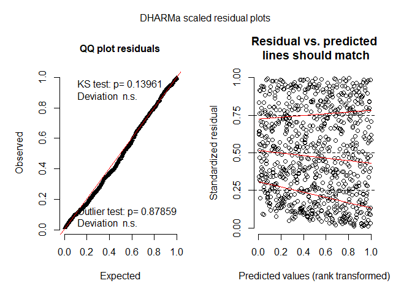
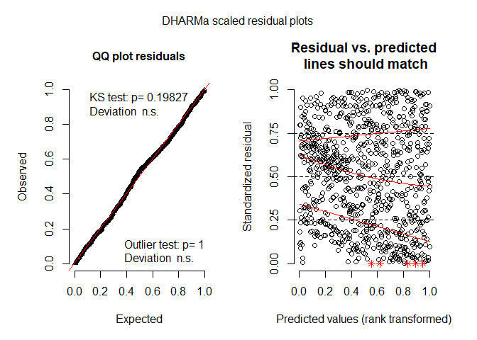
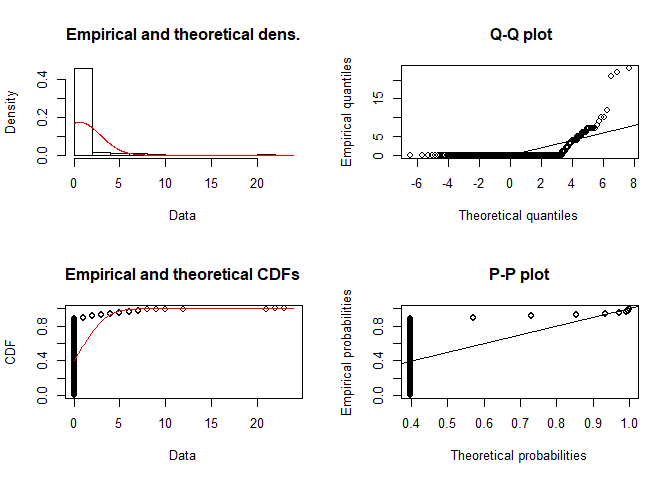
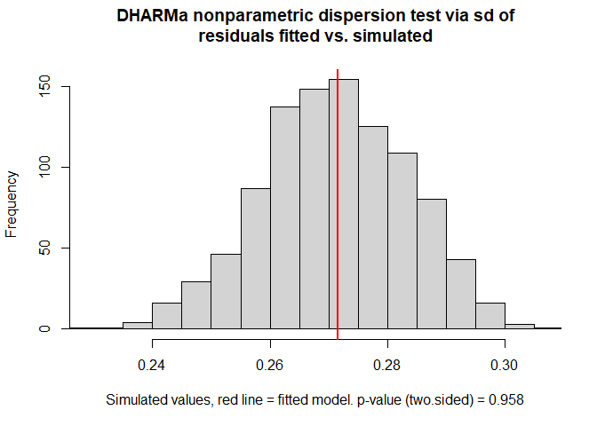

data\_analyses\_GxE
================
Rebecca Batstone
2019-08-28

Load packages
-------------

``` r
# packages
library("tidyverse") ## includes ggplot2, dplyr, readr, stringr
library("cowplot") ## paneled graphs
library("reshape2") ## dcast function
library("lme4") ## mixed effects models
library("emmeans") ## calc model-estimated means
library("DHARMa") ## residual diagnostics for glmm
library("fitdistrplus") ## probability distributions of data
library("car") ## Anova function
library("logistf") ## firth correction (binomial responses)
library("brglm2") ## check separation issue 
```

Spreadsheets
------------

``` r
# created using "data_setup.Rmd"
date <- format(Sys.Date())
load(paste0("combined_field_GH_", date, ".Rdata"))
load("./dataset_cleaned/shoot_cleaned.Rdata")
load("./dataset_cleaned/survival_cleaned.Rdata")
load("./dataset_cleaned/leaves_cleaned.Rdata")
load("./dataset_cleaned/nods_cleaned.Rdata")
load("./dataset_cleaned/choice_cleaned.Rdata")
load("./dataset_cleaned/red_nod_cleaned.Rdata")
load("./dataset_cleaned/flowers_cleaned.Rdata")
load("./dataset_cleaned/fruits_cleaned.Rdata")
```

Set to effects contrasts
------------------------

``` r
options(contrasts = rep ("contr.sum", 2)) 
```

GLMs (line as fixed effect)
---------------------------

### glm1: shoot

Summary:

-   both models perform well, residual diagnostics hold up
-   lm type III SS can be calculated, but interaction is not significant.
-   glm type III SS cannot be calculated using Anova function, but joint\_tests indicates all terms sig.

``` r
# prob dist
ggplot(data=shoot_cc, aes(x=shoot)) + geom_density() + facet_grid(env ~.) ## highly right-skewed
```


``` r
descdist(shoot_cc$shoot, discrete = FALSE)
```


    ## summary statistics
    ## ------
    ## min:  0.8   max:  5131.7 
    ## median:  49.7 
    ## mean:  197.8709 
    ## estimated sd:  415.7647 
    ## estimated skewness:  4.925166 
    ## estimated kurtosis:  39.46961

``` r
## normal, gamma, log normal options
fit.gamma <- fitdist(shoot_cc$shoot, "gamma")
fit.norm <- fitdist(shoot_cc$shoot, "norm")
fit.lnorm <- fitdist(shoot_cc$shoot, "lnorm")
plot(fit.gamma)
```


``` r
plot(fit.norm)
```


``` r
plot(fit.lnorm)
```


``` r
fit.gamma$aic 
```

    ## [1] 9909.188

``` r
fit.norm$aic 
```

    ## [1] 12264.15

``` r
fit.lnorm$aic
```

    ## [1] 9686.514

``` r
## lnorm, gamma, norm (best to worst)

# model
lm1 <- lm(log(shoot) ~ env * line,
            data = shoot_cc)

glm1 <- glm(shoot ~ env * line,
            family = Gamma(link="log"),
            data = shoot_cc)

# residual diagnostics
plot(lm1) ## OK
```

    ## Warning: not plotting observations with leverage one:
    ##   689, 698, 723, 726, 736, 737, 758



    ## Warning: not plotting observations with leverage one:
    ##   689, 698, 723, 726, 736, 737, 758


``` r
simuOut_glm1 <- simulateResiduals(fittedModel = glm1, n = 1000)
```

    ## Model family was recognized or set as continuous, but duplicate values were detected in the response. Consider if you are fitting an appropriate model.

``` r
plot(simuOut_glm1) ## OK
```


``` r
testDispersion(simuOut_glm1) ## NS
```


    ## 
    ##  DHARMa nonparametric dispersion test via sd of residuals fitted
    ##  vs. simulated
    ## 
    ## data:  simulationOutput
    ## ratioObsSim = 1.0331, p-value = 0.698
    ## alternative hypothesis: two.sided

``` r
# model summary
(ANODEV_lm_shoot <- Anova(lm1, type = 2)) ## NS interaction, type 2 used
```

    ## Anova Table (Type II tests)
    ## 
    ## Response: log(shoot)
    ##            Sum Sq  Df F value  Pr(>F)    
    ## env        570.48   4 64.1378 < 2e-16 ***
    ## line        99.15  26  1.7149 0.01531 *  
    ## env:line   266.57 104  1.1527 0.15688    
    ## Residuals 1529.88 688                    
    ## ---
    ## Signif. codes:  0 '***' 0.001 '**' 0.01 '*' 0.05 '.' 0.1 ' ' 1

``` r
(joint_tests(lm1)) # matches Anova results
```

    ##  model term df1 df2 F.ratio p.value
    ##  env          4 688  54.457 <.0001 
    ##  line        26 688   1.348 0.1164 
    ##  env:line   104 688   1.153 0.1569

``` r
(ANODEV_shoot <- Anova(glm1, type = 2)) ## error if type 3, type 2 used
```

    ## Analysis of Deviance Table (Type II tests)
    ## 
    ## Response: shoot
    ##          LR Chisq  Df Pr(>Chisq)    
    ## env        429.91   4  < 2.2e-16 ***
    ## line        55.65  26  0.0006269 ***
    ## env:line   169.50 104  5.257e-05 ***
    ## ---
    ## Signif. codes:  0 '***' 0.001 '**' 0.01 '*' 0.05 '.' 0.1 ' ' 1

``` r
(jt_shoot <- joint_tests(glm1)) ## all terms sig. 
```

    ##  model term df1 df2 F.ratio p.value
    ##  env          4 Inf 103.456 <.0001 
    ##  line        26 Inf   1.869 0.0046 
    ##  env:line   104 Inf   1.614 0.0001

### glm2: survival

Summary:

-   residual diagnostics hold up
-   type III SS can be calculated using Anova, but warning about fitted probabilities issued
-   checked separation in model, and uncovered Inf's
-   used Firth's correction to deal with separation, and detected sig. ME's of line and env, but no interaction

``` r
ggplot(data=survival_cc, aes(x=survival)) + geom_density() + facet_grid(env ~.) 
```


``` r
# prob dist
descdist(survival_cc$survival, discrete = TRUE)
```


    ## summary statistics
    ## ------
    ## min:  0   max:  1 
    ## median:  1 
    ## mean:  0.7445152 
    ## estimated sd:  0.4362878 
    ## estimated skewness:  -1.122478 
    ## estimated kurtosis:  2.258907

``` r
## normal, poisson, negative binomial options
fit.poiss <- fitdist(survival_cc$survival, "pois")
fit.norm <- fitdist(survival_cc$survival, "norm")
fit.nbinom <- fitdist(survival_cc$survival, "nbinom")
plot(fit.norm)
```


``` r
plot(fit.nbinom)
```


``` r
plot(fit.poiss)
```


``` r
fit.poiss$aic 
```

    ## [1] 2726.726

``` r
fit.norm$aic 
```

    ## [1] 1668.885

``` r
fit.nbinom$aic
```

    ## [1] 2728.726

``` r
## norm, poisson, nbinom (best to worst)

# model
glm2 <- glm(survival ~ env * line,
             family = binomial,
               data = survival_cc)

# residual diagnostics
simuOut_glm2 <- simulateResiduals(fittedModel = glm2, n = 1000)
plot(simuOut_glm2) ## OK
```


``` r
testDispersion(simuOut_glm2) ## NS
```


    ## 
    ##  DHARMa nonparametric dispersion test via sd of residuals fitted
    ##  vs. simulated
    ## 
    ## data:  simulationOutput
    ## ratioObsSim = 1.001, p-value = 0.958
    ## alternative hypothesis: two.sided

``` r
# model summary
(ANODEV_survival <- Anova(glm2, type = 3)) ## interaction sig., fitted probability warning issued
```

    ## Warning: glm.fit: fitted probabilities numerically 0 or 1 occurred

    ## Analysis of Deviance Table (Type III tests)
    ## 
    ## Response: survival
    ##          LR Chisq  Df Pr(>Chisq)    
    ## env         0.000   4  1.0000000    
    ## line       45.457  29  0.0265494 *  
    ## env:line  180.003 116  0.0001299 ***
    ## ---
    ## Signif. codes:  0 '***' 0.001 '**' 0.01 '*' 0.05 '.' 0.1 ' ' 1

``` r
(joint_tests(glm2)) ## does not match Anova function results
```

    ##  model term df1 df2 F.ratio p.value
    ##  env          4 Inf   0.000 1.0000 
    ##  line        29 Inf   0.244 1.0000 
    ##  env:line   116 Inf   0.674 0.9973

``` r
# Check separation issue
(glm2_check <- glm(survival ~ env * line,
             family = binomial,
               data = survival_cc,
            method = "detect_separation")) ## Inf detected
```

    ## Separation: TRUE 
    ## Existence of maximum likelihood estimates
    ## (Intercept)        env1        env2        env3        env4       line1 
    ##         Inf        -Inf         Inf        -Inf         Inf        -Inf 
    ##       line2       line3       line4       line5       line6       line7 
    ##        -Inf        -Inf        -Inf        -Inf        -Inf         Inf 
    ##       line8       line9      line10      line11      line12      line13 
    ##        -Inf        -Inf        -Inf        -Inf        -Inf        -Inf 
    ##      line14      line15      line16      line17      line18      line19 
    ##        -Inf        -Inf        -Inf        -Inf        -Inf        -Inf 
    ##      line20      line21      line22      line23      line24      line25 
    ##         Inf        -Inf        -Inf        -Inf        -Inf        -Inf 
    ##      line26      line27      line28      line29  env1:line1  env2:line1 
    ##        -Inf        -Inf        -Inf        -Inf        -Inf         Inf 
    ##  env3:line1  env4:line1  env1:line2  env2:line2  env3:line2  env4:line2 
    ##        -Inf        -Inf         Inf        -Inf         Inf        -Inf 
    ##  env1:line3  env2:line3  env3:line3  env4:line3  env1:line4  env2:line4 
    ##         Inf        -Inf         Inf        -Inf        -Inf         Inf 
    ##  env3:line4  env4:line4  env1:line5  env2:line5  env3:line5  env4:line5 
    ##        -Inf        -Inf        -Inf         Inf        -Inf        -Inf 
    ##  env1:line6  env2:line6  env3:line6  env4:line6  env1:line7  env2:line7 
    ##         Inf        -Inf         Inf        -Inf        -Inf        -Inf 
    ##  env3:line7  env4:line7  env1:line8  env2:line8  env3:line8  env4:line8 
    ##         Inf         Inf         Inf        -Inf         Inf        -Inf 
    ##  env1:line9  env2:line9  env3:line9  env4:line9 env1:line10 env2:line10 
    ##        -Inf         Inf        -Inf        -Inf         Inf        -Inf 
    ## env3:line10 env4:line10 env1:line11 env2:line11 env3:line11 env4:line11 
    ##         Inf        -Inf        -Inf         Inf        -Inf        -Inf 
    ## env1:line12 env2:line12 env3:line12 env4:line12 env1:line13 env2:line13 
    ##         Inf        -Inf         Inf        -Inf         Inf        -Inf 
    ## env3:line13 env4:line13 env1:line14 env2:line14 env3:line14 env4:line14 
    ##         Inf        -Inf        -Inf         Inf        -Inf        -Inf 
    ## env1:line15 env2:line15 env3:line15 env4:line15 env1:line16 env2:line16 
    ##        -Inf         Inf        -Inf        -Inf        -Inf         Inf 
    ## env3:line16 env4:line16 env1:line17 env2:line17 env3:line17 env4:line17 
    ##        -Inf        -Inf        -Inf         Inf        -Inf        -Inf 
    ## env1:line18 env2:line18 env3:line18 env4:line18 env1:line19 env2:line19 
    ##         Inf        -Inf         Inf        -Inf         Inf        -Inf 
    ## env3:line19 env4:line19 env1:line20 env2:line20 env3:line20 env4:line20 
    ##         Inf        -Inf        -Inf         Inf        -Inf         Inf 
    ## env1:line21 env2:line21 env3:line21 env4:line21 env1:line22 env2:line22 
    ##        -Inf         Inf        -Inf        -Inf         Inf        -Inf 
    ## env3:line22 env4:line22 env1:line23 env2:line23 env3:line23 env4:line23 
    ##         Inf        -Inf         Inf        -Inf         Inf        -Inf 
    ## env1:line24 env2:line24 env3:line24 env4:line24 env1:line25 env2:line25 
    ##        -Inf         Inf        -Inf        -Inf        -Inf         Inf 
    ## env3:line25 env4:line25 env1:line26 env2:line26 env3:line26 env4:line26 
    ##        -Inf        -Inf         Inf         Inf         Inf        -Inf 
    ## env1:line27 env2:line27 env3:line27 env4:line27 env1:line28 env2:line28 
    ##         Inf        -Inf         Inf        -Inf         Inf        -Inf 
    ## env3:line28 env4:line28 env1:line29 env2:line29 env3:line29 env4:line29 
    ##         Inf        -Inf         Inf        -Inf         Inf        -Inf 
    ## 0: finite value, Inf: infinity, -Inf: -infinity

``` r
# firth correction
glm_firth_surv <- logistf(survival ~ env * line, data = survival_cc)

glm_firth2_surv <- logistf(survival ~ env + line, data = survival_cc)

glm_firth3_surv <- logistf(survival ~ env, data = survival_cc)

glm_firth4_surv <- logistf(survival ~ line, data = survival_cc)

(firth_anova_int_surv <- anova(glm_firth_surv, glm_firth2_surv, method = "PLR")) ## NS interaction
```

    ## Comparison of logistf models:
    ##                 Formula ChiSquared 
    ## 1 survival ~ env * line   216.6221 
    ## 2 survival ~ env + line   100.0312 
    ## 
    ## Method:  PLR 
    ## Chi-Squared:  116.5909   df= 116   P= 0.467125

``` r
(firth_anova_line_surv <- anova(glm_firth2_surv, glm_firth3_surv, method = "PLR")) ## sig ME of line
```

    ## Comparison of logistf models:
    ##                 Formula ChiSquared 
    ## 1 survival ~ env + line  100.03121 
    ## 2        survival ~ env   55.82799 
    ## 
    ## Method:  PLR 
    ## Chi-Squared:  44.20323   df= 29   P= 0.03510493

``` r
(firth_anova_env_surv <- anova(glm_firth2_surv, glm_firth4_surv, method = "PLR")) ## sig ME of env
```

    ## Comparison of logistf models:
    ##                 Formula ChiSquared 
    ## 1 survival ~ env + line  100.03121 
    ## 2       survival ~ line   41.42589 
    ## 
    ## Method:  PLR 
    ## Chi-Squared:  58.60532   df= 4   P= 5.695e-12

### glm3: leaf

Summary:

-   glm residual diagnostics hold up, but not for lm.
-   lm type III SS can be calculated, but interaction is not significant.
-   glm type III SS cannot be calculated using Anova function, but joint\_tests indicates all terms sig.

``` r
# prob dist
ggplot(data=leaf_cc, aes(x=leaf)) + geom_density() + facet_grid(env ~.) ## highly right-skewed
```


``` r
descdist(leaf_cc$leaf, discrete = TRUE)
```


    ## summary statistics
    ## ------
    ## min:  0   max:  541 
    ## median:  16 
    ## mean:  45.17661 
    ## estimated sd:  70.56839 
    ## estimated skewness:  3.046316 
    ## estimated kurtosis:  14.34338

``` r
## normal, poisson, negative binomial options
fit.poiss <- fitdist(leaf_cc$leaf, "pois")
fit.norm <- fitdist(leaf_cc$leaf, "norm")
fit.nbinom <- fitdist(leaf_cc$leaf, "nbinom")
plot(fit.norm)
```


``` r
plot(fit.nbinom)
```


``` r
plot(fit.poiss)
```


``` r
fit.poiss$aic
```

    ## [1] 64536.3

``` r
fit.norm$aic 
```

    ## [1] 9708.14

``` r
fit.nbinom$aic 
```

    ## [1] 8140.491

``` r
## nbinom, norm, poiss (best to worst)

# model
lm3 <- lm(sqrt(leaf) ~ env * line, 
            data = leaf_cc)

glm3 <- glm.nb(leaf ~ env * line, 
            data = leaf_cc)

# residual diagnostics
plot(lm3) ## not great
```

    ## Warning: not plotting observations with leverage one:
    ##   713, 716, 725, 752, 765, 766, 822


    ## Warning: not plotting observations with leverage one:
    ##   713, 716, 725, 752, 765, 766, 822


``` r
simOut_glm3 <- simulateResiduals(fittedModel = glm3, n = 1000)
plot(simOut_glm3) ## OK
```



``` r
testDispersion(simOut_glm3) ## NS
```


    ## 
    ##  DHARMa nonparametric dispersion test via sd of residuals fitted
    ##  vs. simulated
    ## 
    ## data:  simulationOutput
    ## ratioObsSim = 1.0932, p-value = 0.256
    ## alternative hypothesis: two.sided

``` r
# model summary
(ANODEV_lm_leaf <- Anova(lm3, type = 2)) ## NS interaction, type 2 used
```

    ## Anova Table (Type II tests)
    ## 
    ## Response: sqrt(leaf)
    ##           Sum Sq  Df F value Pr(>F)    
    ## env       4141.5   4 93.3810 <2e-16 ***
    ## line       394.3  27  1.3172 0.1312    
    ## env:line  1149.1 108  0.9596 0.5966    
    ## Residuals 7927.6 715                   
    ## ---
    ## Signif. codes:  0 '***' 0.001 '**' 0.01 '*' 0.05 '.' 0.1 ' ' 1

``` r
(joint_tests(lm3)) # matches Anova results
```

    ##  model term df1 df2 F.ratio p.value
    ##  env          4 715  81.604 <.0001 
    ##  line        27 715   1.169 0.2538 
    ##  env:line   108 715   0.960 0.5966

``` r
(ANODEV_glm_leaf <- Anova(glm3, type = 2)) ## error if set to type 3, type 2 used
```

    ## Analysis of Deviance Table (Type II tests)
    ## 
    ## Response: leaf
    ##          LR Chisq  Df Pr(>Chisq)    
    ## env        773.71   4  < 2.2e-16 ***
    ## line        71.71  27  6.368e-06 ***
    ## env:line   175.30 108  4.519e-05 ***
    ## ---
    ## Signif. codes:  0 '***' 0.001 '**' 0.01 '*' 0.05 '.' 0.1 ' ' 1

``` r
(jt_leaf <- joint_tests(glm3)) ## all terms sig.
```

    ##  model term df1 df2 F.ratio p.value
    ##  env          4 Inf 162.367 <.0001 
    ##  line        27 Inf   2.512 <.0001 
    ##  env:line   108 Inf   1.466 0.0012

### glm4: nod

Summary:

-   glm residual diagnostics hold up, but not for lm.
-   lm type III SS can be calculated, but interaction is not significant.
-   glm type III SS can be calculated using Anova function and joint\_tests closely matches, but non-convergence warning issued

``` r
# prob dist
ggplot(data=nod_cc, aes(x=nod)) + geom_density() + facet_grid(env ~.) ## highly right-skewed
```


``` r
descdist(nod_cc$nod, discrete = TRUE)
```


    ## summary statistics
    ## ------
    ## min:  0   max:  856 
    ## median:  19 
    ## mean:  62.20609 
    ## estimated sd:  118.9718 
    ## estimated skewness:  3.782906 
    ## estimated kurtosis:  19.67637

``` r
## normal, poisson, negative binomial options
fit.poiss <- fitdist(nod_cc$nod, "pois")
fit.norm <- fitdist(nod_cc$nod, "norm")
fit.nbinom <- fitdist(nod_cc$nod, "nbinom")
plot(fit.norm)
```


``` r
plot(fit.nbinom)
```


``` r
plot(fit.poiss)
```


``` r
fit.poiss$aic
```

    ## [1] 107953.7

``` r
fit.norm$aic 
```

    ## [1] 10588.89

``` r
fit.nbinom$aic 
```

    ## [1] 8559.935

``` r
## nbinom, norm, poisson (best to worst)

# model
lm4 <- lm(sqrt(nod) ~ env * line,
          data = nod_cc)

glm4 <- glm.nb(nod ~ env * line, 
            data = nod_cc)

# residual diagnostics
plot(lm4) ## bad
```

    ## Warning: not plotting observations with leverage one:
    ##   711, 714, 723, 751, 763, 764, 820


    ## Warning: not plotting observations with leverage one:
    ##   711, 714, 723, 751, 763, 764, 820


``` r
simOut_glm4 <- simulateResiduals(fittedModel = glm4, n = 1000)
plot(simOut_glm4) ## OK
```


``` r
testDispersion(simOut_glm4) ## NS
```


    ## 
    ##  DHARMa nonparametric dispersion test via sd of residuals fitted
    ##  vs. simulated
    ## 
    ## data:  simulationOutput
    ## ratioObsSim = 1.0336, p-value = 0.672
    ## alternative hypothesis: two.sided

``` r
# model summary
(ANODEV_lm_nod <- Anova(lm4, type = 2)) ## NS interaction, type 2 used
```

    ## Anova Table (Type II tests)
    ## 
    ## Response: sqrt(nod)
    ##            Sum Sq  Df F value Pr(>F)    
    ## env        6064.1   4 80.4370 <2e-16 ***
    ## line        694.9  27  1.3656 0.1032    
    ## env:line   1656.8 108  0.8139 0.9095    
    ## Residuals 13456.9 714                   
    ## ---
    ## Signif. codes:  0 '***' 0.001 '**' 0.01 '*' 0.05 '.' 0.1 ' ' 1

``` r
(joint_tests(lm4)) ## matches Anova results
```

    ##  model term df1 df2 F.ratio p.value
    ##  env          4 714  70.498 <.0001 
    ##  line        27 714   0.607 0.9429 
    ##  env:line   108 714   0.814 0.9095

``` r
(ANODEV_glm_nod <- Anova(glm4, type = 3)) ## non-convergence warning
```

    ## Warning: glm.fit: algorithm did not converge

    ## Warning: glm.fit: algorithm did not converge

    ## Analysis of Deviance Table (Type III tests)
    ## 
    ## Response: nod
    ##          LR Chisq  Df Pr(>Chisq)    
    ## env        485.65   4  < 2.2e-16 ***
    ## line        59.41  27  0.0003154 ***
    ## env:line   142.27 108  0.0151165 *  
    ## ---
    ## Signif. codes:  0 '***' 0.001 '**' 0.01 '*' 0.05 '.' 0.1 ' ' 1

``` r
(jt_nod <- joint_tests(glm4)) ## close to Anova results
```

    ##  model term df1 df2 F.ratio p.value
    ##  env          4 Inf 141.410 <.0001 
    ##  line        27 Inf   1.642 0.0191 
    ##  env:line   108 Inf   1.306 0.0181

### glm5: choice

Summary:

-   type II SS used, no interaction

``` r
# prob dist
ggplot(data=choice_cc, aes(x=choice)) + geom_density() + facet_grid(env ~.) ## normal-ish
```


``` r
descdist(choice_cc$choice, discrete = FALSE)
```


    ## summary statistics
    ## ------
    ## min:  0   max:  1 
    ## median:  0.5531915 
    ## mean:  0.4630196 
    ## estimated sd:  0.2883259 
    ## estimated skewness:  -0.5028709 
    ## estimated kurtosis:  2.006805

``` r
## normal, poisson, negative binomial options
fit.unif <- fitdist(choice_cc$choice, "unif")
fit.norm <- fitdist(choice_cc$choice, "norm")
plot(fit.norm)
```


``` r
plot(fit.unif)
```


``` r
fit.unif$aic 
```

    ## [1] NA

``` r
fit.norm$aic
```

    ## [1] 91.6871

``` r
## norm (best to worst)

# model
glm5 <- lm(choice ~ line, 
             data = choice_cc)

# residual diagnostics
plot(glm5)
```


``` r
# model summary
(ANODEV_choice <- Anova(glm5, type = 2)) # no interaction term, type 2 used
```

    ## Anova Table (Type II tests)
    ## 
    ## Response: choice
    ##            Sum Sq  Df F value    Pr(>F)    
    ## line       4.6621  29  2.2011 0.0007277 ***
    ## Residuals 16.2871 223                      
    ## ---
    ## Signif. codes:  0 '***' 0.001 '**' 0.01 '*' 0.05 '.' 0.1 ' ' 1

### glm6: red nodules

Summary:

-   type II SS used, no interaction

``` r
# prob dist
ggplot(data=red_nod_cc, aes(x=totalred)) + geom_density() + facet_grid(env ~.) ## right skewed
```


``` r
descdist(red_nod_cc$totalred, discrete = TRUE)
```


    ## summary statistics
    ## ------
    ## min:  0   max:  635 
    ## median:  48 
    ## mean:  96.9387 
    ## estimated sd:  128.298 
    ## estimated skewness:  1.865651 
    ## estimated kurtosis:  6.256071

``` r
## normal, poisson, negative binomial options
fit.poiss <- fitdist(red_nod_cc$totalred, "pois")
fit.norm <- fitdist(red_nod_cc$totalred, "norm")
fit.nbinom <- fitdist(red_nod_cc$totalred, "nbinom")
plot(fit.norm)
```


``` r
plot(fit.nbinom)
```


``` r
plot(fit.poiss)
```


``` r
fit.poiss$aic 
```

    ## [1] 38951.16

``` r
fit.norm$aic 
```

    ## [1] 3277.657

``` r
fit.nbinom$aic 
```

    ## [1] 2659.14

``` r
## nbinom, norm, poisson (best to worst)

# model
glm6 <- glm.nb(totalred ~ line,
                data = subset(red_nod_cc, survival > 0))

# residual diagnostics
simOut_glm6 <- simulateResiduals(fittedModel = glm6, n = 1000)
plot(simOut_glm6) ## OK
```


``` r
testDispersion(simOut_glm6) ## NS
```


    ## 
    ##  DHARMa nonparametric dispersion test via sd of residuals fitted
    ##  vs. simulated
    ## 
    ## data:  simulationOutput
    ## ratioObsSim = 0.8601, p-value = 0.246
    ## alternative hypothesis: two.sided

``` r
# model summary
(ANODEV_totalred <- Anova(glm6, type = 2)) ## no interaction term, type 2 used
```

    ## Analysis of Deviance Table (Type II tests)
    ## 
    ## Response: totalred
    ##      LR Chisq Df Pr(>Chisq)   
    ## line   56.932 29   0.001464 **
    ## ---
    ## Signif. codes:  0 '***' 0.001 '**' 0.01 '*' 0.05 '.' 0.1 ' ' 1

### glm7: flower

Summary:

-   residual diagnostics hold up
-   type III SS can be calculated using Anova, but warning about fitted probabilities issued
-   checked separation in model, and uncovered Inf's
-   used Firth's correction to deal with separation, and detected sig. ME's of line and env, but no interaction

``` r
# prob dist
ggplot(data=flower_cc, aes(x=flo)) + geom_density() + facet_grid(env ~ .) ## highly right-skewed
```


``` r
descdist(flower_cc$flo, discrete = TRUE)
```


    ## summary statistics
    ## ------
    ## min:  0   max:  23 
    ## median:  0 
    ## mean:  0.5977011 
    ## estimated sd:  2.283849 
    ## estimated skewness:  6.045295 
    ## estimated kurtosis:  49.66962

``` r
## normal, poisson, negative binomial options
fit.poiss <- fitdist(flower_cc$flo, "pois")
fit.norm <- fitdist(flower_cc$flo, "norm")
fit.nbinom <- fitdist(flower_cc$flo, "nbinom")
plot(fit.norm)
```



``` r
plot(fit.nbinom)
```


``` r
plot(fit.poiss)
```


``` r
fit.poiss$aic 
```

    ## [1] 1735.791

``` r
fit.norm$aic 
```

    ## [1] 2346.571

``` r
fit.nbinom$aic 
```

    ## [1] 697.0818

``` r
## nbinom, poisson, norm (best to worst)

# calculate flower success
flower_cc$flo_succ <- as.numeric(flower_cc$flo > 0) 

# model
glm7 <- glm(flo_succ ~ env * line,
             family= binomial,
             data = subset(flower_cc, survival > 0))

# residual diagnostics
simOut_glm7 <- simulateResiduals(fittedModel = glm7, n = 1000)
plot(simOut_glm7) ## OK
```


``` r
testDispersion(simOut_glm7) ## NS
```



    ## 
    ##  DHARMa nonparametric dispersion test via sd of residuals fitted
    ##  vs. simulated
    ## 
    ## data:  simulationOutput
    ## ratioObsSim = 1.0018, p-value = 0.958
    ## alternative hypothesis: two.sided

``` r
# model summary
(ANODEV_flo <- Anova(glm7, type = 3)) ## no terms sig., fitted probability warning issued
```

    ## Warning: glm.fit: fitted probabilities numerically 0 or 1 occurred

    ## Warning: glm.fit: fitted probabilities numerically 0 or 1 occurred

    ## Analysis of Deviance Table (Type III tests)
    ## 
    ## Response: flo_succ
    ##          LR Chisq Df Pr(>Chisq)
    ## env          0.00  2     1.0000
    ## line         0.00 27     1.0000
    ## env:line    37.98 54     0.9517

``` r
(joint_tests(glm7)) ## matches Anova results
```

    ##  model term df1 df2 F.ratio p.value
    ##  env          2 Inf   0.000 1.0000 
    ##  line        27 Inf   0.000 1.0000 
    ##  env:line    54 Inf   0.089 1.0000

``` r
# Check separation issue
(glm7_check <- glm(flo_succ ~ env * line,
             family= binomial,
             data = subset(flower_cc, survival > 0),
            method = "detect_separation")) ## Inf detected
```

    ## Separation: TRUE 
    ## Existence of maximum likelihood estimates
    ## (Intercept)        env1        env2       line1       line2       line3 
    ##        -Inf         Inf         Inf         Inf        -Inf        -Inf 
    ##       line4       line5       line6       line7       line8       line9 
    ##        -Inf         Inf         Inf        -Inf         Inf        -Inf 
    ##      line10      line11      line12      line13      line14      line15 
    ##        -Inf         Inf         Inf        -Inf         Inf        -Inf 
    ##      line16      line17      line18      line19      line20      line21 
    ##        -Inf         Inf        -Inf         Inf         Inf         Inf 
    ##      line22      line23      line24      line25      line26      line27 
    ##         Inf         Inf        -Inf        -Inf        -Inf        -Inf 
    ##  env1:line1  env2:line1  env1:line2  env2:line2  env1:line3  env2:line3 
    ##        -Inf        -Inf         Inf         Inf         Inf         Inf 
    ##  env1:line4  env2:line4  env1:line5  env2:line5  env1:line6  env2:line6 
    ##         Inf         Inf        -Inf        -Inf        -Inf        -Inf 
    ##  env1:line7  env2:line7  env1:line8  env2:line8  env1:line9  env2:line9 
    ##         Inf         Inf        -Inf        -Inf         Inf         Inf 
    ## env1:line10 env2:line10 env1:line11 env2:line11 env1:line12 env2:line12 
    ##         Inf         Inf        -Inf        -Inf        -Inf        -Inf 
    ## env1:line13 env2:line13 env1:line14 env2:line14 env1:line15 env2:line15 
    ##         Inf         Inf        -Inf        -Inf         Inf         Inf 
    ## env1:line16 env2:line16 env1:line17 env2:line17 env1:line18 env2:line18 
    ##         Inf        -Inf        -Inf        -Inf         Inf         Inf 
    ## env1:line19 env2:line19 env1:line20 env2:line20 env1:line21 env2:line21 
    ##        -Inf        -Inf        -Inf        -Inf        -Inf        -Inf 
    ## env1:line22 env2:line22 env1:line23 env2:line23 env1:line24 env2:line24 
    ##        -Inf        -Inf        -Inf        -Inf         Inf         Inf 
    ## env1:line25 env2:line25 env1:line26 env2:line26 env1:line27 env2:line27 
    ##         Inf         Inf         Inf         Inf        -Inf         Inf 
    ## 0: finite value, Inf: infinity, -Inf: -infinity

``` r
# firth correction
glm7_firth_flo <- logistf(flo_succ ~ env * line, data = subset(flower_cc, survival > 0))

glm7_firth2_flo <- logistf(flo_succ ~ env + line, data = subset(flower_cc, survival > 0))

glm7_firth3_flo <- logistf(flo_succ ~ env, data = subset(flower_cc, survival > 0))

glm7_firth4_flo <- logistf(flo_succ ~ line, data = subset(flower_cc, survival > 0))

(firth_anova_int_flo <- anova(glm7_firth_flo, glm7_firth2_flo, method = "PLR")) ## NS interaction
```

    ## Comparison of logistf models:
    ##                 Formula ChiSquared 
    ## 1 flo_succ ~ env * line   79.77240 
    ## 2 flo_succ ~ env + line   78.48999 
    ## 
    ## Method:  PLR 
    ## Chi-Squared:  1.282415   df= 54   P= 1

``` r
(firth_anova_line_flo <- anova(glm7_firth2_flo, glm7_firth3_flo, method = "PLR")) ## sig ME of line
```

    ## Comparison of logistf models:
    ##                 Formula ChiSquared 
    ## 1 flo_succ ~ env + line   78.48999 
    ## 2        flo_succ ~ env   33.98819 
    ## 
    ## Method:  PLR 
    ## Chi-Squared:  44.5018   df= 27   P= 0.01834046

``` r
(firth_anova_env_flo <- anova(glm7_firth2_flo, glm7_firth4_flo, method = "PLR")) ## sig ME of env
```

    ## Comparison of logistf models:
    ##                 Formula ChiSquared 
    ## 1 flo_succ ~ env + line   78.48999 
    ## 2       flo_succ ~ line   49.36539 
    ## 
    ## Method:  PLR 
    ## Chi-Squared:  29.1246   df= 2   P= 4.738862e-07

### glm8: fruit

Summary:

-   residual diagnostics hold up on binomial data, not count data

Binomial: - type III SS can be calculated using Anova, but warning about fitted probabilities issued - checked separation in model, and uncovered Inf's - used Firth's correction to deal with separation, and detected sig. ME's of line and env, but no interaction

``` r
# prob dist
ggplot(data=fruit_cc, aes(x=fru)) + geom_density() + facet_grid(env ~.) ## highly right-skewed
```


``` r
descdist(fruit_cc$fru, discrete = TRUE)
```


    ## summary statistics
    ## ------
    ## min:  0   max:  72 
    ## median:  0 
    ## mean:  2.097701 
    ## estimated sd:  7.792907 
    ## estimated skewness:  5.194199 
    ## estimated kurtosis:  34.60909

``` r
## normal, poisson, negative binomial options
fit.poiss <- fitdist(fruit_cc$fru, "pois")
fit.norm <- fitdist(fruit_cc$fru, "norm")
fit.nbinom <- fitdist(fruit_cc$fru, "nbinom")
plot(fit.norm)
```


``` r
plot(fit.nbinom)
```


``` r
plot(fit.poiss)
```


``` r
fit.poiss$aic 
```

    ## [1] 5597.182

``` r
fit.norm$aic 
```

    ## [1] 3627.926

``` r
fit.nbinom$aic 
```

    ## [1] 995.7986

``` r
## nbinom, norm, poisson  (best to worst)

# calculate fruit success
fruit_cc$fru_succ <- as.numeric(fruit_cc$fru > 0) 

# models
lm8_nz <- lm(sqrt(fru) ~ env * line, 
              data = subset(fruit_cc, fru > 0))

glm8_nz <- glm.nb(fru ~ env * line, 
              data = subset(fruit_cc, fru > 0))

glm8_succ <- glm(fru_succ ~ env * line, 
              family = binomial,   
              data = fruit_cc)

# residual diagnostics
plot(lm8_nz) ## OK
```

    ## Warning: not plotting observations with leverage one:
    ##   5, 6, 7, 9, 15, 16, 17, 19, 21, 22, 30, 41, 50, 51, 55, 61, 62, 64, 66, 67, 71


    ## Warning: not plotting observations with leverage one:
    ##   5, 6, 7, 9, 15, 16, 17, 19, 21, 22, 30, 41, 50, 51, 55, 61, 62, 64, 66, 67, 71


    ## Warning in sqrt(crit * p * (1 - hh)/hh): NaNs produced

    ## Warning in sqrt(crit * p * (1 - hh)/hh): NaNs produced


``` r
simOut_glm8_nz <- simulateResiduals(fittedModel = glm8_nz, n = 1000)
plot(simOut_glm8_nz) ## bad
```


``` r
testDispersion(simOut_glm8_nz) ## NS
```


    ## 
    ##  DHARMa nonparametric dispersion test via sd of residuals fitted
    ##  vs. simulated
    ## 
    ## data:  simulationOutput
    ## ratioObsSim = 0.85933, p-value = 0.442
    ## alternative hypothesis: two.sided

``` r
simOut_glm8_succ <- simulateResiduals(fittedModel = glm8_succ, n = 1000)
plot(simOut_glm8_succ) ## OK
```


``` r
testDispersion(simOut_glm8_succ) ## NS
```


    ## 
    ##  DHARMa nonparametric dispersion test via sd of residuals fitted
    ##  vs. simulated
    ## 
    ## data:  simulationOutput
    ## ratioObsSim = 1.0014, p-value = 0.996
    ## alternative hypothesis: two.sided

``` r
# model summaries
(ANODEV_lm_fru_nz <- Anova(lm8_nz, type = 2)) ## singular, cannot assess type 3, type 2 used
```

    ## Note: model has aliased coefficients
    ##       sums of squares computed by model comparison

    ## Anova Table (Type II tests)
    ## 
    ## Response: sqrt(fru)
    ##            Sum Sq Df F value  Pr(>F)  
    ## env        20.533  2  4.2098 0.02353 *
    ## line      122.308 24  2.0897 0.02491 *
    ## env:line   42.365 16  1.0857 0.40523  
    ## Residuals  80.479 33                  
    ## ---
    ## Signif. codes:  0 '***' 0.001 '**' 0.01 '*' 0.05 '.' 0.1 ' ' 1

``` r
(joint_tests(lm8_nz)) ## matches Anova type III results (non-estimability)
```

    ##  model term df1 df2 F.ratio p.value note
    ##  line         1  33   0.029 0.8648     e
    ##  env:line    16  33   1.086 0.4052     e
    ## 
    ## e: df1 reduced due to non-estimability

``` r
(ANODEV_glm_fru_nz <- Anova(glm8_nz, type = 2)) ## singular, cannot assess type 3, type 2 used
```

    ## Analysis of Deviance Table (Type II tests)
    ## 
    ## Response: fru
    ##          LR Chisq Df Pr(>Chisq)    
    ## env        17.272  2  0.0001776 ***
    ## line      104.848 24  4.424e-12 ***
    ## env:line   41.455 16  0.0004756 ***
    ## ---
    ## Signif. codes:  0 '***' 0.001 '**' 0.01 '*' 0.05 '.' 0.1 ' ' 1

``` r
(jt_fruit <- joint_tests(glm8_nz)) ## matches Anova type III results (non-estimability)
```

    ##  model term df1 df2 F.ratio p.value note
    ##  line         1 Inf   0.180 0.6716     e
    ##  env:line    16 Inf   2.452 0.0010     e
    ## 
    ## e: df1 reduced due to non-estimability

``` r
(ANODEV_fru_succ <- Anova(glm8_succ, type = 3)) ## no terms sig., fitted probability warning issued
```

    ## Warning: glm.fit: fitted probabilities numerically 0 or 1 occurred

    ## Analysis of Deviance Table (Type III tests)
    ## 
    ## Response: fru_succ
    ##          LR Chisq Df Pr(>Chisq)
    ## env         0.000  2     1.0000
    ## line       29.829 27     0.3219
    ## env:line   55.603 54     0.4142

``` r
(joint_tests(glm8_succ)) ## close to Anova results
```

    ##  model term df1 df2 F.ratio p.value
    ##  env          2 Inf   0.000 0.9999 
    ##  line        27 Inf   0.000 1.0000 
    ##  env:line    54 Inf   0.198 1.0000

``` r
# Check separation issue
(glm8_check <- glm(fru_succ ~ env * line, 
              family = binomial,   
              data = fruit_cc,
            method = "detect_separation")) ## Inf detected
```

    ## Separation: TRUE 
    ## Existence of maximum likelihood estimates
    ## (Intercept)        env1        env2       line1       line2       line3 
    ##        -Inf         Inf         Inf         Inf        -Inf        -Inf 
    ##       line4       line5       line6       line7       line8       line9 
    ##        -Inf         Inf         Inf        -Inf        -Inf        -Inf 
    ##      line10      line11      line12      line13      line14      line15 
    ##        -Inf         Inf         Inf        -Inf         Inf        -Inf 
    ##      line16      line17      line18      line19      line20      line21 
    ##        -Inf        -Inf        -Inf         Inf         Inf         Inf 
    ##      line22      line23      line24      line25      line26      line27 
    ##         Inf        -Inf         Inf        -Inf        -Inf         Inf 
    ##  env1:line1  env2:line1  env1:line2  env2:line2  env1:line3  env2:line3 
    ##        -Inf        -Inf         Inf         Inf         Inf         Inf 
    ##  env1:line4  env2:line4  env1:line5  env2:line5  env1:line6  env2:line6 
    ##         Inf         Inf        -Inf        -Inf        -Inf        -Inf 
    ##  env1:line7  env2:line7  env1:line8  env2:line8  env1:line9  env2:line9 
    ##         Inf         Inf         Inf         Inf         Inf         Inf 
    ## env1:line10 env2:line10 env1:line11 env2:line11 env1:line12 env2:line12 
    ##         Inf         Inf        -Inf        -Inf        -Inf        -Inf 
    ## env1:line13 env2:line13 env1:line14 env2:line14 env1:line15 env2:line15 
    ##         Inf         Inf        -Inf        -Inf         Inf         Inf 
    ## env1:line16 env2:line16 env1:line17 env2:line17 env1:line18 env2:line18 
    ##         Inf        -Inf        -Inf         Inf         Inf         Inf 
    ## env1:line19 env2:line19 env1:line20 env2:line20 env1:line21 env2:line21 
    ##        -Inf        -Inf        -Inf        -Inf        -Inf        -Inf 
    ## env1:line22 env2:line22 env1:line23 env2:line23 env1:line24 env2:line24 
    ##        -Inf        -Inf         Inf         Inf        -Inf        -Inf 
    ## env1:line25 env2:line25 env1:line26 env2:line26 env1:line27 env2:line27 
    ##         Inf         Inf         Inf         Inf        -Inf        -Inf 
    ## 0: finite value, Inf: infinity, -Inf: -infinity

``` r
# firth correction
glm8_firth_fru <- logistf(fru_succ ~ env * line, data = fruit_cc)

glm8_firth2_fru <- logistf(fru_succ ~ env + line, data = fruit_cc)

glm8_firth3_fru <- logistf(fru_succ ~ env, data = fruit_cc)

glm8_firth4_fru <- logistf(fru_succ ~ line, data = fruit_cc)

(firth_anova_int_fru <- anova(glm8_firth_fru, glm8_firth2_fru, method = "PLR")) ## NS interaction
```

    ## Comparison of logistf models:
    ##                 Formula ChiSquared 
    ## 1 fru_succ ~ env * line   88.42753 
    ## 2 fru_succ ~ env + line   73.19702 
    ## 
    ## Method:  PLR 
    ## Chi-Squared:  15.23051   df= 54   P= 1

``` r
(firth_anova_line_fru <- anova(glm8_firth2_fru, glm8_firth3_fru, method = "PLR")) ## marg sig ME of line
```

    ## Comparison of logistf models:
    ##                 Formula ChiSquared 
    ## 1 fru_succ ~ env + line   73.19702 
    ## 2        fru_succ ~ env   33.94419 
    ## 
    ## Method:  PLR 
    ## Chi-Squared:  39.25284   df= 27   P= 0.06008161

``` r
(firth_anova_env_fru <- anova(glm8_firth2_fru, glm8_firth4_fru, method = "PLR")) ## sig ME of env
```

    ## Comparison of logistf models:
    ##                 Formula ChiSquared 
    ## 1 fru_succ ~ env + line   73.19702 
    ## 2       fru_succ ~ line   42.05208 
    ## 
    ## Method:  PLR 
    ## Chi-Squared:  31.14494   df= 2   P= 1.725688e-07

combine dfs
-----------

``` r
non_binary_comb <- rbind(jt_shoot, jt_leaf, jt_nod, jt_fruit[,-c(6)])
binary_comb <- rbind(firth_anova_env_surv, firth_anova_line_surv, firth_anova_int_surv, 
                     firth_anova_env_flo, firth_anova_line_flo, firth_anova_int_flo, 
                     firth_anova_env_fru, firth_anova_line_fru, firth_anova_int_fru)

write.csv(non_binary_comb, "GxE_non-binary.csv")
write.csv(binary_comb, "GxE_binary.csv")
```
