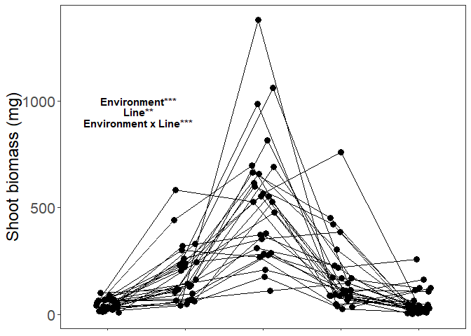
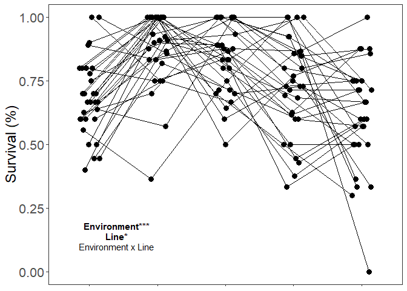
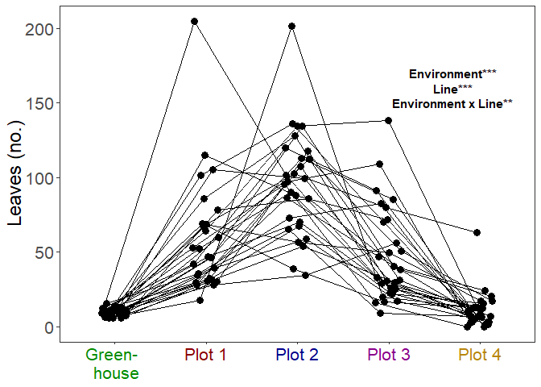
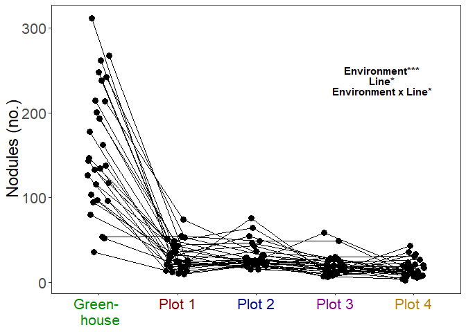
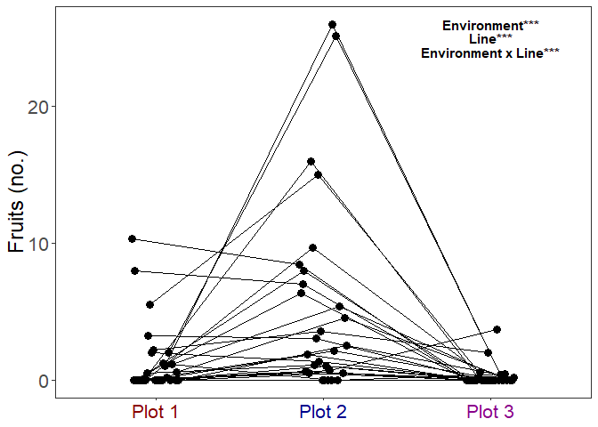
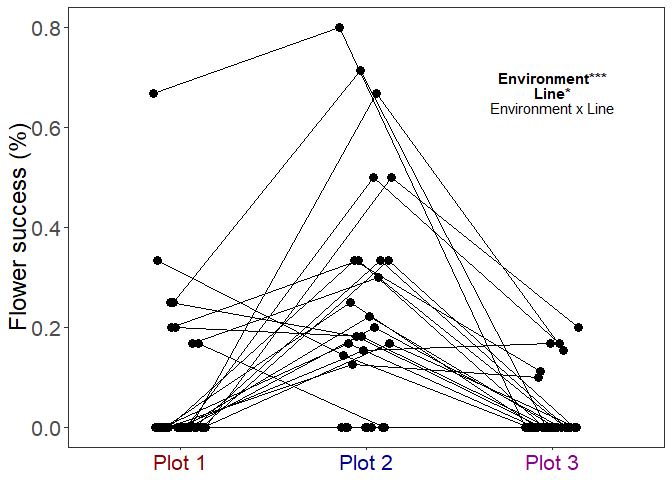

data\_analyses\_raw\_means
================
Rebecca Batstone
2019-08-19

Load packages
-------------

``` r
# packages
library("tidyverse") #includes ggplot2, dplyr, readr, stringr
library("cowplot") # paneled graphs
library("reshape2") # dcast function
library("lme4") # mixed effects models
library("emmeans") # calc model-estimated means
library("DHARMa") # residual diagnostics for glmm
library("fitdistrplus") # probability distributions of data
library("car") # Anova function
```

Spreadsheets
------------

``` r
# created using "data_setup.Rmd"
F_GH_ds <- read_csv("combined_field_GH_19Aug2019.csv")

# created using "data_analyses_GxE.Rmd"
shoot <- read_csv("./dataset_cleaned/shoot_cleaned.csv")
survival <- read_csv("./dataset_cleaned/survival_cleaned.csv")
leaves <- read_csv("./dataset_cleaned/leaves_cleaned.csv")
nods <- read_csv("./dataset_cleaned/nods_cleaned.csv")
choice <- read_csv("./dataset_cleaned/choice_cleaned.csv")
red.nods <- read_csv("./dataset_cleaned/red.nods_cleaned.csv")
flowers <- read_csv("./dataset_cleaned/flowers_cleaned.csv")
fruit_succ <- read_csv("./dataset_cleaned/fruit_succ_cleaned.csv")
fruit_nz <- read_csv("./dataset_cleaned/fruit_nz_cleaned.csv")
```

Calculate raw means
-------------------

``` r
# shoot
sum_shoot_E.raw <- shoot %>%
  group_by(env) %>%
  summarize(mean_shoot = mean(shoot), SE_shoot = (sd(shoot))/(sqrt(length(shoot)))) %>%
  as.data.frame(.)

sum_shoot_G.raw <- shoot %>%
  group_by(line) %>%
  summarize(mean_shoot = mean(shoot), SE_shoot = (sd(shoot))/(sqrt(length(shoot)))) %>%
  as.data.frame(.)

sum_shoot_GE.raw <- shoot %>%
  group_by(env, line) %>%
  summarize(mean_shoot = mean(shoot), SE_shoot = (sd(shoot))/(sqrt(length(shoot)))) %>%
  as.data.frame(.)

# survival
sum_surv_E.raw <- survival %>%
  group_by(env) %>%
  summarize(mean_surv = mean(survival), SE_surv = (sd(survival))/(sqrt(length(survival)))) %>%
  as.data.frame(.)

sum_surv_G.raw <- survival %>%
  group_by(line) %>%
  summarize(mean_surv = mean(survival), SE_surv = (sd(survival))/(sqrt(length(survival)))) %>%
  as.data.frame(.)

sum_surv_GE.raw <- survival %>%
  group_by(env, line) %>%
  summarize(mean_surv = mean(survival), SE_surv = (sd(survival))/(sqrt(length(survival)))) %>%
  as.data.frame(.)

# leaves
sum_leaf_E.raw <- leaves %>%
  group_by(env) %>%
  summarize(mean_leaf = mean(leaf), SE_leaf = (sd(leaf))/(sqrt(length(leaf)))) %>%
  as.data.frame(.)

sum_leaf_G.raw <- leaves %>%
  group_by(line) %>%
  summarize(mean_leaf = mean(leaf), SE_leaf = (sd(leaf))/(sqrt(length(leaf)))) %>%
  as.data.frame(.)

sum_leaf_GE.raw <- leaves %>%
  group_by(env, line) %>%
  summarize(mean_leaf = mean(leaf), SE_leaf = (sd(leaf))/(sqrt(length(leaf)))) %>%
  as.data.frame(.)

# nodules
sum_nod_E.raw <- nods %>%
  group_by(env) %>%
  summarize(mean_nod = mean(nod), SE_nod = (sd(nod))/(sqrt(length(nod)))) %>%
  as.data.frame(.)

sum_nod_G.raw <- nods %>%
  group_by(line) %>%
  summarize(mean_nod = mean(nod), SE_nod = (sd(nod))/(sqrt(length(nod)))) %>%
  as.data.frame(.)

sum_nod_GE.raw <- nods %>%
  group_by(env, line) %>%
  summarize(mean_nod = mean(nod), SE_nod = (sd(nod))/(sqrt(length(nod)))) %>%
  as.data.frame(.)

# choice
sum_choice_G.raw <- choice %>%
  group_by(line) %>%
  summarize(mean_choice = mean(choice), SE_choice = (sd(choice))/(sqrt(length(choice)))) %>%
  as.data.frame(.)

# red nodules
sum_totalred_G.raw <- red.nods %>%
  group_by(line) %>%
  summarize(mean_totalred = mean(totalred), SE_totalred = (sd(totalred))/(sqrt(length(totalred)))) %>%
  as.data.frame(.)

# flowers
sum_flo_E.raw <- flowers %>%
  group_by(env) %>%
  summarize(mean_flo = mean(flo), SE_flo = (sd(flo))/(sqrt(length(flo)))) %>%
  as.data.frame(.)

sum_flo_G.raw <- flowers %>%
  group_by(line) %>%
  summarize(mean_flo = mean(flo), SE_flo = (sd(flo))/(sqrt(length(flo)))) %>%
  as.data.frame(.)

sum_flo_GE.raw <- flowers %>%
  group_by(env, line) %>%
  summarize(mean_flo = mean(flo), SE_flo = (sd(flo))/(sqrt(length(flo)))) %>%
  as.data.frame(.)

# fruit success
sum_fru_E.raw <- fruit_succ %>%
  group_by(env) %>%
  summarize(mean_fru = mean(fru), SE_fru = (sd(fru))/(sqrt(length(fru)))) %>%
  as.data.frame(.)

sum_fru_G.raw <- fruit_succ %>%
  group_by(line) %>%
  summarize(mean_fru = mean(fru), SE_fru = (sd(fru))/(sqrt(length(fru)))) %>%
  as.data.frame(.)

sum_fru_GE.raw <- fruit_succ %>%
  group_by(env, line) %>%
  summarize(mean_fru = mean(fru), SE_fru = (sd(fru))/(sqrt(length(fru)))) %>%
  as.data.frame(.)
```

Combine raw means
-----------------

``` r
## main effect of line across environments
G_comb_raw_SE1 <- merge(y=sum_shoot_G.raw, x=sum_surv_G.raw, by = "line", all = TRUE)
G_comb_raw_SE2 <- merge(y=G_comb_raw_SE1, x=sum_leaf_G.raw, by = "line", all = TRUE)
G_comb_raw_SE3 <- merge(y=G_comb_raw_SE2, x=sum_nod_G.raw, by = "line", all = TRUE)
G_comb_raw_SE4 <- merge(y=G_comb_raw_SE3, x=sum_choice_G.raw, by = "line", all = TRUE)
G_comb_raw_SE5 <- merge(y=G_comb_raw_SE4, x=sum_totalred_G.raw, by = "line", all = TRUE)
G_comb_raw_SE6 <- merge(y=G_comb_raw_SE5, x=sum_flo_G.raw, by = "line", all = TRUE)
G_comb_raw_SE <- merge(y=G_comb_raw_SE6, x=sum_fru_G.raw, by = "line", all = TRUE)

# drop all SE. columns
G_comb_raw <- G_comb_raw_SE[, -grep(c("SE_"), colnames(G_comb_raw_SE))]
names(G_comb_raw) <- c("line","fruits","flowers","red_nodules","choice",
                       "total_nodules","leaves","survival","shoot_biomass")

## effect of line within environments
sum_shoot_GE.raw$line_env <- do.call(paste, c(sum_shoot_GE.raw[c("line","env")], sep = "-"))
sum_surv_GE.raw$line_env <- do.call(paste, c(sum_surv_GE.raw[c("line","env")], sep = "-"))
sum_leaf_GE.raw$line_env <- do.call(paste, c(sum_leaf_GE.raw[c("line","env")], sep = "-"))
sum_nod_GE.raw$line_env <- do.call(paste, c(sum_nod_GE.raw[c("line","env")], sep = "-"))
sum_flo_GE.raw$line_env <- do.call(paste, c(sum_flo_GE.raw[c("line","env")], sep = "-"))
sum_fru_GE.raw$line_env <- do.call(paste, c(sum_fru_GE.raw[c("line","env")], sep = "-"))
sum_choice_G.raw$env <- "GH"
sum_choice_G.raw$line_env <- do.call(paste, c(sum_choice_G.raw[c("line","env")], sep = "-"))
sum_totalred_G.raw$env <- "GH"
sum_totalred_G.raw$line_env <- do.call(paste, c(sum_totalred_G.raw[c("line","env")], sep = "-"))

GE_comb_raw_SE1 <- merge(y=sum_shoot_GE.raw, x=sum_surv_GE.raw, by = "line_env", all = TRUE)
GE_comb_raw_SE2 <- merge(y=GE_comb_raw_SE1, x=sum_leaf_GE.raw, by = "line_env", all = TRUE)
GE_comb_raw_SE3 <- merge(y=GE_comb_raw_SE2, x=sum_nod_GE.raw, by = "line_env", all = TRUE)
GE_comb_raw_SE4 <- merge(y=GE_comb_raw_SE3, x=sum_flo_GE.raw, by = "line_env", all = TRUE)
GE_comb_raw_SE5 <- merge(y=GE_comb_raw_SE4, x=sum_fru_GE.raw, by = "line_env", all = TRUE)
GE_comb_raw_SE6 <- merge(y=GE_comb_raw_SE5, x=sum_choice_G.raw, by = "line_env", all = TRUE)
GE_comb_raw_SE <- merge(y=GE_comb_raw_SE6, x=sum_totalred_G.raw, by = "line_env", all = TRUE)

# drop all SE. columns
GE_comb_raw1 <- GE_comb_raw_SE[, -grep(c("SE_"), colnames(GE_comb_raw_SE))]
GE_comb_raw2 <- GE_comb_raw1[, -grep(c("x"), colnames(GE_comb_raw1))]
GE_comb_raw3 <- GE_comb_raw2[, -grep(c("y"), colnames(GE_comb_raw2))]

GE_comb_raw <- GE_comb_raw3 %>% 
  separate(line_env, c('line','env'), sep = '-')

names(GE_comb_raw) <- c("line","env","totalred","choice","fruit","flower",
                       "nod","leaf","surv","shoot")

## dcast for env 
# reshape from long to wide (for each env)
GE_comb_raw.w <- reshape(GE_comb_raw, idvar = "line", timevar = "env", direction = "wide")
```

Reaction norm plots (same traits across env)
--------------------------------------------

``` r
plot_colours <- c('green4','firebrick3', 'darkblue','darkorchid', 'darkgoldenrod')
names(plot_colours) <- levels(F_GH_ds$env)
colScale3 <- scale_fill_manual(name = "Environment", 
                               values = plot_colours, 
                                breaks = c("GH", "plot_1", "plot_2","plot_3","plot_4"), 
                                labels = c("Green- \n house", "Plot 1", "Plot 2","Plot 3","Plot 4"))

# for x-axis labels and colors
env_names <- list(
  'GH'="Green- \n house",
  'plot_1'="Plot 1",
  'plot_2'="Plot 2",
  'plot_3'="Plot 3",
  'plot_4'="Plot 4"
)

env_labeller <- function(variable,value){
  return(env_names[value])
}

# rxn norm plots (raw means)

# shoot
(plot.sum_shoot <- ggplot(GE_comb_raw, aes(x=env, y=shoot, group=line)) + 
  geom_point(size=3, position = position_dodge(0.3)) + 
  geom_line(position = position_dodge(0.3)) +
  annotate("text", x = 1, y = 1500, label ="A", fontface="bold") +
  annotate("text", x = 2, y = 1500, label = "B", fontface="bold") +
  annotate("text", x = 3, y = 1500, label = "C", fontface="bold") +
  annotate("text", x = 4, y = 1500, label = "B", fontface="bold") +
  annotate("text", x = 5, y = 1500, label = "A", fontface="bold") +  
  annotate("text", x = 1.4, y = 1000, label =  'bold("Environment***")', parse = TRUE) + 
  annotate("text", x = 1.4, y = 950, label =  'bold("Line***")', parse = TRUE) +  
  annotate("text", x = 1.4, y = 900, label =  'bold("Environment x Line***")', parse = TRUE) +   
  theme_bw() +
  xlab(NULL) + 
  ylab("Shoot biomass (mg)") +
  theme(axis.title.y = element_text(colour = "black", size = 18), 
        axis.text.y = element_text(size=16), 
        axis.title.x = element_text(size=18), 
        axis.text.x = element_blank(),
        legend.position="none",
        legend.title = element_text(colour="black", size=16, face="bold"),
        legend.text = element_text(colour="black", size=12),
        panel.grid.major = element_blank(), 
        panel.grid.minor = element_blank()))
```



``` r
# surv
(plot.sum_surv <- ggplot(GE_comb_raw, aes(x=env, y=surv, group=line)) + 
  geom_point(size=3, position = position_dodge(0.3)) + 
  geom_line(position = position_dodge(0.3)) +
  annotate("text", x = 1, y = 1.05, label ="A", fontface="bold") +
  annotate("text", x = 2, y = 1.05, label = "A", fontface="bold") +
  annotate("text", x = 3, y = 1.05, label = "A", fontface="bold") +
  annotate("text", x = 4, y = 1.05, label = "A", fontface="bold") +
  annotate("text", x = 5, y = 1.05, label = "A", fontface="bold") +  
  annotate("text", x = 1.4, y = 0.18, label =  'bold("Environment***")', parse = TRUE) + 
  annotate("text", x = 1.4, y = 0.14, label =  'bold("Line*")', parse = TRUE) +  
  annotate("text", x = 1.4, y = 0.1, label =  'bold("Environment x Line***")', parse = TRUE) +   
  theme_bw() +
  xlab(NULL) + 
  ylab("Survival (%)") +
  theme(axis.title.y = element_text(colour = "black", size = 18), 
        axis.text.y = element_text(size=16), 
        axis.title.x = element_text(size=18), 
        axis.text.x = element_blank(),
        legend.position="none",
        legend.title = element_text(colour="black", size=16, face="bold"),
        legend.text = element_text(colour="black", size=12),
        panel.grid.major = element_blank(), 
        panel.grid.minor = element_blank()))
```



``` r
# leaf
(plot.sum_leaf <- ggplot(GE_comb_raw, aes(x=env, y=leaf, 
                                      group=line)) + 
  geom_point(size=3, position = position_dodge(0.3)) + 
  geom_line(position = position_dodge(0.3)) +
  annotate("text", x = 1, y = 210, label = "A", fontface="bold") +
  annotate("text", x = 2, y = 210, label = "B", fontface="bold") +
  annotate("text", x = 3, y = 210, label = "C", fontface="bold") +
  annotate("text", x = 4, y = 210, label = "B", fontface="bold") +
  annotate("text", x = 5, y = 210, label = "A,B,C", fontface="bold") +   
  annotate("text", x = 4.7, y = 170, label =  'bold("Environment***")', parse = TRUE) + 
  annotate("text", x = 4.7, y = 160, label =  'bold("Line***")', parse = TRUE) +  
  annotate("text", x = 4.7, y = 150, label =  'bold("Environment x Line***")', parse = TRUE) +     
  theme_bw() +
  xlab(NULL) + 
  ylab("Leaves (no.)") +
  scale_x_discrete(labels=env_labeller)  +
  theme(axis.title.y = element_text(colour = "black", size = 18), 
        axis.text.y = element_text(size=16), 
        axis.title.x = element_text(size=18), 
        axis.text.x = element_text(size=16, colour = c('green4','darkred', 
                                                       'darkblue','darkmagenta', 
                                                       'darkgoldenrod')), 
        legend.position="none",
        legend.title = element_text(colour="black", size=16, face="bold"),
        legend.text = element_text(colour="black", size=12),
        panel.grid.major = element_blank(), 
        panel.grid.minor = element_blank()))
```



``` r
# nodules
(plot.sum_nod <- ggplot(GE_comb_raw, aes(x=env, y=nod, 
                                      group=line)) + 
  geom_point(size=3, position = position_dodge(0.3)) + 
  geom_line(position = position_dodge(0.3)) +
  annotate("text", x = 1, y = 330, label = "C", fontface="bold") +
  annotate("text", x = 2, y = 330, label = "B", fontface="bold") +
  annotate("text", x = 3, y = 330, label = "B", fontface="bold") +
  annotate("text", x = 4, y = 330, label = "A", fontface="bold") +
  annotate("text", x = 5, y = 330, label = "A", fontface="bold") +   
  annotate("text", x = 4.6, y = 250, label =  'bold("Environment***")', parse = TRUE) + 
  annotate("text", x = 4.6, y = 238, label =  'bold("Line***")', parse = TRUE) +  
  annotate("text", x = 4.6, y = 226, label =  'bold("Environment x Line**")', parse=TRUE) +  
  theme_bw() +
  xlab(NULL) + 
  ylab("Nodules (no.)") +
  scale_x_discrete(labels=env_labeller)  +
  theme(axis.title.y = element_text(size = 18), 
        axis.text.y = element_text(size=16), 
        axis.title.x = element_text(size=18), 
        axis.text.x = element_text(size=16, colour = c('green4','darkred', 
                                                       'darkblue','darkmagenta', 
                                                       'darkgoldenrod')), 
        legend.position="none",
        legend.title = element_text(colour="black", size=16, face="bold"),
        legend.text = element_text(colour="black", size=12),
        panel.grid.major = element_blank(), 
        panel.grid.minor = element_blank()))
```



``` r
# rxn norm plot for field and GH-only data

# label for x-axis
plot_names3 <- list(
  '1'="Plot 1",
  '2'="Plot 2",
  '3'="Plot 3",
  '4'="Plot 4"
)

plot_label3 <- function(variable,value){
  return(plot_names3[value])
}

# fruit
(plot.sum_fru <- ggplot(subset(GE_comb_raw, ! env %in% c("GH","plot_4")), aes(x=env, y=fruit, 
                                      group=line)) + 
  geom_point(size=3, position = position_dodge(0.3)) + 
  geom_line(position = position_dodge(0.3)) +
  theme_bw() +
  annotate("text", x = 1, y = 30, label = "A", fontface="bold") +
  annotate("text", x = 2, y = 30, label = "B", fontface="bold") +
  annotate("text", x = 3, y = 30, label = "A", fontface="bold") +
  annotate("text", x = 3, y = 26, label =  'bold("Environment***")', parse = TRUE) + 
  annotate("text", x = 3, y = 24.5, label =  'bold("Line***")', parse = TRUE) +  
  annotate("text", x = 3, y = 23, label =  'bold("Environment x Line***")', parse = TRUE) +   
  xlab(NULL) + 
  ylab("Fruits (no.)") +
  scale_x_discrete(labels=plot_label3)  +
  theme(axis.title.y = element_text(colour = "black", size = 18), 
        axis.text.y = element_text(size=16), 
        axis.title.x = element_text(size=18), 
        axis.text.x = element_text(size=16, colour = c('darkred', 'darkblue','darkmagenta', 'darkgoldenrod')),  
        legend.position="none",
        legend.title = element_text(colour="black", size=16, face="bold"),
        legend.text = element_text(colour="black", size=12),
        panel.grid.major = element_blank(), 
        panel.grid.minor = element_blank()))
```



``` r
# flowers
(plot.sum_flo <- ggplot(subset(GE_comb_raw, ! env %in% c("GH","plot_4")), aes(x=env, y=flower, 
                                      group=line)) + 
  geom_point(size=3, position = position_dodge(0.3)) + 
  geom_line(position = position_dodge(0.3)) +
  annotate("text", x = 1, y = 5, label = "A", fontface="bold") +
  annotate("text", x = 2, y = 5, label = "B", fontface="bold") +
  annotate("text", x = 3, y = 5, label = "A", fontface="bold") +
  annotate("text", x = 3, y = 4.0, label =  'bold("Environment***")', parse = TRUE) + 
  annotate("text", x = 3, y = 3.7, label =  'bold("Line***")', parse = TRUE) +  
  annotate("text", x = 3, y = 3.5, label =  expression("Environment x Line"^'NS')) +   
  theme_bw() +
  xlab(NULL) + 
  ylab("Flowers (no.)") +
  scale_x_discrete(labels=plot_label3)  +
  theme(axis.title.y = element_text(colour = "black", size = 18), 
        axis.text.y = element_text(size=16), 
        axis.title.x = element_text(size=18), 
        axis.text.x = element_text(size=16, colour = c('darkred', 'darkblue','darkmagenta', 'darkgoldenrod')),  
        legend.position="none",
        legend.title = element_text(colour="black", size=16, face="bold"),
        legend.text = element_text(colour="black", size=12),
        panel.grid.major = element_blank(), 
        panel.grid.minor = element_blank()))
```



``` r
# cowplots

# put all four plots into one
fig_base1 <- plot_grid(plot.sum_surv, plot.sum_shoot, plot.sum_leaf, plot.sum_nod, plot.sum_flo, plot.sum_fru,
          ncol = 2,
          nrow = 3,
          align = "hv",
          labels = c("AUTO"))

fig1 <- add_sub(fig_base1, "Environment", size = 20, hjust = 0.5)

save_plot("rxn_norms.pdf", fig1,
          ncol = 2, # we're saving a grid plot of 2 columns
          nrow = 3, # and 3 rows
          # each individual subplot should have an aspect ratio of 1.3
          base_aspect_ratio = 1.3
          )
```
