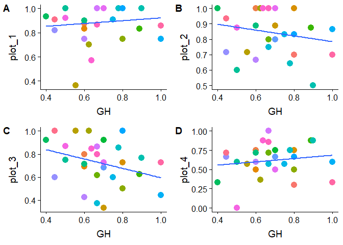
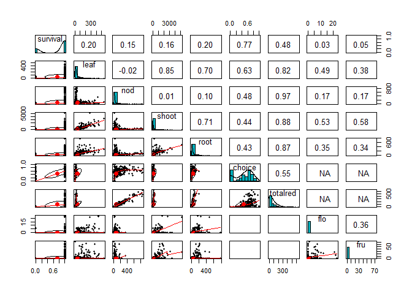
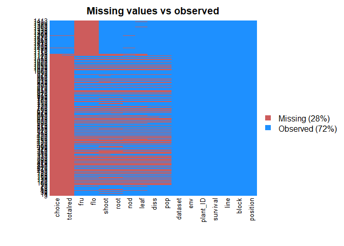

data\_setup
================
Rebecca Batstone
2019-08-28

Load packages
-------------

``` r
# packages
library("tidyverse") ## includes ggplot2, dplyr, readr, stringr
library("cowplot") ## paneled graphs
library("psych") ## pairs.panels function, correlations of raw data
library("Amelia") ## missmap function, examine missing data
```

Spreadsheets
------------

``` r
# From Anna's greehouse experiment
greenhouse <- read_csv("SimonsenStinchcombe_Proc.Roy.Soc.B_2014_rawdata_pluslinename.csv")

# set variable types:
greenhouse$line <- greenhouse$family
greenhouse$line <- as.factor(greenhouse$line)
greenhouse$population <- as.factor(greenhouse$population)

# calc proportion white
greenhouse$prop_white <- (greenhouse$totalwhite)/(greenhouse$totalnod)
greenhouse$choice <- 1 - greenhouse$prop_white

# subset to only lines in my dataset
greenhouse_s30 <- greenhouse %>%
  filter(line %in% c('AC3','AC15','AC20','DE7','DE15','DU4','DU17','FOR15','FOR26','FOR43','F217',"F219",
                                      "F224", "HTD2", "HTD28", "HTR1", "HTR25", "HTR30", "KA7", "KA16", "KA24", "RBE17",                                         "RBE34","RBE38","WR31","WR34","WR40a","WT18","WT30","WT39")) %>%
  droplevels(.)
                         
# subset to the mixed treatment only
GH_mix <- subset(greenhouse_s30, treatment == "Mix")
GH_mix <- droplevels(GH_mix)

# include a column for plant ID (unique to each plant)
GH_mix$plant_ID <- do.call(paste, c(GH_mix[c("tag","tray")], 
                                    sep = "-"))
GH_mix$plant_ID <- as.factor(GH_mix$plant_ID)

str(GH_mix)
```

    ## Classes 'tbl_df', 'tbl' and 'data.frame':    282 obs. of  27 variables:
    ##  $ tag                         : num  2353 2353 2303 707 945 ...
    ##  $ tray                        : num  80 80 79 25 33 40 83 3 45 45 ...
    ##  $ tray.rep                    : num  25 25 7 15 19 16 28 31 22 18 ...
    ##  $ treatment                   : chr  "Mix" "Mix" "Mix" "Mix" ...
    ##  $ block                       : num  7 7 7 3 3 4 7 1 4 4 ...
    ##  $ family                      : chr  "WR40a" "WR40a" "FOR43" "F219" ...
    ##  $ population                  : Factor w/ 11 levels "AC","DE","DU",..: 10 10 5 4 1 9 5 2 5 4 ...
    ##  $ uline                       : num  102 102 42 27 11 85 38 17 38 29 ...
    ##  $ dateplanted                 : chr  "20-Oct-11" "20-Oct-11" "20-Oct-11" "18-Oct-11" ...
    ##  $ shoot                       : num  3.31 3.69 3.51 5.13 5.34 ...
    ##  $ root                        : num  0.383 0.625 0.708 0.78 0.832 ...
    ##  $ survival                    : num  0 0 0 0 0 0 0 0 0 0 ...
    ##  $ daysharvest                 : num  NA NA NA NA NA NA NA NA NA NA ...
    ##  $ leaf_atharvest              : num  1 1 2 3 2 4 2 3 3 3 ...
    ##  $ height_atharvest            : chr  NA NA NA NA ...
    ##  $ branches_atharvest          : num  NA NA NA NA NA NA NA NA NA NA ...
    ##  $ datedeathmiss               : num  0 0 0 0 0 0 0 0 0 0 ...
    ##  $ daysdeath                   : num  26 26 27 40 22 47 36 69 41 51 ...
    ##  $ noddatamiss                 : num  0 0 0 0 0 0 0 0 0 0 ...
    ##  $ totalwhite                  : num  3 3 4 9 2 2 5 1 3 0 ...
    ##  $ totalred                    : num  0 0 2 0 0 0 0 2 0 0 ...
    ##  $ totalnod                    : num  3 3 6 9 2 2 5 3 3 0 ...
    ##  $ contaminated_nfixing_nodules: num  NA NA NA NA NA NA NA NA NA NA ...
    ##  $ line                        : Factor w/ 30 levels "AC15","AC20",..: 27 27 13 9 2 23 12 4 12 10 ...
    ##  $ prop_white                  : num  1 1 0.667 1 1 ...
    ##  $ choice                      : num  0 0 0.333 0 0 ...
    ##  $ plant_ID                    : Factor w/ 280 levels "1006-35","1010-35",..: 161 161 148 243 272 28 170 274 53 52 ...

``` r
## 282 obs., 280 plants, 30 lines

# Field dataset

# after updating merged spreadsheet:
field <- read_csv("field_combined_21March2019.csv", 
    col_types = cols(batch = col_factor(levels = c("one", 
        "two")), no = col_character(), plot = col_factor(levels = c("plot_1", 
        "plot_2", "plot_3", "plot_4"))))

# set variable types
field$line <- as.factor(field$line)
field$plant_ID <- as.factor(field$plant_ID)

str(field)
```

    ## Classes 'spec_tbl_df', 'tbl_df', 'tbl' and 'data.frame': 1131 obs. of  22 variables:
    ##  $ plant_ID   : Factor w/ 1131 levels "1-A01","1-A02",..: 1 2 3 4 5 6 7 8 9 10 ...
    ##  $ line       : Factor w/ 30 levels "AC15","AC20",..: 5 26 13 28 26 13 16 28 21 22 ...
    ##  $ batch      : Factor w/ 2 levels "one","two": 1 2 2 2 2 2 1 2 1 1 ...
    ##  $ type       : chr  "reference" NA "pool" "pheno" ...
    ##  $ pop        : chr  "de" NA "fz" "wt" ...
    ##  $ no         : chr  "7" NA "24" "18" ...
    ##  $ nod_alive  : num  53 NA 6 32 8 14 19 39 4 4 ...
    ##  $ nod        : num  53 NA 6 32 8 14 19 39 4 21 ...
    ##  $ leaf       : num  75 NA 8 54 18 1 78 72 49 2 ...
    ##  $ fru        : num  0 NA 0 0 0 0 0 0 0 0 ...
    ##  $ flo        : num  0 NA 0 0 0 0 0 0 0 0 ...
    ##  $ root_BM    : num  0.0579 NA 0.0039 0.0826 0.0155 0.0084 0.0612 0.062 0.0129 NA ...
    ##  $ shoot_BM   : num  0.3003 NA 0.0085 0.1503 0.0284 ...
    ##  $ seed_BM    : num  0 NA 0 0 0 0 0 0 0 NA ...
    ##  $ date_diss  : chr  "3-Sep-14" NA "22-Sep-14" "30-Jul-15" ...
    ##  $ diss       : chr  "Rebecca" NA "Simran" "not recoreded" ...
    ##  $ diss_note  : chr  NA NA NA NA ...
    ##  $ plot       : Factor w/ 4 levels "plot_1","plot_2",..: 1 1 1 1 1 1 1 1 1 1 ...
    ##  $ loc        : chr  "A01" "A02" "A03" "A04" ...
    ##  $ survive    : num  1 1 1 1 1 0 1 1 1 1 ...
    ##  $ field_notes: chr  NA "harv" "harv" "fewleaves" ...
    ##  $ line_ID    : chr  "de7" "wrx34" "fzx24" "wtx18" ...
    ##  - attr(*, "spec")=
    ##   .. cols(
    ##   ..   plant_ID = col_character(),
    ##   ..   line = col_character(),
    ##   ..   batch = col_factor(levels = c("one", "two"), ordered = FALSE, include_na = FALSE),
    ##   ..   type = col_character(),
    ##   ..   pop = col_character(),
    ##   ..   no = col_character(),
    ##   ..   nod_alive = col_double(),
    ##   ..   nod = col_double(),
    ##   ..   leaf = col_double(),
    ##   ..   fru = col_double(),
    ##   ..   flo = col_double(),
    ##   ..   root_BM = col_double(),
    ##   ..   shoot_BM = col_double(),
    ##   ..   seed_BM = col_double(),
    ##   ..   date_diss = col_character(),
    ##   ..   diss = col_character(),
    ##   ..   diss_note = col_character(),
    ##   ..   plot = col_factor(levels = c("plot_1", "plot_2", "plot_3", "plot_4"), ordered = FALSE, include_na = FALSE),
    ##   ..   loc = col_character(),
    ##   ..   survive = col_double(),
    ##   ..   field_notes = col_character(),
    ##   ..   line_ID = col_character()
    ##   .. )

``` r
## 1131 plants, 30 lines
```

### Combine Anna's raw data (N = 282 plants) with mine

``` r
# df with: line, include column (env), 4 traits (nod, shoot, leaf, survival), researcher (include Anna)

# change F2 to FZ to match my df
levels(GH_mix$line)[levels(GH_mix$line)=="F217"] <- "FZ17"
levels(GH_mix$line)[levels(GH_mix$line)=="F219"] <- "FZ19"
levels(GH_mix$line)[levels(GH_mix$line)=="F224"] <- "FZ24"
levels(GH_mix$population)[levels(GH_mix$population)=="F2"] <- "FZ"

# select columns that match my df
GH_mix.sub <- GH_mix[ , c("tray", "block", "line","population","survival","leaf_atharvest","totalnod","plant_ID",
                          "shoot","root","choice","totalred")]

# include column for env and diss
GH_mix.sub$env <- "GH"
GH_mix.sub$dataset <- "ESC-greenhouse"
GH_mix.sub$diss <- "Simonsen"
GH_mix.sub$flo <- NA
GH_mix.sub$fru <- NA

# select columns from my df that match
field.sub <- field[ , c("loc", "batch", "line","pop","shoot_BM","root_BM","survive","leaf","nod","plant_ID",
                        "plot","diss","flo","fru")]

# change case of population to upper
field.sub$pop <- toupper(field.sub$pop)

# transform shoot and root to mg to match
field.sub$shoot <- field.sub$shoot_BM * 1000
field.sub$root <- field.sub$root_BM * 1000

# drop columns shoot_BM and root_BM
drops8 <- c("shoot_BM","root_BM")
field.sub <- field.sub[ , !(names(field.sub) %in% drops8)]

# add a column for dataset
field.sub$dataset <- "KSR-field" 
field.sub$totalred <- NA
field.sub$choice <- NA

# rename columns to match
colnames(GH_mix.sub)[colnames(GH_mix.sub)=="tray"] <- "position"
colnames(GH_mix.sub)[colnames(GH_mix.sub)=="population"] <- "pop"
colnames(GH_mix.sub)[colnames(GH_mix.sub)=="leaf_atharvest"] <- "leaf"
colnames(GH_mix.sub)[colnames(GH_mix.sub)=="totalnod"] <- "nod"
colnames(field.sub)[colnames(field.sub)=="loc"] <- "position"
colnames(field.sub)[colnames(field.sub)=="batch"] <- "block"
colnames(field.sub)[colnames(field.sub)=="survive"] <- "survival"
colnames(field.sub)[colnames(field.sub)=="plot"] <- "env"

# combine into one
F_GH_ds <- rbind(GH_mix.sub, field.sub)

# change env to factor
F_GH_ds$env <- factor(F_GH_ds$env, levels = c("GH","plot_1","plot_2","plot_3","plot_4"))

F_GH_ds <- droplevels(F_GH_ds)
str(F_GH_ds)
```

    ## Classes 'tbl_df', 'tbl' and 'data.frame':    1413 obs. of  17 variables:
    ##  $ position: chr  "80" "80" "79" "25" ...
    ##  $ block   : chr  "7" "7" "7" "3" ...
    ##  $ line    : Factor w/ 30 levels "AC15","AC20",..: 27 27 13 9 2 23 12 4 12 10 ...
    ##  $ pop     : Factor w/ 11 levels "AC","DE","DU",..: 10 10 5 4 1 9 5 2 5 4 ...
    ##  $ survival: num  0 0 0 0 0 0 0 0 0 0 ...
    ##  $ leaf    : num  1 1 2 3 2 4 2 3 3 3 ...
    ##  $ nod     : num  3 3 6 9 2 2 5 3 3 0 ...
    ##  $ plant_ID: Factor w/ 1411 levels "1006-35","1010-35",..: 161 161 148 243 272 28 170 274 53 52 ...
    ##  $ shoot   : num  3.31 3.69 3.51 5.13 5.34 ...
    ##  $ root    : num  0.383 0.625 0.708 0.78 0.832 ...
    ##  $ choice  : num  0 0 0.333 0 0 ...
    ##  $ totalred: num  0 0 2 0 0 0 0 2 0 0 ...
    ##  $ env     : Factor w/ 5 levels "GH","plot_1",..: 1 1 1 1 1 1 1 1 1 1 ...
    ##  $ dataset : chr  "ESC-greenhouse" "ESC-greenhouse" "ESC-greenhouse" "ESC-greenhouse" ...
    ##  $ diss    : chr  "Simonsen" "Simonsen" "Simonsen" "Simonsen" ...
    ##  $ flo     : num  NA NA NA NA NA NA NA NA NA NA ...
    ##  $ fru     : num  NA NA NA NA NA NA NA NA NA NA ...

``` r
## 1413 obs, 1411 plants, 30 lines
```

Raw data summaries
------------------

``` r
sapply(F_GH_ds, function(x) sum(is.na(x)))
```

    ## position    block     line      pop survival     leaf      nod plant_ID 
    ##        0        0        0      435        0      490      491        0 
    ##    shoot     root   choice totalred      env  dataset     diss      flo 
    ##      514      510     1160     1152        0        0      439      752 
    ##      fru 
    ##      752

``` r
sapply(F_GH_ds, function(x) length(unique(x)))
```

    ## position    block     line      pop survival     leaf      nod plant_ID 
    ##      391       10       30       12        2      181      206     1411 
    ##    shoot     root   choice totalred      env  dataset     diss      flo 
    ##      768      619      182      138        5        2       25       16 
    ##      fru 
    ##       35

``` r
F_GH_ds_sum <- F_GH_ds %>%
  group_by(env, line) %>%
  summarise_if(is.numeric, mean, na.rm=TRUE)

F_GH_ds_count <- F_GH_ds %>%
  group_by(env, line) %>%
  summarise(count = length(line))

F_GH_sum_join <- F_GH_ds_sum %>%
  right_join(F_GH_ds_count)
```

    ## Joining, by = c("env", "line")

### Examine proportion of surviving plants btw GH and field plots

``` r
F_GH_ds_prop <- F_GH_ds %>%
  group_by(env, line) %>%
  summarise(prop_surv = sum(survival)/length(survival))

F_GH_ds_prop.w <- spread(F_GH_ds_prop, env, prop_surv)

plot1 <- ggplot(F_GH_ds_prop.w, aes(x=GH, y=plot_1)) + 
  geom_point(size=4, aes(color=line)) + 
  geom_smooth(method=lm, se=FALSE) +
  theme(legend.position = "none")

plot2 <- ggplot(F_GH_ds_prop.w, aes(x=GH, y=plot_2)) + 
  geom_point(size=4, aes(color=line)) + 
  geom_smooth(method=lm, se=FALSE) +
  theme(legend.position = "none")

plot3 <- ggplot(F_GH_ds_prop.w, aes(x=GH, y=plot_3)) + 
  geom_point(size=4, aes(color=line)) + 
  geom_smooth(method=lm, se=FALSE) +
  theme(legend.position = "none")

plot4 <- ggplot(F_GH_ds_prop.w, aes(x=GH, y=plot_4)) + 
  geom_point(size=4, aes(color=line)) + 
  geom_smooth(method=lm, se=FALSE) +
  theme(legend.position = "none")

(sub1 <- plot_grid(plot1, plot2, plot3, plot4, 
          ncol = 2,
          nrow = 2,
          #rel_heights = c(0.8, 1),
          align = "hv",
          labels = c("AUTO")))
```



### Raw data correlations

``` r
(pairs.panels(F_GH_ds[,c(5:7,9:12,16:17)], 
             method = "pearson", # correlation method
             hist.col = "#00AFBB",
             density = TRUE,  # show density plots
             ellipses = TRUE # show correlation ellipses
             ))
```



    ## NULL

### Examine missing data

``` r
missmap(F_GH_ds, main = "Missing values vs observed")
```



Traits without sufficient replication:

-   flower and fruit: only measured in field, not enough reps for plot 4 and line WT39
-   choice and number of red nodules: only measured in GH
-   shoot: not available for DU17 (plot3) and KA24 (plot4)
-   leaf, nod: not available for WT39 (plot4)
-   No traits available for WR34 (plot4), none survived

### Clean up dataset for each trait to analyze

``` r
# drop lines that do not have enough replicates across each env to calc interaction terms:
drop_WR34 <- F_GH_ds %>%
  filter(! line %in% "WR34") %>%
  droplevels(.)

shoot_df <- drop_WR34 %>%
  filter(! line %in% c("DU17","KA24")) %>%
  droplevels(.)

leaf_df <- drop_WR34 %>%
  filter(! line %in% c("WT39")) %>%
  droplevels(.)

nod_df <- drop_WR34 %>%
  filter(! line %in% c("WT39")) %>%
  droplevels(.)

choice_df <- F_GH_ds %>%
  filter(! dataset %in% c("KSR-field")) %>%
  droplevels(.)

red_nod_df <- F_GH_ds %>%
  filter(! dataset %in% c("KSR-field")) %>%
  droplevels(.)

flower_df <- drop_WR34 %>%
  filter(! line %in% c("WT39") & ! env %in% c("GH","plot_4")) %>%
  droplevels(.)

fruit_df <- drop_WR34 %>%
  filter(! line %in% c("WT39") & ! env %in% c("GH","plot_4")) %>%
  droplevels(.)

# complete cases for each trait:
shoot_cc <- shoot_df[complete.cases(shoot_df[ ,c("shoot")]),]
survival_cc <- F_GH_ds[complete.cases(F_GH_ds[ ,c("survival")]),]
leaf_cc <- leaf_df[complete.cases(leaf_df[ ,c("leaf")]),]
nod_cc <- nod_df[complete.cases(nod_df[ ,c("nod")]),]
choice_cc <- choice_df[complete.cases(choice_df[ ,c("choice")]),]
red_nod_cc <- red_nod_df[complete.cases(red_nod_df[ ,c("totalred")]),]
flower_cc <- flower_df[complete.cases(flower_df[ ,c("flo")]),]
fruit_cc <- fruit_df[complete.cases(fruit_df[ ,c("fru")]),]

# calculate flower success
flower_cc$flo_succ <- as.numeric(flower_cc$flo > 0) 

# calculate fruit success
fruit_cc$fru_succ <- as.numeric(fruit_cc$fru > 0) 
```

Save files for downstream analyses
----------------------------------

``` r
save(F_GH_ds, file = "./combined_field_GH_28Aug2019.Rdata")
save(shoot_cc, file = "./dataset_cleaned/shoot_cleaned.Rdata")
save(survival_cc, file="./dataset_cleaned/survival_cleaned.Rdata")
save(leaf_cc, file="./dataset_cleaned/leaves_cleaned.Rdata")
save(nod_cc, file="./dataset_cleaned/nods_cleaned.Rdata")
save(choice_cc, file="./dataset_cleaned/choice_cleaned.Rdata")
save(red_nod_cc, file="./dataset_cleaned/red_nod_cleaned.Rdata")
save(flower_cc, file="./dataset_cleaned/flowers_cleaned.Rdata")
save(fruit_cc, file="./dataset_cleaned/fruits_cleaned.Rdata")
```
